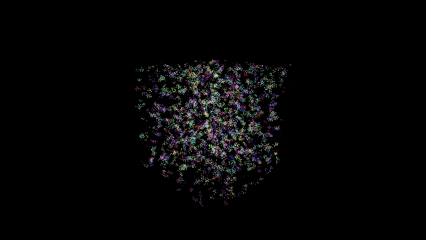
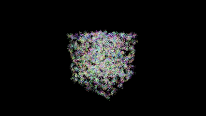
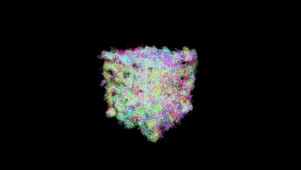
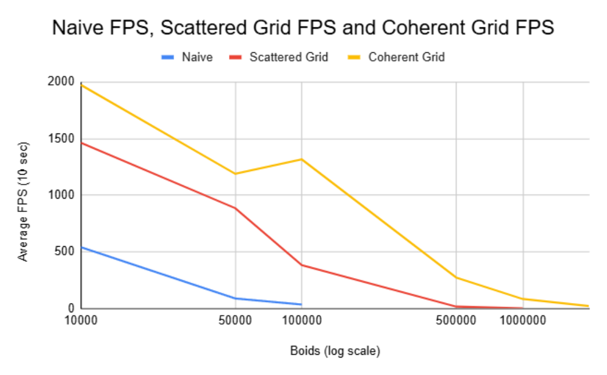
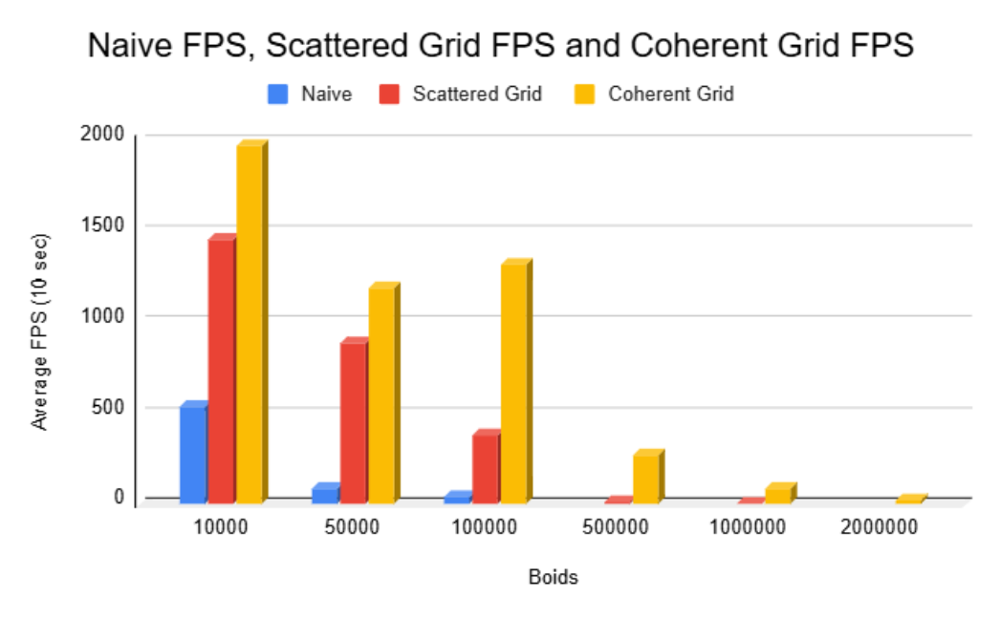
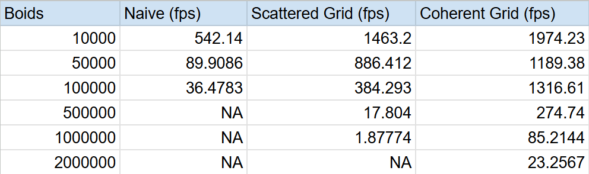

**University of Pennsylvania, CIS 5650: GPU Programming and Architecture,  
Project 1 - Flocking**

* Lewis Ghrist  
* [LinkedIn](https://www.linkedin.com/in/lewis-ghrist-4b1b3728b/), [personal website](https://siwel-cg.github.io/siwel.cg_websiteV1/index.html#home)  
* Tested on: Windows 11, AMD Ryzen 9 5950X 16-Core Processor, 64GB, NVIDIA GeForce RTX 3080 10GB (Personal PC)

---

## Overview
A somewhat realistic and nice looking flocking simulation can be achieved using three simple behavior rulses for agents:
- Move towards the centroid of your neighbors
- Don't get to close to your neighbors
- Move at a similar speed to your neighbors
By adjusting the radius for which other agents are consider neighbors and the strength of the influence neighbors have your a boid's velocity, some varied and jcomplex behaviors can emmerge. The main place for optimization is when determining which other agenst should effect the current agent. The naive approach is to simply check every single agent to see if they are within a certain distance. This ofcourse is alot of checks, and doesn't scale well as the number of boids increases (see graphs below). For better results, we implemented a spacial grid so that rather than checking every single other agent, we just need to check the one in our current agent's cell and the 26 neighboring cells. Additionally we can even further optimize this by structuring our data in a way which allows for easy and quicker memory acessing on the GPU. Further analysis on the optimizations below:

### Example Simulation Runs 
These were all run with the coherent grid implementation. 

Rule 1 distance: 8.0 | Rule 1 strength: 0.05

Rule 2 distance: 3.0 | Rule 2 strength: 0.1

Rule 3 distance: 4.0 | Rule 3 strength: 0.1

- **10,000 boids**  
  

- **50,000 boids**  
  

- **100,000 boids**  
  

---
Rule 1 distance: 10.0 | Rule 1 strength: 0.01

Rule 2 distance: 2.0 | Rule 2 strength: 0.1

Rule 3 distance: 8.0 | Rule 3 strength: 0.1

- **100,000 boids**  
  

---
Rule 1 distance: 5.0 | Rule 1 strength: 0.01

Rule 2 distance: 2.0 | Rule 2 strength: 0.1

Rule 3 distance: 10.0 | Rule 3 strength: 0.1

- **100,000 boids**  
  

---

## Performance Results
The average fps was calculated over a 10 second window for each simulation method with varying numbers of boids.
### FPS Line Graph

### FPS Breakdown by Block Size

### FPS Table

At **1M+ boids**, only the coherent grid remains practical.

## Performance Analysis
For each implementation, how does changing the number of boids affect performance? Why do you think this is?
As expected, and as can be seen from the graphs, with the naive implementation, increacing the number of boids dramatically decrease fps. This is because its takes roughly O(N^2) to compare every boid to every other boid. On the other hand, using the grid methods, asumming boids are randomly and somewhat evenly scattered throughout our domain, each boid only need to check the limited number of other boids in the surrouning cells. This of course will be just like the naive case as N really grows, but it allows for a much larger total number to be simulated before a significant and visual decrease in performance.

For each implementation, how does changing the block count and block size affect performance? Why do you think this is?
There were slight changes to overall runtimes, but nothing too drastic. As the block size decreased, there were some performance drop offs. 

For the coherent uniform grid: did you experience any performance improvements with the more coherent uniform grid? Was this the outcome you expected? Why or why not?
At first, it seems that changing from organizing the position and velocity data in arbitrary spots to be coherent in memory wouldn't really have any improvements. You are still doing the same number of memory acesses and calculations, and infact a decrease in performance might be expected since we do some additional reorganizing steps. However, as the results show, clearly there was significant improvements when switching to a coherent structure. This is because although we do the same numeber of memory acesses, the cost for each acess is less. Since our memory is coherent, when fetching data for boid i, boid i+1's data is right next to it in memory and thus as we iterate through i, we can "grab" larger chunks of memory at a time. 

Did changing cell width and checking 27 vs 8 neighboring cells affect performance? Why or why not? Be careful: it is insufficient (and possibly incorrect) to say that 27-cell is slower simply because there are more cells to check!
In order to check 8 blocks instead of 27, you need to double the block size. Thus the total volume of cells actually is less for a 27 cell setup ((3*cellWidth)^3 vs (4*cellWidth)^3). This is somewhat insignificant unless you have a large number of boids, but does technically provide some improvement. 