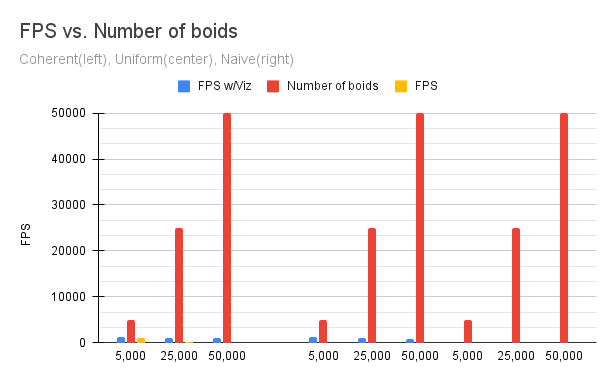
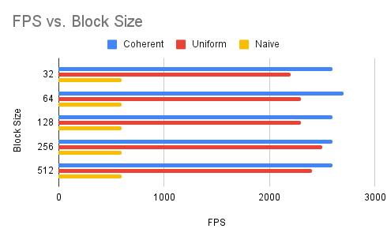
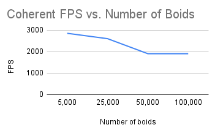

**University of Pennsylvania, CIS 5650: GPU Programming and Architecture,
Project 1 - Flocking**

* Caroline Fernandes
  * [LinkedIn](https://www.linkedin.com/in/caroline-fernandes-0-/), [personal website](https://0cfernandes00.wixsite.com/visualfx)
* Tested on: Windows 11, i9-14900HX @ 2.20GHz, Nvidia GeForce RTX 4070

### Results

Preformance Analysis
============================
I am running my tests with baseline settings of a blockSize = 128 & Number of boids = 10,000.
I am evaluating FPS and using CUDA events to time the velocity kernel for each implementation as a benchmark.

An increase in the number of boids will slow the simulation. I will cover why with each implementation.

I did not notice much of a change in performance when adjusting block Size and block Count, I believe this 
to be because of the CUDA Scheduler that the GPU was unlikely to be idle. The bulk of the flocking kernels
include multiple necessary reads to global memory which can't be improved upon by changing these parameters.

Changing the cell width from 27 to 8 neighboring cells also did not have a huge percievable impact on performance.
I was expecting that (keeping everything else the same) only checking 8 cells would improve speed.
While making the cell width bigger could decrease the number of neighboring cells to check, this increases
the number of boids in each cell inflating each cell and the number of boids it is required to evaluate.

### Coherent Analysis
My upper and lower bound tests only saw a 67% decrease in FPS which outpreforms the uniform and naive methods.
I anticipated that this implementation would have the fastest FPS because it made the positions and velocities of boids
contiguous in memory. This allowed us to change how we accessed these values providing the boid's data with one less array than the uniform grid.
Each access to global memory is expensive, therefore reducing the amount of reads improves performance.

vs.Numberofboids.png)

### Uniform Grid Analysis
Similary to the naive algorithm each boid in the simulation must check it's preprocessed grid to look for potential neighbors
Increasing N requires an increased number of checks, slowing FPS.

vs.Numberofboids.png)

### Naive Flocking Analysis
The naive algorithm checks each boid in the simulation as a potential neighbor.
Increasing N requires an increased number of checks, slowing FPS.

vs.Numberofboids.png)

