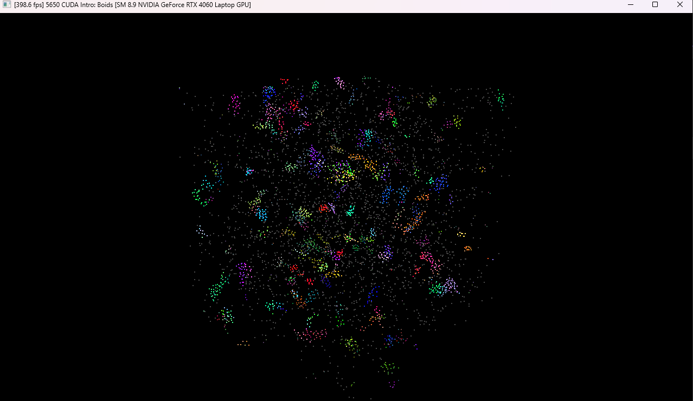
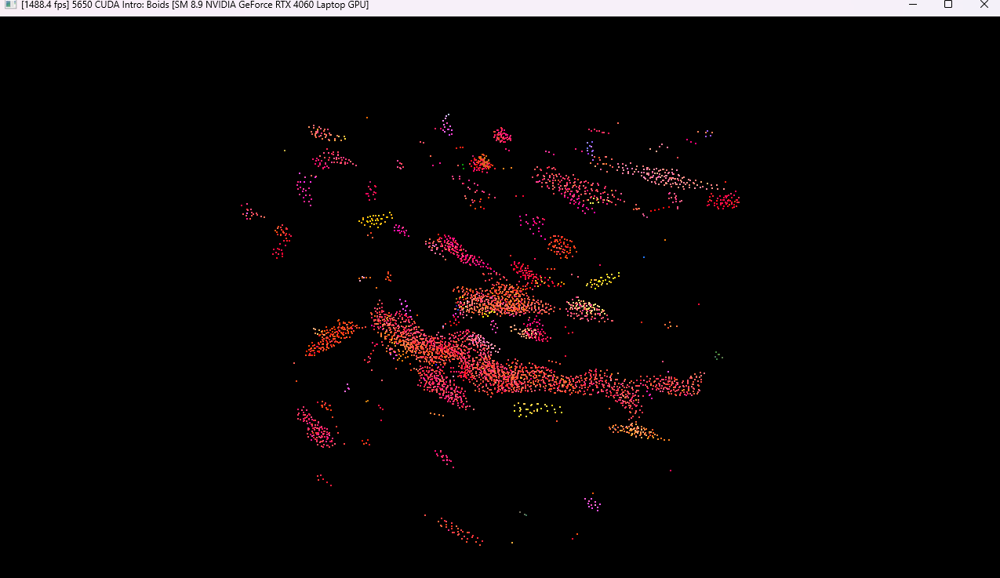
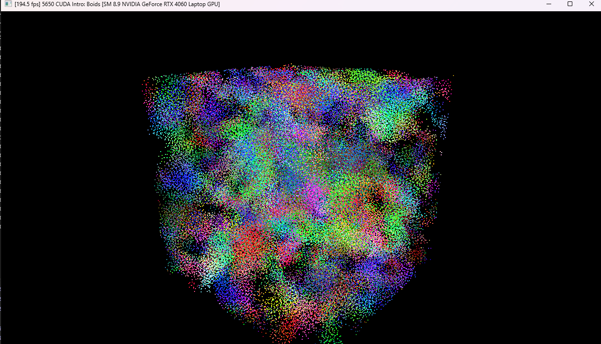
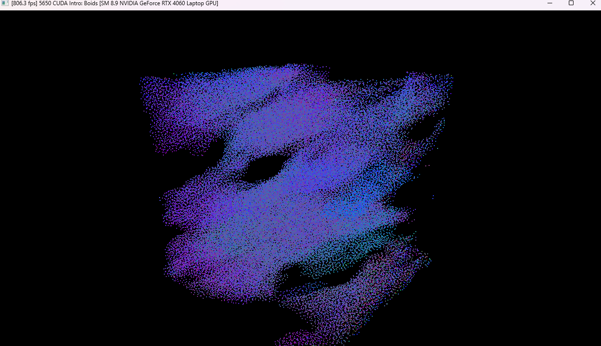
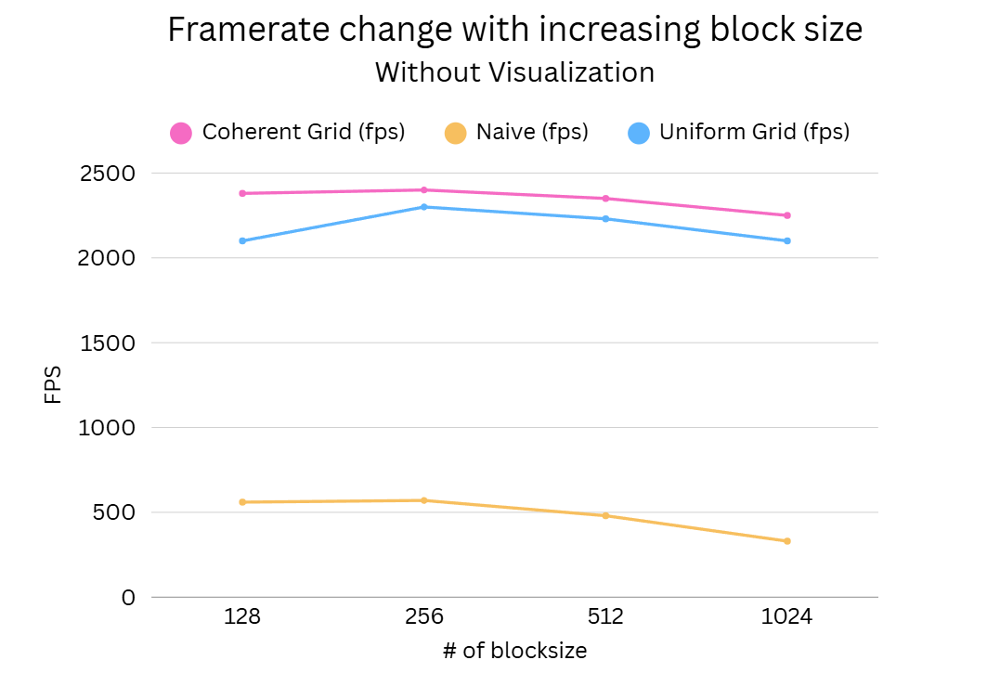
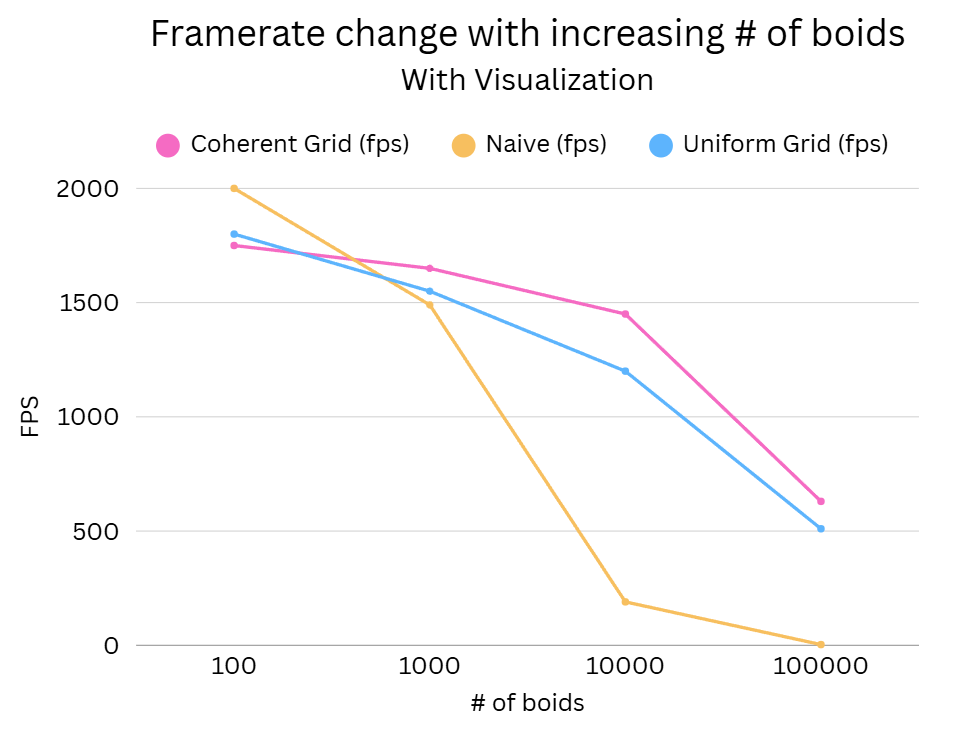
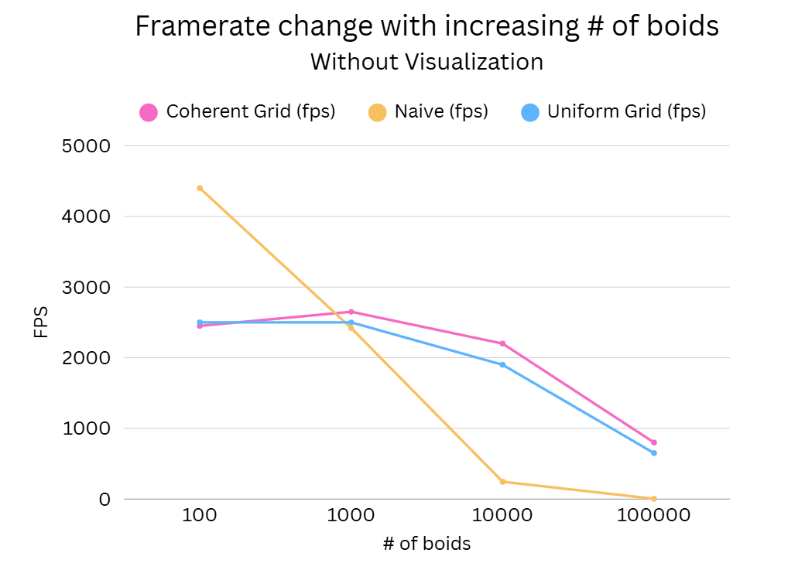

**University of Pennsylvania, CIS 5650: GPU Programming and Architecture,
Project 1 - Flocking**

* Sirui Zhu
  * [LinkedIn](https://www.linkedin.com/in/sirui-zhu-28a24a260/)
* Tested on: Windows 11, i7-13620H, RTX 4060 (Personal)

## Demo

### 100,000 Boids Simulation

The above shows the full simulation process with 100,000 boids.

---

## Simulation Screenshots

### 5,000 Boids
| Start | End |
|-------|-----|
|  |  |

### 100,000 Boids
| Start | End |
|-------|-----|
|  |  |

## Boids Simulation Performance 

---

### Q1. For each implementation, how does changing the number of boids affect performance? Why do you think this is?

- **Naive:**  
  Performance decreases extremely rapidly as the number of boids grows (e.g., ~4400 fps at 100 boids → ~3.5 fps at 100,000 boids without visualization). This is because the algorithm is O(N²): every boid checks all others, so computation explodes as population increases.

- **Uniform grid:**  
  Performance decreases much more gradually. The grid restricts neighbor checks to nearby cells, so the complexity is closer to O(N) in practice. This allows it to scale far better than the naive method. Using 8 cells in the coherent path reduces a small constant cost as well.

- **Coherent grid:**  
  Similar to the uniform grid at small scales, but consistently faster at larger scales. The improvement comes from reordering boids in memory so neighbors are contiguous, which enables coalesced global memory access and reduces latency.

- **With visualization:**  
  All values are lower due to rendering overhead, but the same trends hold: naive collapses at scale, while uniform and coherent grids degrade more gracefully.

---

### Q2. For each implementation, how does changing the block count and block size affect performance? Why do you think this is?

- **Naive:**  
  The Naive method is sensitive to block size. Performance peaks at block sizes around 128–256 (560–570 fps) but decreases for larger sizes (330 fps at 1024). This occurs because larger blocks reduce GPU occupancy: too many registers/shared memory per block means fewer active warps, which makes it harder to hide memory latency. In contrast, with smaller blocks, multiple blocks can be active on the same SM, keeping many warps in flight and hiding memory delays better.

- **Uniform and coherent grid:**  
  Both are much less sensitive to block size. Performance remains consistently high (2100–2400 fps) with only a slight dip at 1024. This stability is due to smaller per-thread workloads and structured memory access, which reduce reliance on block configuration.

---

### Q3. For the coherent uniform grid: did you experience any performance improvements with the more coherent uniform grid? Was this the outcome you expected? Why or why not?

Yes. The coherent grid consistently outperformed the standard uniform grid. This improvement comes from reordering boids so that those in the same cell are stored contiguously in memory, which improves spatial locality and enables memory coalescing. At higher boid counts, memory access patterns become the main bottleneck, so optimizing the memory layout provides measurable gains.  

In addition, when looping through neighboring cells, we iterate from the z-axis outward (z → y → x) instead of starting with x. This ordering matches the row-major storage layout of 3D arrays, where x varies fastest, followed by y, then z. By looping over z first, threads in the same warp are more likely to access contiguous memory addresses, reducing stride jumps and improving coalesced memory access. This further enhances the performance benefits of the coherent grid.

Finally, with cellWidth = 2×r the coherent pass correctly checks only 8 cells (the current cell plus the half-space neighbor along each axis), which gives a modest constant-factor gain over a 27-cell sweep; if cellWidth is smaller than 2×r we revert to 27 cells to remain correct.

---

### Q4. Did changing cell width and checking 27 vs 8 neighboring cells affect performance? Why or why not?

Changing cell width had the largest impact on performance; switching between 27 and 8 neighbor cells only helped modestly and only when the width was set correctly. With 
cellWidth≈2𝑟, valid neighbors lie in the current cell or the half-space cell along each axis, so visiting 8 cells is both correct and a bit faster than 27 because it reduces header checks and branches—especially in the coherent grid where data is contiguous. If the cell width is smaller than 2𝑟, you must scan 27 cells to remain correct. If the cell width is much larger than 2𝑟, the inner loop slows down because each visited cell holds many boids, regardless of 8 vs 27. Overall, runtime is dominated by how many boids are actually iterated per thread.

---