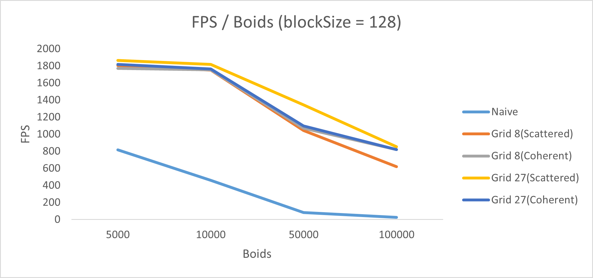
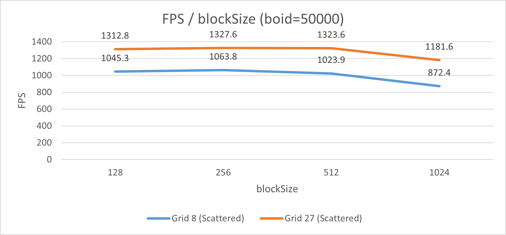

**University of Pennsylvania, CIS 5650: GPU Programming and Architecture,
Project 1 - Flocking**

* Zhanbo Lin
  * [LinkedIn](https://www.linkedin.com/in/zhanbo-lin)
* Tested on: Windows 10, i5-10400F @ 2.90GHz 48GB, RTX-3080 10GB (Personal)
* GPU Compute Capability: 8.6

### Boids Simulation

![simulation] 

boids count = 100000

### Performance Analysis

Figure-1

Figure-2

##### For each implementation, how does changing the number of boids affect performance? Why do you think this is?

The framerate drops as the number of boids increases (Figure-1). This is expected and intuitive, that it takes more compute power to simulate more boids.

##### For each implementation, how does changing the block count and block size affect performance? Why do you think this is?

How the block count and block size affects performance depends on the actual implementation (Figure-2). The search algorithm reaches peak performance at blockSize=256. I think it is more of a hardware-dependent thing, that this blockSize aligns better with number of cores in each SM, resulting in more efficient scheduling.

##### For the coherent uniform grid: did you experience any performance improvements with the more coherent uniform grid? Was this the outcome you expected? Why or why not?

With the number of boids less than 100000, the performance difference varies between 8-neighbors and 27-neighbors search algorithm (Figure-1). For the 8-neighbors search, the coherent version performs better. In contrast, for the 27-neighbors serch, the scattered version performs better. This is expected because the coherent version has better data locality, which reduces cache misses.

##### Did changing cell width and checking 27 vs 8 neighboring cells affect performance? Why or why not?

The 27-neighbor version performs better for the scattered version but not the coherent version (Figure-1). I suspect this is related to data locality, possibly because the 27-neighbor search results in fewer boids per cell, though I am not certain of the exact cause.”
