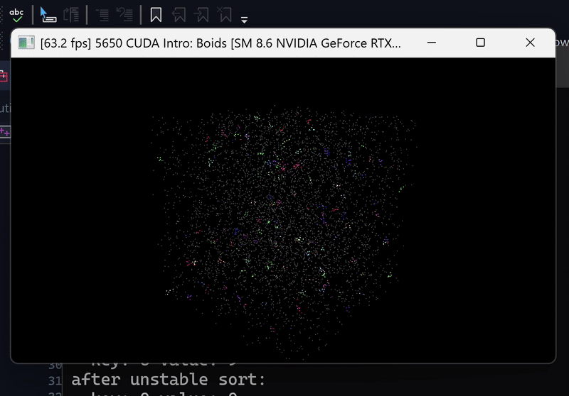
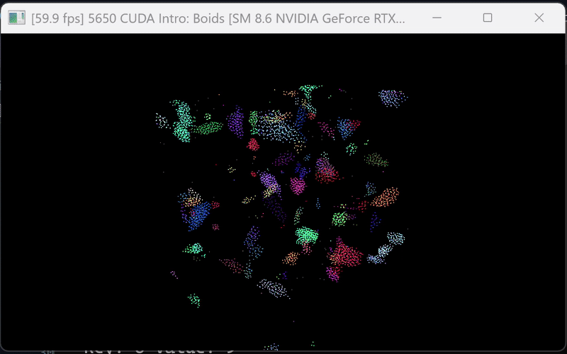

# Project 1 - CUDA Boids
**University of Pennsylvania, CIS 5650: GPU Programming and Architecture,
Project 1 - Flocking**

* Rachel Lin

  * [LinkedIn](https://www.linkedin.com/in/rachel-lin-452834213/)
  * [personal website](https://www.artstation.com/rachellin4)
  * [Instagram](https://www.instagram.com/lotus_crescent/)

* Tested on: (TODO) Windows 11, 12th Gen Intel(R) Core(TM) i7-12700H @ 2.30GHz, NVIDIA GeForce RTX 3080 Laptop GPU (16 GB)

## Naive Neighbor Search

For each boid, this implementation naively checks every other existing boid to compute a new velocity each frame.

### 50,000 Boid Simulation Using Naive Algorithm

### 5,000 Boid Simulation Using Naive Algorithm

## Uniform Grid Search

This implementation checks only boids that are within the same neighborhood (i.e. they are at a close enough distance to actually influence the current boid's velocity).

### 50,000 Boid Simulation Using Uniform Grid Algorithm

## Coherent Grid Search

This implementation is similar to the uniform grid search, but instead of using pointers from each boid to its position and velocity data index, it rearranges the boid data so that it can be directly accessed using the boid's grid cell start and end indices.

### 50,000 Boid Simulation Using Coherent Grid Algorithm

## Performance Analysis

Increasing the number of boids has the greatest impact on performance when using the naive method, which makes sense because the naive algorithm loops through every boid. As a result, the time taken per frame has a roughly linear growth with respect to the number of boids. The uniform and coherent methods, while impacted, do not see as drastic of a change because they only loop through boids that are within a set distance away in world space. Increasing the number of total boids will indirectly increase the number of boids within the neighborhood, but not as drastically.

Block size refers to the number of threads running concurrently in a block. Block count refers to the number of blocks in the grid. Threads within a block can share memory and synchronize with each other. For a fixed problem size, a greater block size usually results in fewer blocks, and vice versa. If the block size is too small, the GPU's ability to perform many computations in parallel is underutilized. If the block size is too large, then the block count will be smaller, so many threads would be sharing the same block memory. This could hurt performance if the GPU hits per-block resource limits in memory. This trade-off is especially apparent with the uniform and coherent grid implementations, where each thread's workload is smaller and only contains nearby neighbors. The sweet spot balances the number of threads and blocks so that memory access latency is less noticeable (because memory access happens concurrently) and the GPU blocks don't hit memory occupancy limits. However, the trade-off is less noticeable with the naive implementation because each thread has to do a lot of work regardless (since every boid's computation loops through all other boids indiscriminately). 

For the coherent uniform grid, there were significant performance improvements, especially as the number of boids increased. This was expected because we avoid looping through any boids that are too far away to actually affect the current boid's movement. Reshuffling the data to avoid using pointers to the velocity and position data did not see as significant of an improvement, but there was still a noticeable one.

If the cell width is larger, more boids will fall within the same cell, so each cell check will involve looping through many boids. This will result in drops in performance. Although the 8-cell case has fewer cells, there would also likely be more boids per cell, so it wouldn't necessarily be more performant. Using 27 cells would involve searching through more cells, but each cell would also contain fewer boids. It's also possible that using 27 cells could result in a more even distribution of boids among the cells, creating a more balanced workload across threads, and resulting in better performance.

### Increasing Number of Boids

#### Average Simulation Time Without Visualization

| Number of Boids | Naive | Uniform | Coherent |
| --------- | --------- | --------- | --------- |
| 2500 | 1.519 | 0.401 | 0.475 |
| 5000 | 2.288 | 0.627 | 0.760 |
| 10000 | 3.800 | 0.732 | 0.551 |
| 25000 | 6.073 | 0.964 | 0.662 |
| 50000 | 15.760 | 2.113 | 1.145 |

#### Average Simulation Time With Visualization

| Number of Boids | Naive | Uniform | Coherent |
| --------- | --------- | --------- | --------- |
| 2500 | 1.258 | 0.443 | 0.360 |
| 5000 | 1.977 | 0.645 | 0.470 |
| 10000 | 3.081 | 0.706 | 0.465 |
| 25000 | 10.056 | 1.085 | 0.655 |
| 50000 | 15.422 | 1.793 | 0.831 |

#### Average Search Time Without Visualization

| Number of Boids | Naive | Uniform | Coherent |
| --------- | --------- | --------- | --------- |
| 2500 | 1.255 | 0.173 | 0.103 |
| 5000 | 2.089 | 0.288 | 0.128 |
| 10000 | 3.601 | 0.331 | 0.154 |
| 25000 | 5.858 | 0.446 | 0.186 |
| 50000 | 15.524 | 1.495 | 0.308 |

#### Average Search Time With Visualization

| Number of Boids | Naive | Uniform | Coherent |
| --------- | --------- | --------- | --------- |
| 2500 | 1.152 | 0.196 | 0.087 |
| 5000 | 1.843 | 0.275 | 0.114 |
| 10000 | 2.939 | 0.267 | 0.138 |
| 25000 | 9.891 | 0.498 | 0.159 |
| 50000 | 15.182 | 1.217 | 0.301 |

### Increasing Block Size

#### Average Simulation Time Without Visualization for 5000 Boids

| Number of Boids | Naive | Uniform | Coherent |
| --------- | --------- | --------- | --------- |
| 64 | 2.435 | 0.660 | 0.42 |
| 128 | 2.460 | 0.641 | 0.546 |
| 256 | 2.6939 | 1.155 | 0.463 |
| 512 | 2.676 | 0.595 | 0.518 |
| 1024 | 3.649 | 0.747 | 0.709 |

#### Average Search Time Without Visualization for 5000 Boids

| Number of Boids | Naive | Uniform | Coherent |
| --------- | --------- | --------- | --------- |
| 64 | 2.294 | 0.292 | 0.116 |
| 128 | 2.301 | 0.273 | 0.114 |
| 256 | 2.337 | 0.264 | 0.113 |
| 512 | 2.519 | 0.249 | 0.138 |
| 1024 | 3.525 | 0.42 | 0.170 |

