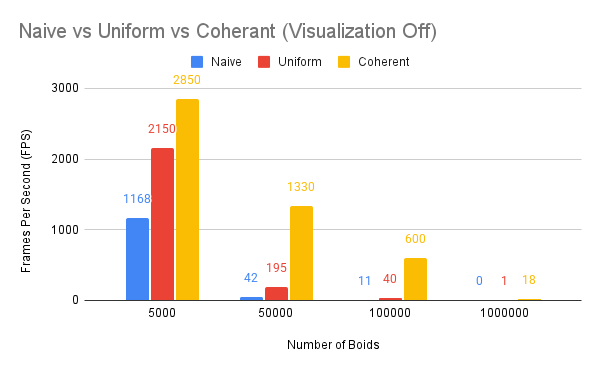
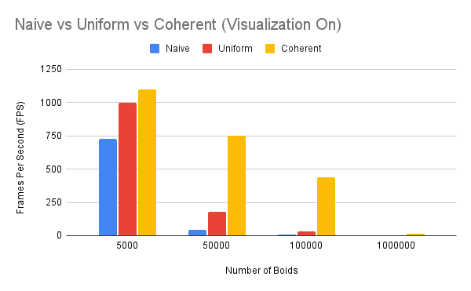
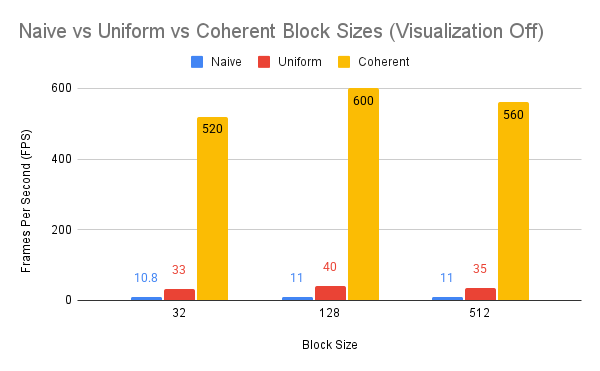
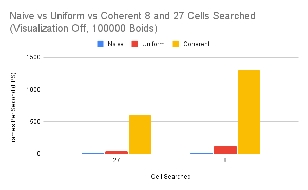

##**University of Pennsylvania, CIS 5650: GPU Programming and Architecture,
###Project 1 - Flocking**

* Zwe Tun
  * LinkedIn: https://www.linkedin.com/in/zwe-tun-6b7191256/
* Tested on: Intel(R) i7-14700HX, 2100 Mhz, RTX 5060 Laptop

*100,000 boids with Coherent Grid Search* 
### Overview 
Boids are artificial agents that simulate the behavior of flocking animals. Introduced by Craig Reynolds in 1986, each boid follows three simple rules:
Cohesion - boids move towards the perceived center of mass of their neighbors
Separation - boids avoid getting to close to their neighbors
Alignment - boids generally try to move with the same direction and speed as their neighbors

## Implementation 

### Naive 
The naive implementation uses a straightforward algorithm: each boid iterates over every other boid in the system to calculate its updated velocity and position based on the three flocking rules (separation, alignment, and cohesion).
While conceptually simple, this approach results in O(n²) time complexity, making it highly inefficient for large numbers of boids. Every boid must check all others regardless of distance, leading to significant computational overhead.

*10,000 boids with Naive*

### Uniform Grid Search
A more effcient algorithm is dividing into 3D cells, and each boid is assigned to a cell based on its position. By storing cell indices and mapping boid data accordingly, each thread can now limit its neighbor search to only nearby cells rather than the entire boid population.
In the scattered version, boid data (position, velocity) is stored in separate buffers, and additional lookup is required to gather information based on the grid cell. This greatly reduces the number of comparisons per boid, improving performance. 

*10,000 boids with Uniform Grid Search*

### Coherent Grid Search 
The coherent grid improves on the uniform grid approach by taking advantage of spatial locality to optimize memory access on the GPU. In the scattered grid version, boid data is stored in separate buffers and accessed via indirect lookups, causing threads to read from scattered memory locations. This leads to reduced cache utilization. The coherent grid reorganizes the boid data so that boids located in the same or neighboring grid cells are stored contiguously in memory. By reshuffling the boid data arrays to align with their cell indices, the GPU can access data in adjacent memory locations, further improving performance. 

*10,000 boids with Coherent Grid Search*  

## Performance Analysis
All performance tests were conducted on Windows 11, Intel(R) i7-14700HX CPU (2.1 GHz), NVIDIA RTX 5060 Laptop GPU. The primary metric used to evaluate performance is Frames Per Second (FPS). Higher FPS values indicate better performance and smoother real-time simulation.

## Questions 
**For each implementation, how does changing the number of boids affect performance? Why do you think this is?**

As the number of boids increases, all 3 methods see a decrease in performance (FPS) due to more computational load. This is shown in the plots where all 3 methods see a decrease in FPS as boid counts increases. 

**For each implementation, how does changing the block count and block size affect performance? Why do you think this is?**

Yes, increasing or decreasing the block size tends to slightly lower performance across the board. This happens because the GPU scheduler tries to optimize its task based on the given resources, and if the sizes or counts or not well balanced it can lead to poor optimization. 

**For the coherent uniform grid: did you experience any performance improvements with the more coherent uniform grid? Was this the outcome you expected? Why or why not?**

For the coherent uniform grid, clear performance improvements are found in the graphs above. With 5,000 boids, the coherent grid achieves nearly 2.5× the FPS of the naive implementation. This performance gap is more noticible at higher boid counts—for example, at 100,000 boids, the coherent grid runs at about 55× the FPS of the naive method. This superior performance is expected, as the coherent grid uses spatial locality to get more efficient memory access and reduce unnecessary computations.

**Did changing cell width and checking 27 vs 8 neighboring cells affect performance? Why or why not?**

I found that checking 8 neighboring cells results in about a 2× increase in FPS compared to checking 27 cells, for both the uniform and coherent grid implementations. The naive implementation’s performance remains unchanged. This improvement is contributed by checking fewer neighboring cells reducing the number of boids each thread must evaluate. In addition checking a smaller area means that neighbor boids that will not affect the overall are skipped wasting less performance. 

