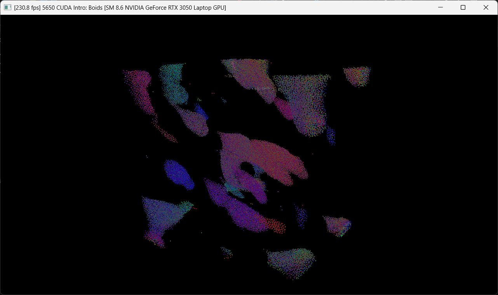
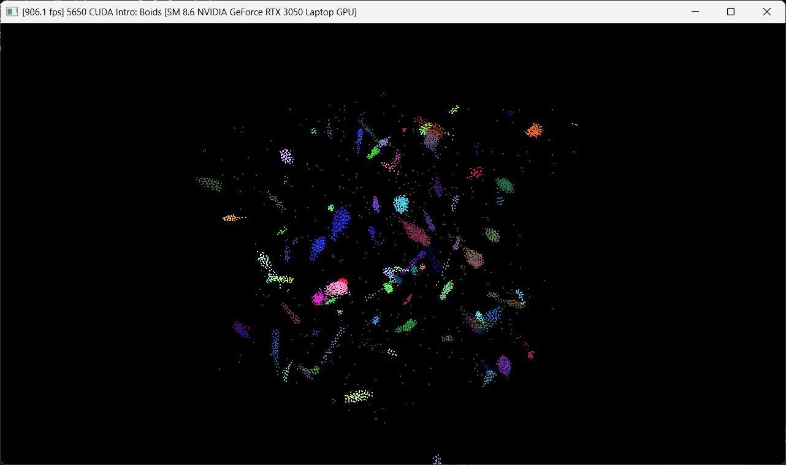
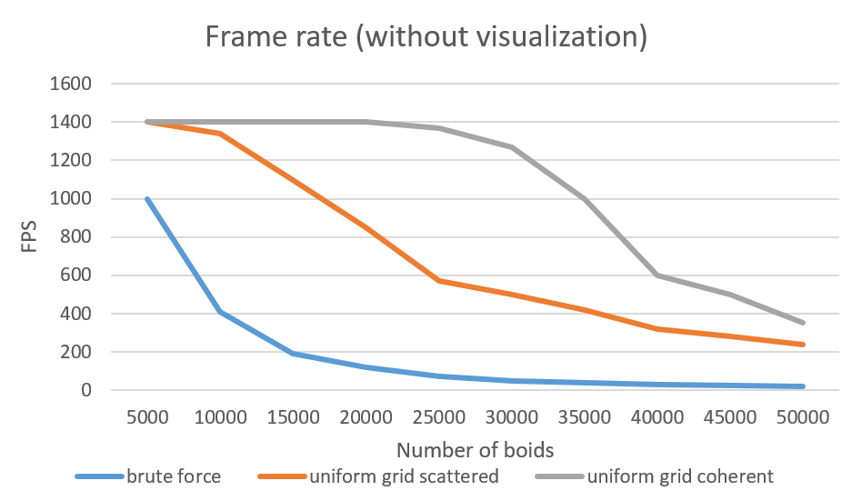
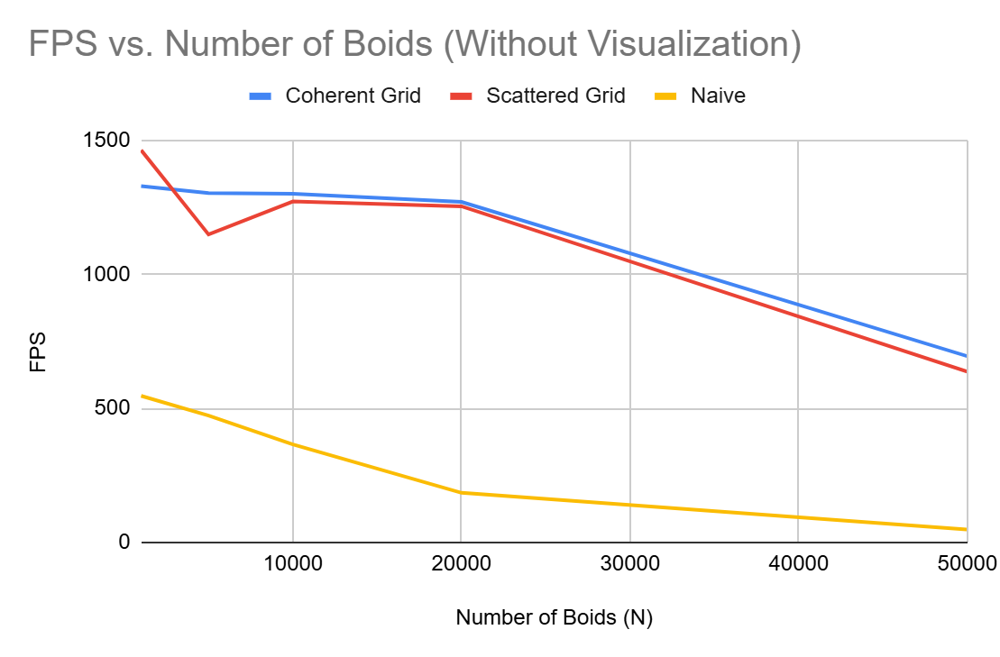

**University of Pennsylvania, CIS 5650: GPU Programming and Architecture,
Project 1 - Flocking**

* Joanne Li
  * [LinkedIn](https://www.linkedin.com/in/zhuoran-li-856658244/)
* Tested on: Windows 11, AMD Ryzen 5 5600H @ 3.30 GHz 16.0GB, NVIDIA GeForce RTX 3050 Laptop GPU 4GB

## Final results
50000 boids:

5000 boids:

## Performance analysis
Frame rate with visualization:

Frame rate without visualization:

* For each implementation, how does changing the number of boids affect performance? Why do you think this is?

  **Naive implementation**: When I increase the number of boids, performance drops a lot. This makes sense because every boid checks against all other boids, so the work grows like N^2.

  **Uniform grid (scattered and coherent)**: Performance also gets worse as I add more boids, but not as dramatically. Each boid only checks neighbors in a few cells instead of all boids, so the growth is closer to linear. The grid helps cut down the comparisons.

* For each implementation, how does changing the block count and block size affect performance? Why do you think this is?

  If the block size is too small, the GPU isn't fully used, so performance suffers. If the block size is too big (more than what the hardware can handle well), some resources are wasted.

  Changing the number of blocks mostly changes how work is split; as long as there are enough blocks to keep all GPU cores busy, performance is stable.

* For the coherent uniform grid: did you experience any performance improvements with the more coherent uniform grid? Was this the outcome you expected? Why or why not?

  Yes, the coherent grid was faster than the scattered one. This is because, after sorting, positions and velocities of boids in the same cell are stored next to each other in memory. That means memory accesses are more friendly, so the GPU can grab data efficiently.

  I expected this improvement, since the main difference between scattered vs coherent is how memory is accessed. GPUs are very sensitive to memory patterns, so coherent layout helps.

* Did changing cell width and checking 27 vs 8 neighboring cells affect performance? Why or why not?

  Yes, changing the cell width affects performance. If the cell width is too small, there are many empty cells, and each boid still needs to check lots of cells, which wastes time. On the other hand, If the cell width is too big, too many boids fall into the same cell, so each boid ends up checking way more neighbors than needed.

  For 27 vs 8 cells: it's not always true that 27 is slower just because it's more cells. Sometimes checking 27 cells is better if the cell width is small, because each cell has very few boids, so the total number of comparisons stays low. On the other hand, with larger cells, 8 is usually enough, because most neighbors are already in those few cells.