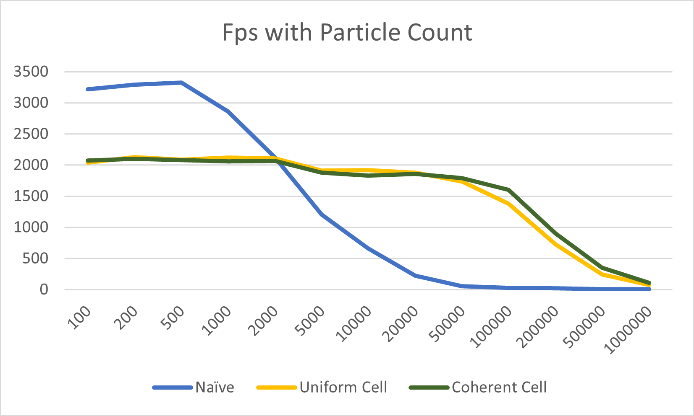
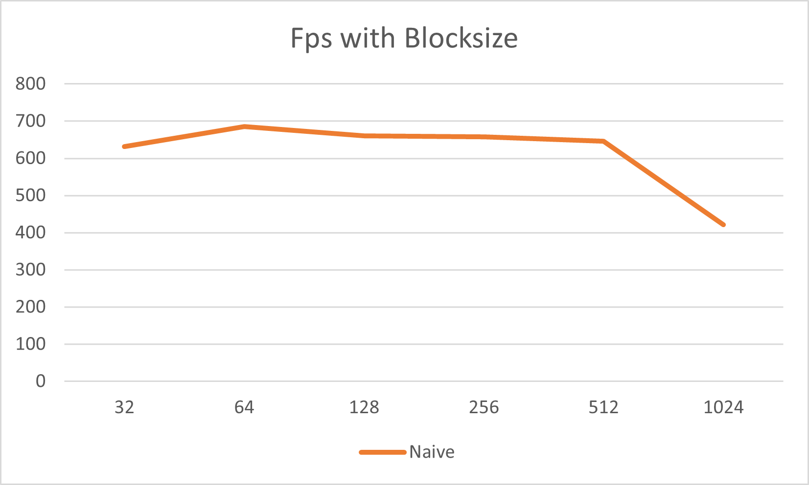
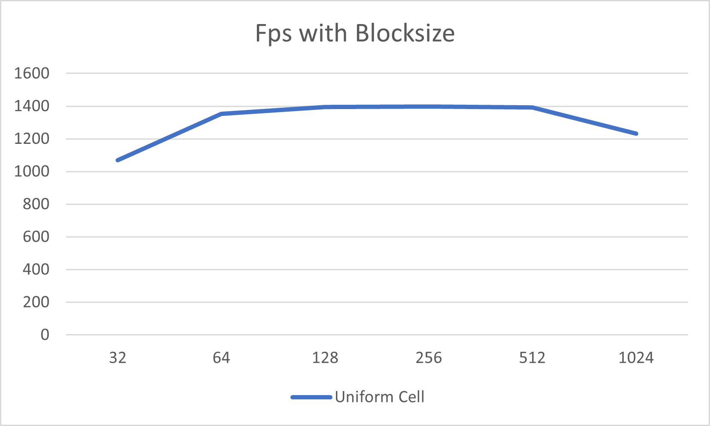
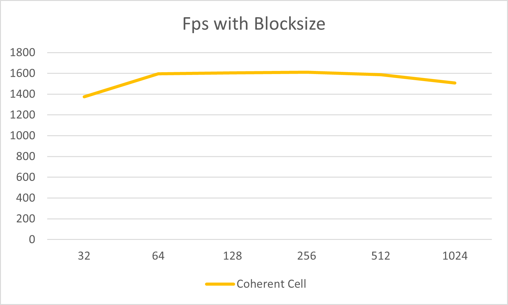

**University of Pennsylvania, CIS 5650: GPU Programming and Architecture,
Project 1 - Flocking**

-   Yu Jiang
    -   [LinkedIn](https://www.linkedin.com/in/yu-jiang-450815328/), [twitter](https://x.com/lvtha0711)
-   Tested on: Windows 11, Ultra 7 155H @ 3.80 GHz, 32GB RAM, RTX 4060 8192MB (Personal Laptop)

## Results

gifs

## Performance Analysis

### 1. Fps With Number of Boids

All these three implementation are tested in release build with blocksize of 128, visualization off, vertical sync off. Uniform Scattered Cells and Coherent Cells are using cellwidth = 2\*radius, which means 8 neighbor cells max.  
It is obvious that when number of boids(or particles) increases, the fps will decrease. For all implementations this is true.

-   For naive implementation, fps starts to decrease steeply when number of boids exceeds 500, this is because each boid needs to check every other boid to update its velocity, which means O(N^2) time complecity without parallel, and when count exceeds maximum number of threads excecuted at the same time, fps will decrease very steeply even with CUDA parallel.
-   For uniform scattered cell implementation, fps starts to decrease later than naive implementation, since it avoids searching for all other boids, instead we only search in 8 or 27 neighbor cells. When boid number < 50000, since we have about 22^3 = 10648 cells, there are few boids in one cell, so the bottleneck will be reading dev_gridCellStartIndices, dev_gridCellEndIndices global memory, which is irrelevant to boid number, that's why performance decrease slowly at this period, and it's also why fps is even lower than naive when we have really few boids(< 2000). But when boid number goes higher, reading dev_pos memory and computing those data will take more time than walking through cells, so the fps then starts to decrease steeper than before.
-   For uniform coherent cell implementation, there are little difference compared to uniform scattered cell when boid number < 50000, because we won't access boids very frequent (same as above), but the reordering itself requires performance, so the help of contiguous memory won't outperform the cost of reordering. But when boid number goes higher, there will be obvious more time cost on accessing dev_pos and dev_velocity memory, reordering resulting contiguous memory plus removing cost accessing dev_particleArrayIndices really improves performance than uniform scattered cell implementation.

### 2. Fps With Blocksize

  
Naive implementation is tested in release build with boid number = 10000, visualization off, vertical sync off.
