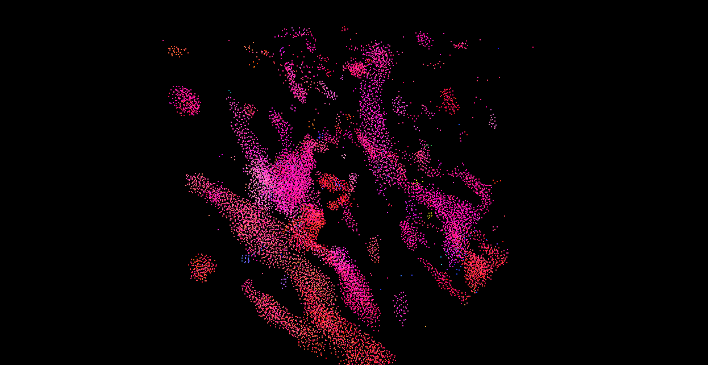
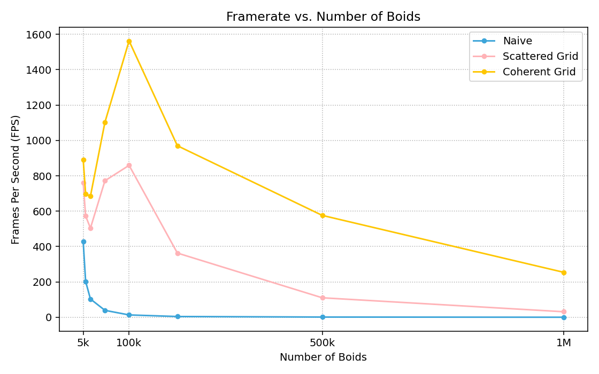
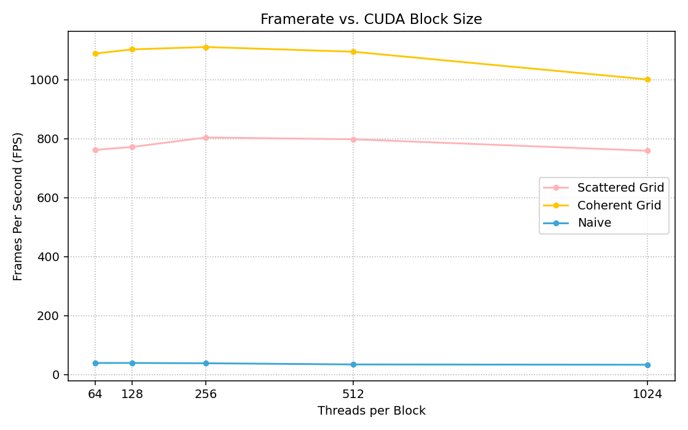

# **Project 1 - Flocking**
## **University of Pennsylvania, CIS 5650: GPU Programming and Architecture**

* Ruichi Zhang
  * [LinkedIn](https://www.linkedin.com/in/ruichi-zhang-537204381/)
* Tested on: Windows 10, AMD Ryzen 9 7950X3D @ 4201 Mhz, 16 Core(s), NVIDIA GeForce RTX 4080 SUPER

## Visulization

<!-- 

  

 -->

  

<em>Figure 1. Boids simulation with N = 5000.</em>

## Performance Analysis

### 1. Effect of Number of Boids on Performance

I recorded the average framerate over the first 20 seconds for boid counts of 5K, 10K, 20K, 50K, 100K, 200K, 500K, and 1M, with the block size fixed at 128. The results are shown in Figure 2.

  
 
Figure 2. Framerate as a function of the number of boids across different implementations.

For both the scattered and coherent grids, an increase in framerate is observed when the number of boids is below 100K. This is likely because, with fewer threads, the GPU is underutilized and many cores remain idle. As the number of boids grows, more threads are launched, allowing the GPU to more fully exploit its parallel processing capabilities. Once the GPU reaches saturation (all cores are fully occupied), further increases in the number of boids eventually decrease framerate, as the workload begins to exceed the hardware’s capacity.

### 2. Effect of Block Count and Block Size on Performance
I recorded the average framerate over the first 20 seconds for block sizes of 64, 128, 256, 512, and 1024, with the number of boids fixed at 50K. The results are shown in Figure 3.

  
 
Figure 3. Framerate as a function of CUDA block size.

Performance remains nearly unchanged for smaller block sizes (e.g., 128, 256, 512). This is likely because the GPU scheduler can launch many blocks concurrently, and the total number of threads is sufficient to keep the GPU fully occupied. Within this range, increasing block size does not significantly affect performance.
However, when the block size reaches 1024, performance begins to decline. This is likely because each block now consumes more shared memory and registers, reducing the number of blocks that can be scheduled concurrently on each SM. As occupancy decreases, the GPU is less able to hide memory latency, resulting in a slight drop in performance.

### 3. Performance of the Coherent Uniform Grid

In my experiments, the coherent uniform grid achieved nearly a 100% improvement in framerate compared to the scattered grid. This is because accessing contiguous memory enables the hardware to transfer data more efficiently, reducing memory latency and improving bandwidth utilization.

## 4. Effect of Cell Width and Neighbor Checking (27 vs 8)
Framerate decreased by approximately 30% when switching from 8-cell to 27-cell neighbor checking for both the scattered and coherent grids. This is likely because, although the search region becomes smaller (a cubic region only 0.75^3 the original volume), the algorithm must perform roughly three times as many memory accesses and computations. The additional overhead outweighs the reduced spatial extent, resulting in lower overall performance.