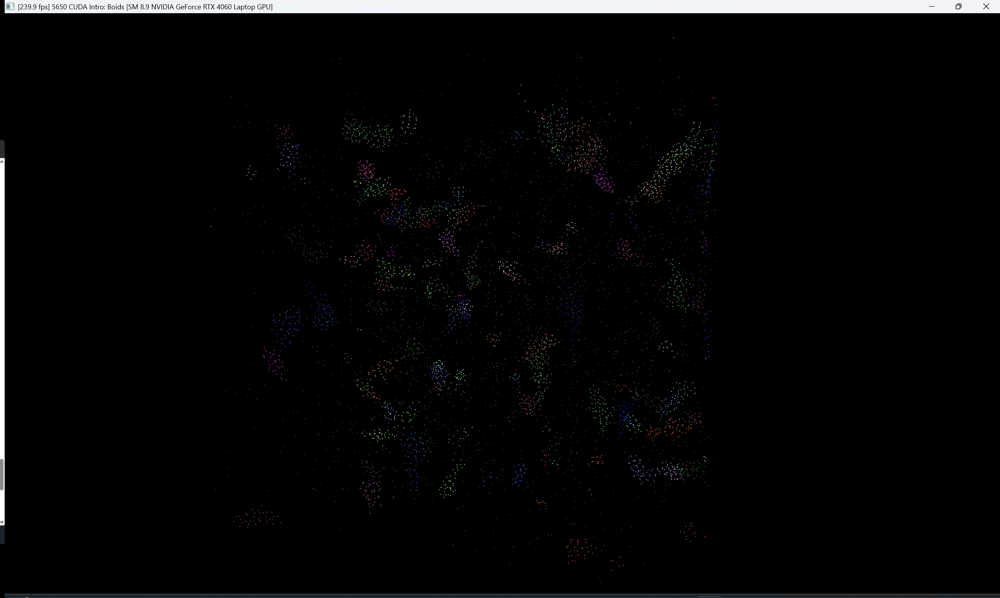
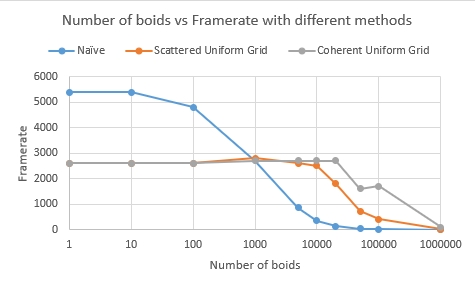
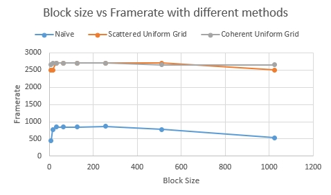

**University of Pennsylvania, CIS 5650: GPU Programming and Architecture,
Project 1 - Flocking**

* Tianhong Zhou
  * [LinkedIn](https://www.linkedin.com/in/tianhong-zhou-b559aa159/)
* Tested on: Windows 11, i9-13950HX @ 2.20GHz, 32GB RAM, NVIDIA GeForce RTX 4060 Laptop GPU 8GB (Personal Laptop)

### Results

### Performance Analysis

- Framerate change with increasing # of boids for naive, scattered uniform grid, and coherent uniform grid (with and without visualization)

- Framerate change with increasing block size

### Questions

1. For each implementation, how does changing the number of boids affect performance? Why do you think this is?

- Naive: Framterate drops super-linearly as N grows: each boid checks every other, so work scales N^2. In the plot this falls off quickly after 1-5k boids and collapses by large N.
- Scattered uniform grid: Much flatter at small/medium N because we only scan the current cell and neighbours; cost scales N*k where k is average neighbours per cell. As N gets very large, k rises and framerate declines.
- Coherent uniform grid: Best stability across a wide range. Reordering pos/vel makes each cell's data contiguous, so neighbour scans hit memory in long, coalesced runs. Overhead is an O(N) reorder each frame, but for moderate/large N the better memory behavior dominates.

- Why: Naive is compute+memory quadratic; Grid methods bound the neighbour count by locality. Coherent improves memory coalescing and cache locality versus scattered's extra indirection.

2. For each implementation, how does changing the block count and block size affect performance? Why do you think this is?

- Across methods, increasing block size from very small values improves occupancy and latency hiding; performance plateaus around 128-512 threads/blocks and then can dip at 1024 due to register pressure and fewer concurrent blocks per SM.
- With fixed N, block cound = ceil(N / blockSize). Very large blocks at small N reduce the number of resident blocks.
- Naive benefits more from moving off tiny blocks.
- Scattered/Coherent are more memory-bound; once bandwidth is saturated, block size tweaks have smaller effect.

3. For the coherent uniform grid: did you experience any performance improvements with the more coherent uniform grid? Was this the outcome you expected? Why or why not?

- Observed: coherent is consistently faster or at least not worse across N, with the curve staying flatter at medium-large N.

- Expected: Yes. Removing the indirection and scanning contiguous [start, end] ranges improved coalescing and cache hit rate; the one extra O(N) reorder per frame is cheap relative to the many neighbour reads it streamlines. At very small N, the benefit is minimal, matching the plot.

4. Did changing cell width and checking 27 vs 8 neighboring cells affect performance? Why or why not? Be careful: it is insufficient (and possibly incorrect) to say that 27-cell is slower simply because there are more cells to check!

- If cellWidth >= 2*R (R = max rule distance), each boid's neighbourhood fits within its cell and one adjacent cell per axis -> at most 8 cells to check. This typically improves performance because you scan fewer ranges and touch fewer cache lines.

- If cellWidth < 2*R, limiting to 8 misses neighbours; you must scan 27 cells (offsets -1/0/+1). 27 isn't always much slower:
  
  - Many of those cells can be empty (start == -1), so the extra loops are cheap.
  - When cells are too large, even with 8 cells the per-cell density k grows, and the inner loop dominates; choosing 27 with a smaller cell width can sometimes be comparable or better because it reduces k (fewer boids per cell) even though you visit more cells.

- Performance is a trade-off between number of cells visited and boids per cell. Best results come from a cell width near 2*R, using the 8-cell path; otherwise use the adaptive 8/27 logic to stay correct and close to optimal.