**University of Pennsylvania, CIS 5650: GPU Programming and Architecture,
Project 1 - Flocking**

* Jacqueline (Jackie) Li
  * [LinkedIn](https://www.linkedin.com/in/jackie-lii/), [personal website](https://sites.google.com/seas.upenn.edu/jacquelineli/home), [Instagram](https://www.instagram.com/sagescherrytree/), etc.
* Tested on: Windows 10, 11th Gen Intel(R) Core(TM) i7-11800H @ 2.30GHz, NVIDIA GeForce RTX 3060 Laptop GPU (6 GB)

# Program Overview

This program is an implementation of boids simulation on the GPU, in which three methods are implemented and subsequently compared. 
1. Naive boids simulation. 
2. Scattered boids simulation on uniform grid.
3. Coherent boids simulation on uniform grid.

#### 50,000 Boids Simulation

|  |
|:--:|

| 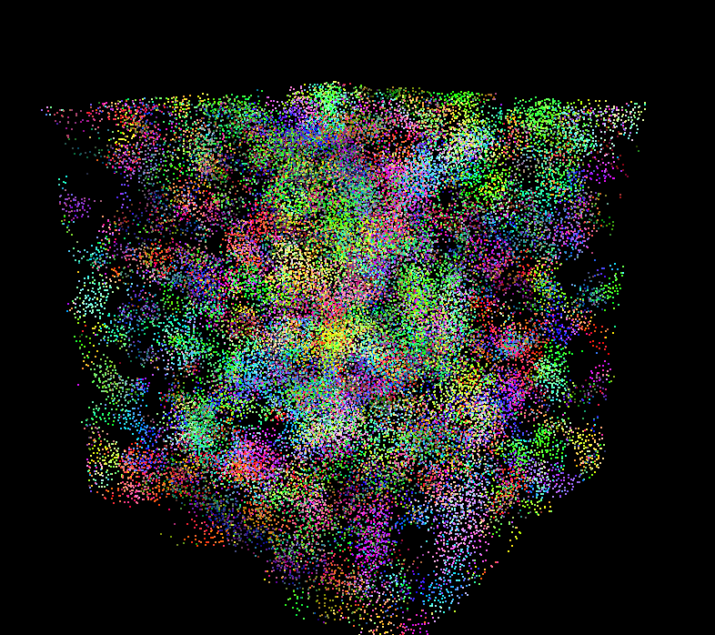 | 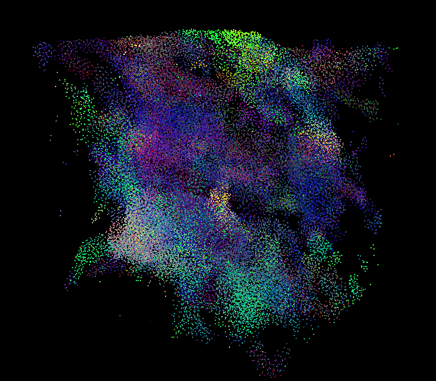 | 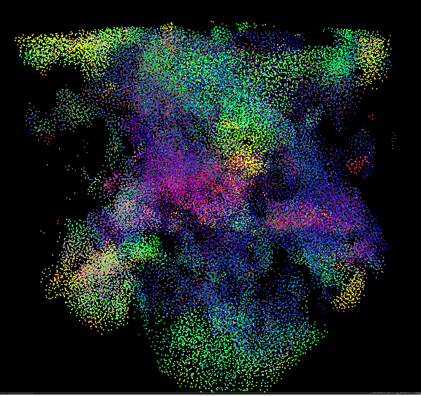 |
|:--:|:--:|:--:|


### Naive Boids Algorithm

Idea: For each boid, naively check every other boid to compute velocity according to rules.

Pseudocode:

```
for each boid i in boids array:
    check all other boids against curr boid
    vel_new[i] = compute_new_velocity(pos, vel)

for each boid i in boids array:
    pos[i] += vel_new[i] * dt

swap(vel_old, vel_new)
```

Runtime: O(N^2)

#### Naive Algorithm Images

| 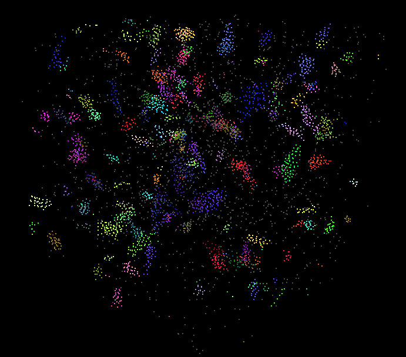 |  |
|:--:|:--:|

### Scattered Uniform Grid Algorithm

Idea: Sets up uniform spacial grid so each boid only checks grid cells close enough for rules of boids. Positions/velocities remain in original arrays.

Pseudocode:

```
1. Compute grid indices for all boids
for each boid i in parallel:
    label boid by grid cell indices
    label boid by particle array indices

2. Sort boids by grid index (so same-cell boids are grouped)
sort_by_key(gridIndex, particleArrayIndex)

3. Identify start & end indices of each grid cell
for each sorted boid i in parallel:
    if gridIndex[i] changes:
        mark start/end of cell

4. Velocity update with neighbor search (scattered)
for each boid i in parallel:
    for each neighbour in range of boid i:
	vel_new[i] = compute_new_velocity(pos, vel)

5. Update positions
for each boid i in parallel:
    pos[i] += vel_new[i] * dt

swap(vel_old, vel_new)
```

Runtime: O(N) * max_neighbours of boid

#### Scattered Algorithm Images

| 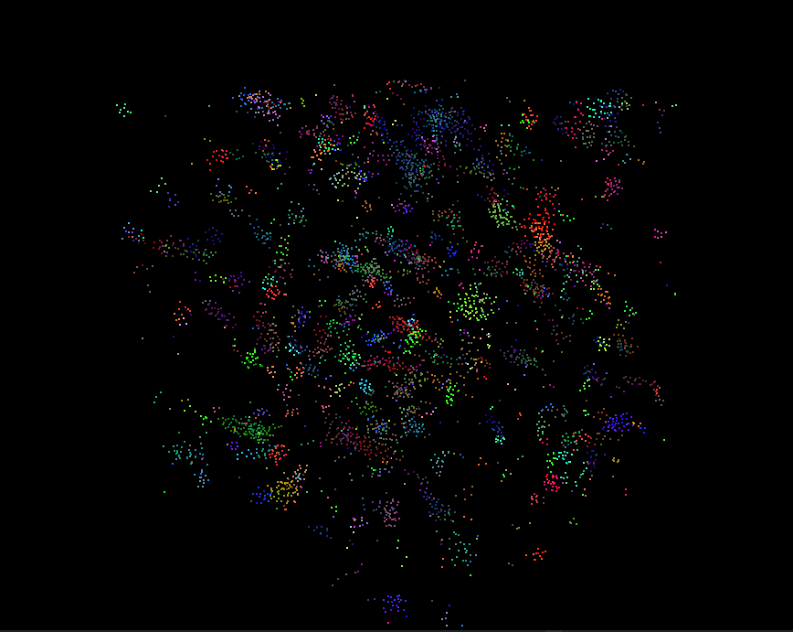 | 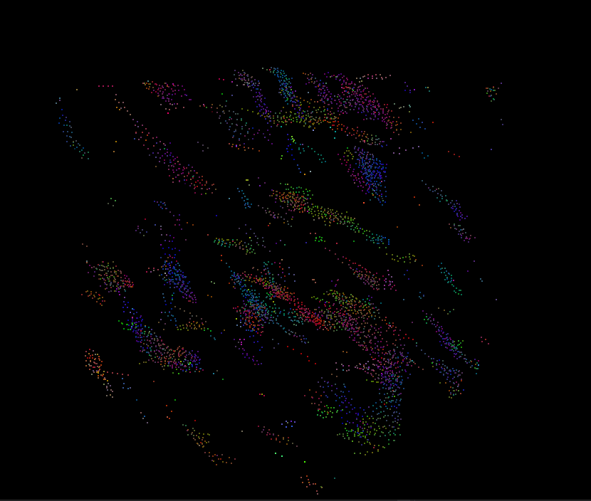 |
|:--:|:--:|

| 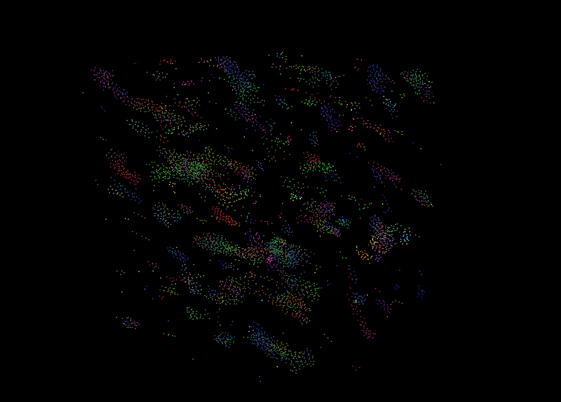 |
|:--:|

### Coherent Uniform Grid Algorithm

Idea: Same as scattered grid, but after sorting, reshuffle particle data so boid data in same grid are updated in memory.

Pseudocode:
```
1. Compute grid indices for all boids
for each boid i in parallel:
    label boid by grid cell indices
    label boid by particle array indices

2. Sort boids by grid index
sort_by_key(gridIndex, particleArrayIndex)

3. Identify start & end indices of each grid cell
for each sorted boid i in parallel:
    if gridIndex[i] changes:
        mark start/end of cell

4. Additional step: Reshuffle pos/vel arrays into coherent order
for each sorted boid i in parallel:
    reshufflePos of boid = position of boid's corresponding particle index
    reshuffleVel of boid = position of boid's corresponding particle index

5. Velocity update with neighbor search (scattered)
for each boid i in parallel:
    for each neighbour in range of boid i:
	vel_new[i] = compute_new_velocity(pos, vel)

6. Update positions
for each boid i in parallel:
    reshufflePos[i] += vel_new[i] * dt

7. Restore coherent positions back to original array order
for each sorted boid i in parallel:
    position of particle index = reshufflePos of boid
    velocity of particle index = reshuffleVel of boid

swap(vel_old, vel_new)
```

Runtime: O(N) * neighbours
Additional strength over Scattered: for boids in same cell, memory is consequently gathered together, better GPU cache.

#### Coherent Algorithm Images

| 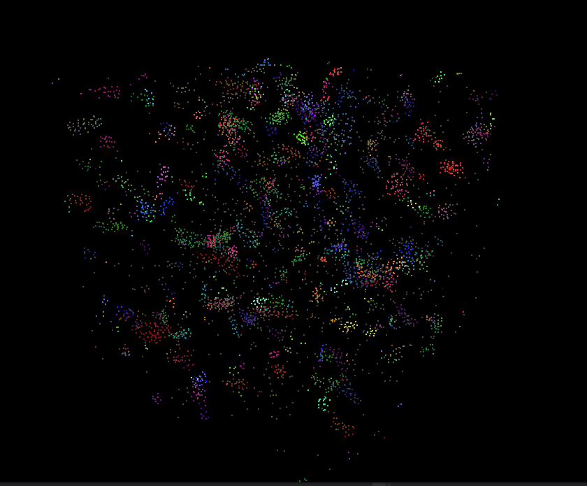 | 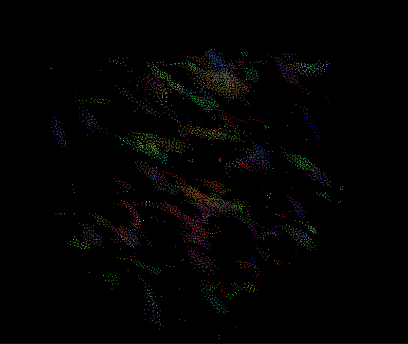 |
|:--:|:--:|

| 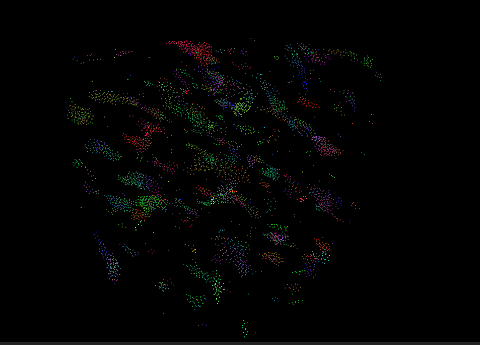 |
|:--:|

#### Some extra .gifs.
|  |  |
|:--:|:--:|
| *100K boids, dt = 0.02, scattered uniform grid* | *100K boids, dt = 0.02, coherent uniform grid* |

## Runtime Analysis

For the first set of tests, I timed the neighbour search functions for each of the three methods, and compared it against number of boids in simulation. I hypothesise that the naive search will take the longest time by a long shot, while coherent method will only be slightly more optimised than scattered method.

### Number of Boids v. Time for Neighbour Search (ms)

**blockSize = 128, no visualization, dt = 0.2**

| # of Boids     | Naive | Scattered Uniform Grid | Coherent Uniform Grid |
|----------------|-------|------------------------|-----------------------|
| 2000           | ~0.33 | ~0.05                  | ~0.04                 |
| 5000 (default) | ~0.77 | ~0.08                  | ~0.07                 |
| 10000          | ~1.57 | ~0.13                  | ~0.10                 |
| 50000          | ~22.7 | ~0.46                  | ~0.37                 |

|  |
|:--:|

**blockSize = 128, visualization, dt = 0.2**

| # of Boids     | Naive | Scattered Uniform Grid | Coherent Uniform Grid |
|----------------|-------|------------------------|-----------------------|
| 2000           | ~0.34 | ~0.05                  | ~0.03                 |
| 5000 (default) | ~0.77 | ~0.07                  | ~0.06                 |
| 10000          | ~1.59 | ~0.13                  | ~0.09                 |
| 50000          | ~21.5 | ~0.49                  | ~0.38                 |

| 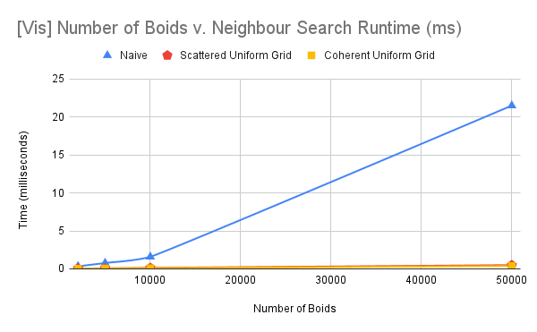 |
|:--:|

The neighbourhood search already proves the difference in runtime between the three methods, with naive search being significantly timed higher than scattered and coherent methods. 

### Number of Boids v. Entire GPU Simulation Runtime (ms)

**blockSize = 128, no visualization, dt = 0.2**

| # of Boids     | Naive | Scattered Uniform Grid | Coherent Uniform Grid |
|----------------|-------|------------------------|-----------------------|
| 2000           | ~0.43 | ~0.13                  | ~0.13                 |
| 5000 (default) | ~0.90 | ~0.17                  | ~0.17                 |
| 10000          | ~1.69 | ~0.23                  | ~0.19                 |
| 50000          | ~22.9 | ~0.63                  | ~0.52                 |

| 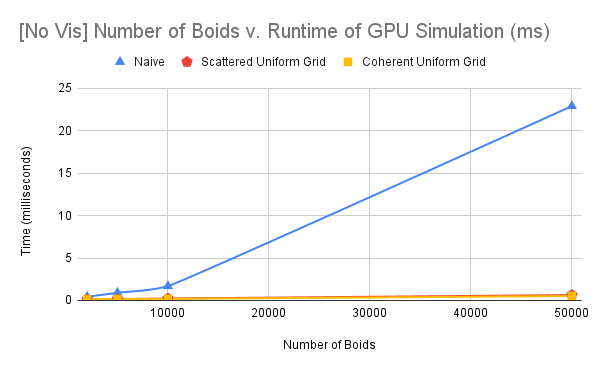 |
|:--:|

**blockSize = 128, visualization, dt = 0.2**

| # of Boids     | Naive | Scattered Uniform Grid | Coherent Uniform Grid |
|----------------|-------|------------------------|-----------------------|
| 2000           | ~0.42 | ~0.13                  | ~0.12                 |
| 5000 (default) | ~0.90 | ~0.19                  | ~0.18                 |
| 10000          | ~1.72 | ~0.23                  | ~0.21                 |
| 50000          | ~21.8 | ~0.56                  | ~0.53                 |

| 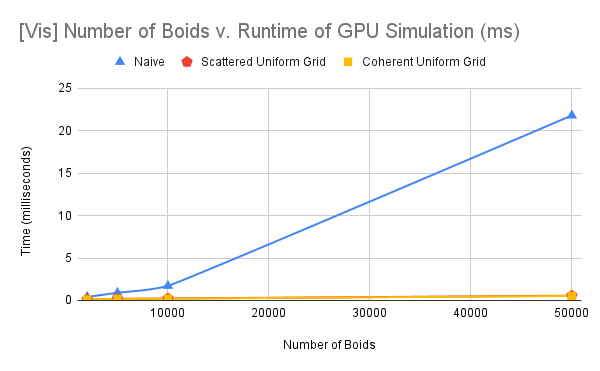 |
|:--:|

### Blocksize v. Entire GPU Simulation Runtime (ms)

**# of boids = 50000, no visualization, dt = 0.2**

| Blocksize      | Naive | Scattered Uniform Grid | Coherent Uniform Grid |
|----------------|-------|------------------------|-----------------------|
| 64             | ~22.1 | ~0.61                  | ~0.51                 |
| 128  (default) | ~22.9 | ~0.63                  | ~0.52                 |
| 256            | ~24.1 | ~0.64                  | ~0.52                 |
| 512            | ~23.3 | ~0.66                  | ~0.56                 |

| 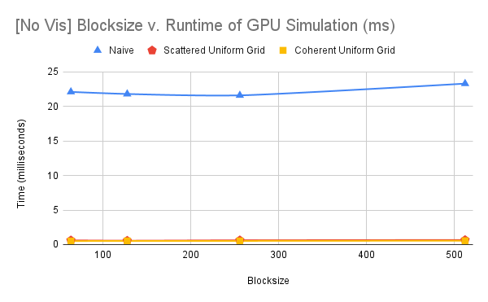 |
|:--:|

**# of boids = 50000, visualization, dt = 0.2**

| Blocksize      | Naive | Scattered Uniform Grid | Coherent Uniform Grid |
|----------------|-------|------------------------|-----------------------|
| 64             | ~22.2 | ~0.62                  | ~0.48                 |
| 128  (default) | ~21.8 | ~0.56                  | ~0.53                 |
| 256            | ~21.6 | ~0.62                  | ~0.53                 |
| 512            | ~23.7 | ~0.66                  | ~0.54                 |

| 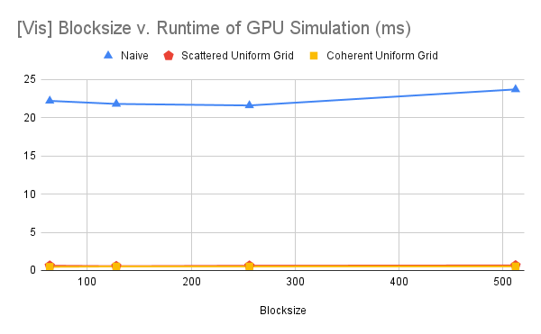 |
|:--:|

### 8 Neighbours v. 27 Neighbours, Neighbour Search (ms)

**# of boids = 5000, no visualization, dt = 0.2**

| # of Neighbours| Scattered Uniform Grid | Coherent Uniform Grid |
|----------------|------------------------|-----------------------|
| 8              | ~0.048                 | ~0.039                |
| 27   (default) | ~0.096                 | ~0.067                |

| 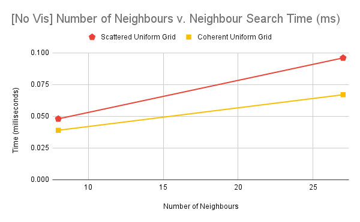 |
|:--:|

## 8 Neighbours v. 27 Neighbours, GPU Simulation Runtime (ms)

**# of boids = 5000, no visualization, dt = 0.2**

| # of Neighbours| Scattered Uniform Grid | Coherent Uniform Grid |
|----------------|------------------------|-----------------------|
| 8              | ~0.13                  | ~0.12                 |
| 27   (default) | ~0.16                  | ~0.14                 |

| 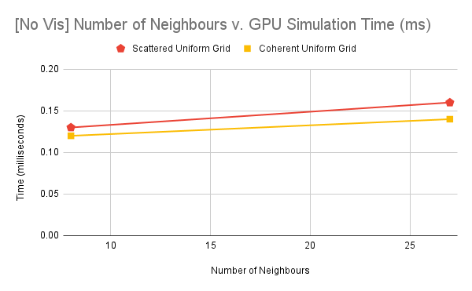 |
|:--:|

Again, the table and the graphs reinforce the runtime hypothesis that I mentioned at the beginning is proven to be true.

### Queries for Runtime

1. Changing the number of boids for the implementation naturally increases the runtime for every numerical increase. In the naive method, increasing the number of boids exhibits an exponential increase in the runtime of the simulation, while both scattered and coherent methods exhibit a much, much slower exponential increase of runtime. If you reference the tables and the graphs, we can see that coherent's line runs slightly below scattered method's line consistently, meaning that the rate of change for the coherent method is slightly slower than that of scattered. 

2. Changing the blocksize for each implementation does not experience much drastic change in runtime. Other than some minor variations on each runtime here and there, the overall trend for runtime stays flat, as the tables and the graphs portray. Naive, as always, is significantly higher of runtime than scattered and coherent, and that is to be expected. I notice though that for blocksizes on the extremes (e.g. blockSize = 64 and blockSize = 512), the runtime will increase for all methods of implementation in comparison to blockSize = 128 and blockSize = 256.  

3. Yes, the coherent uniform grid consistently has a better runtime than its scattered uniform grid counterpart. This is because the coherent method is constantly sorting the boids such that neighbours will always be near each other according to the cell index, making the individual threads not have to search so much in order to find the boids of influence. According to the data from the tables and the graphs above, coherent timings are around 15% - 25% faster than scattered. 

4. Yes, changing the check from 27 cells to 8 cells did indeed decrease the runtime for neighbour search and consequently the entire simulation run. This may be because with 27 cells to check, each boid may be checking neighbours that do not exist, leading to more loop iterations and memory lookup. However, 8 cell neighbour lookup may lead to reduced accuracy in the flocking simulation because instead of also checking z positions, it only checks the horizontal/vertical slice on the x and y axes, meaning that z position adjacent neighbour boids may be missed. So while 8 cell neighbour lookup is indeed slightly faster, it is not necessarily more efficient. 