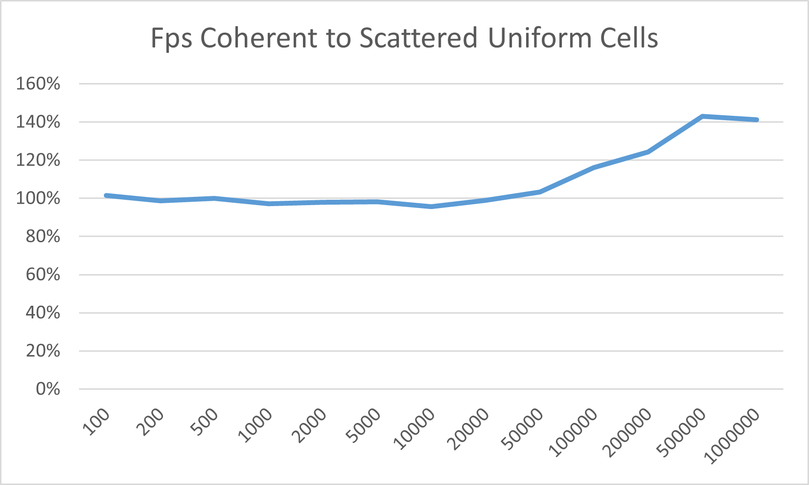
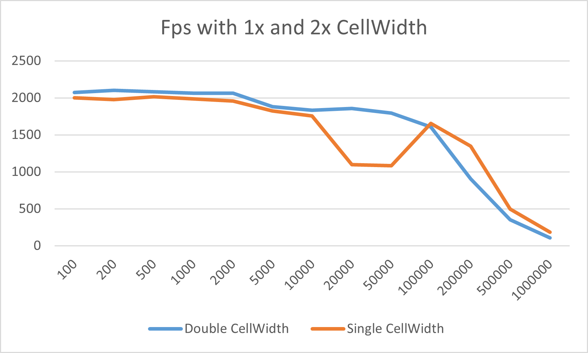
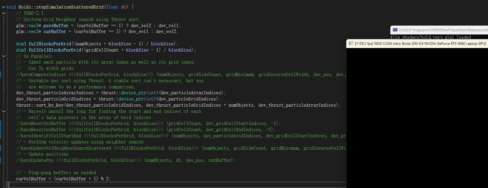
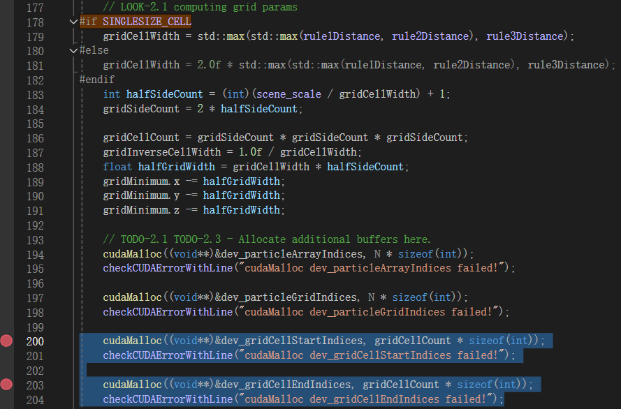
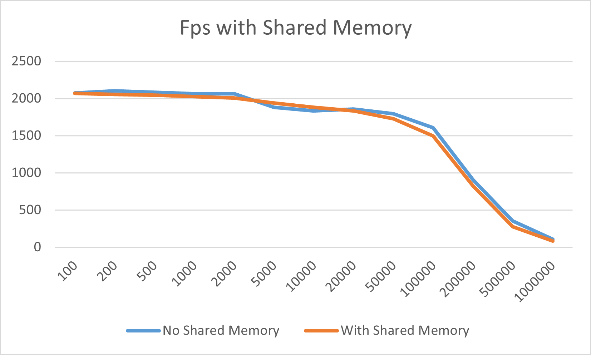

**University of Pennsylvania, CIS 5650: GPU Programming and Architecture,
Project 1 - Flocking**

-   Yu Jiang
    -   [LinkedIn](https://www.linkedin.com/in/yu-jiang-450815328/), [twitter](https://x.com/lvtha0711)
-   Tested on: Windows 11, Ultra 7 155H @ 3.80 GHz, 32GB RAM, RTX 4060 8192MB (Personal Laptop)

## Results

**100k boids**  
  
**500k boids**  

## Performance Analysis

### 1. Fps With Number of Boids

All these 3 implementations are tested in release build with blocksize of 128, visualization off, vertical sync off. Uniform Scattered Cells and Coherent Cells are using cellwidth = 2\*radius, which means 8 neighbor cells max.  
It is obvious that when number of boids(or particles) increases, the fps will decrease. For all implementations this is true.

-   For naive implementation, fps starts to decrease steeply when number of boids exceeds 500, this is because each boid needs to check every other boid to update its velocity, which means O(N^2) time complecity without parallel, and when count exceeds maximum number of threads excecuted at the same time, fps will decrease very steeply even with CUDA parallel.
-   For uniform scattered cell implementation, fps starts to decrease later than naive implementation, since it avoids searching for all other boids, instead we only search in 8 or 27 neighbor cells. When boid number < 50000, since we have about 22^3 = 10648 cells, there are few boids in one cell, so the bottleneck will be reading dev_gridCellStartIndices, dev_gridCellEndIndices global memory, which is irrelevant to boid number, that's why performance decrease slowly at this period, and it's also why fps is even lower than naive when we have really few boids(< 2000). But when boid number goes higher, reading dev_pos memory and computing those data will take more time than walking through cells, so the fps then starts to decrease steeper than before.
-   For uniform coherent cell implementation, there are little difference compared to uniform scattered cell when boid number < 50000, because we won't access boids very frequent (same as above), but the reordering itself requires performance, so the help of contiguous memory won't outperform the cost of reordering. But when boid number goes higher, there will be obvious more time cost on accessing dev_pos and dev_velocity memory, reordering resulting contiguous memory plus removing cost accessing dev_particleArrayIndices really improves performance than uniform scattered cell implementation.

### 2. Fps With Blocksize

|  |  |  |
| ----------------------------------------- | ----------------------------------------- | ----------------------------------------- |

Naive implementation is tested in release build with boid number = 10000, visualization off, vertical sync off.
Uniform Scattered Cell and Coherent Cell implementations are tested in release build with boid number = 100000, visualization off, vertical sync off.

for all 3 implementations, the fps will go up when blocksize goes from 32 to bigger values, and will go down when blocksize exceeds 512.

When blocksize goes from very small to a little bigger, there will be more warps in one block so it's better at hiding lantency. And at middle blocksizes (128/256/512), there's a balance between registers, shared memory and other resources so there are as many warps in one SM while available resources for each thread. And when blocksize gets even bigger, one block will requires more registers and more shared memory, which leads to less blocks running in one SM, thus less warps, so the occupancy will decrease at that time, so the performance will decrease when blocksize is too big.

Additionally, there will be some performance drop when blocksize is not devided by 32, because we have to arrange 1 warp for thread num less than 32, so there will be some additional warps but they are fully utilized.

### 3. Scattered vs Coherent

Both these implementations are tested in release build with blocksize of 128, visualization off, vertical sync off.

We can see from the plot that we can gain lots of performance from using coherent grid especially with large boid numbers. As covered in part 1, when boid number goes higher there will be obvious more time cost on accessing dev_pos and dev_velocity memory, so removing additional memory access and better memory continuity will significantly decrease the time cost when iterating over other boids.

You may notice that there's a little performance decreasing at < 10000 boids, on one hand it's because the bottle neck is checking cells rather than checking perticles and reordering itself has performance cost, on the other hand is that I's running this program on a "thin-laptop" where RTX4060 only have maxium 100 watts power limit, and 86℃ temp limit, so the GPU frequency will start to fluctuate after testing this program for several minutes, which leads to small performance gap between implementations with similar theoretical performance.

### 4. Single Radius Cellwidth vs Double Radius Cellwidth

Both these implementations are tested in release build with blocksize of 128, visualization off, vertical sync off.

At lower boid number, the performance of single cellwidth is a little bit lower than double cellwidth, but when there are more boids, then the performance of single cellwidth is better than double cellwidth.

We can find that, with double cellwidth, you are checking 8 \* (2\*2\*2) \* radius^3 = 64 \* radius^3 space, and with single cellwidth you are checking 27 \* (1\*1\*1) \* radius^3 = 27 \* radius^3 space. Therefore,

-   Double cellwidth: less cells to check, but potentially more boids to check
-   Single cellwidth: more cells to check, but potentially less boids to check

This computation fits perfectly with our data, because we have mentioned above that when number of boids is low, the bottleneck is at checking cells, and checking boids will be the bottleneck only at higher number. So with lower number of boids, Double cellwidth which check less cells is better, vice versa.

### 4.1 Strange falling when boid number is between 20000 - 50000, with single cellwidth?

Actually, I found the performance starts to decrease when Boid Number goes from **19584 to 19585**, you may think that's because blocksize or something related, because 19584 = 153 \* 128, but I found this has nothing to do with our kernels!!!

**Even we cut our code to have only thrust::sort_by_key, it still has only < 1200 fps!!!**  
And I also found that, if I comment out these cudaMalloc, the performance of thrust::sort_by_key will recover  
  
**But these two buffers are not related to thrust::sort_by_key's parameters at all!!!**
We can also see that with double cellwidth there's no problem for thrust::sort_by_key and these two cudaMallocs, the difference between single and double cellwidth for those two cudaMallocs, is gridCellCount is bigger for single cellwidth, so these cudaMallocs are allocating more spaces **But HOW the size of irrelevant buffers can infulence the performance of thrust::sort_by_key???**

**I guess** that this is because too big buffers takes up some GPU memory makes thrust::sort_by_key using some lowspeed memory or something like that, but the real reason is a question for the developers of thrust, since it is too hard for me to check the implementation detail of thrust, especially with my Nsight Compute broken😂

### 5. Extra Credit: Shared-Memory Optimization

For each block, each thread load one element in dev_pos into shared memory, then syncthreads, in update velocity part, if the other boid is in the same block, use shared memory pos, otherwise use global memory pos.  
The performance comparison is following:

For very low number of boids, the bottleneck will be at checking cells, so there will be no improvements, instead the \_\_syncthreads will have backward effects. For very high number of boids, there will be too much boids in one cell, so the boids in neighbor cells will definitely exceeds the size of blocksize, which makes lots of boids will fall back to loading from global memory, plus threads are sechduled in warps so those warps need to go both loading from shared and global memory (branch will be this), so the performance is also lower than without shared memory. Only with 5000-10000 boids, there is a balance between checking boid's position and the hit probability of sharedmemory, so there is a little improvement.

Personal idea: I think boid simulation is not suitable for using shared memory(at least using without changing the algorithm completely is not suitable), because even if we have reordering of the boids, boids in the same cell is distributing randomly (the data is kind of chaos, which is completely different from neat data like matrix multiplication), so which block those boids in neighbor cells belongs to are hard to figure out, so it's really hard (or need other advanced reodering algorithm) to load all required boids into shared memory, so the hit rate of shared memory is not graunteed.

### 5. Extra Credit: Grid-Looping Optimization

Use radius to compute the area of neighbor cells, and only looping in these cells instead of fixed 8 or 27 cells.  
This is applied in all uniform grid kernels.
