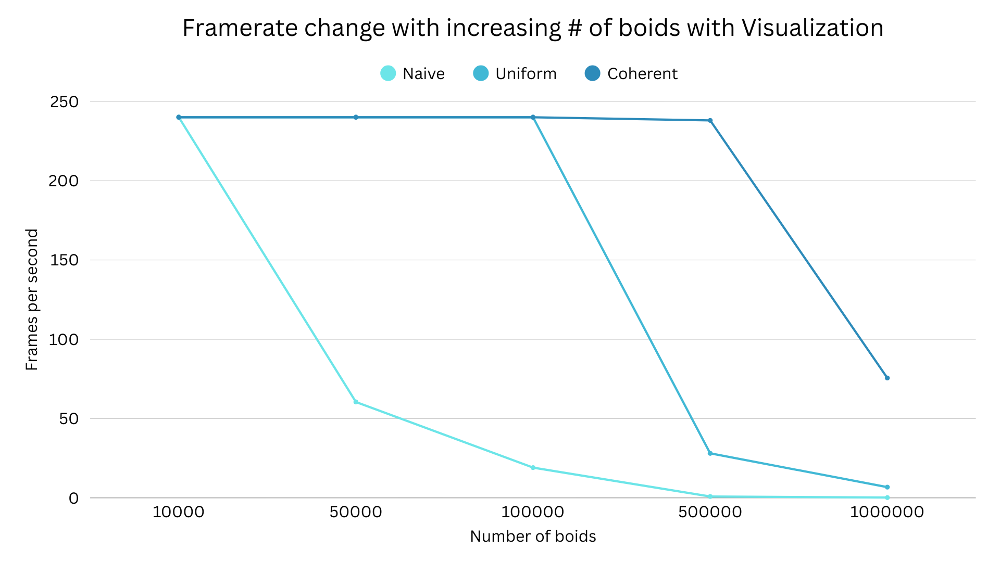
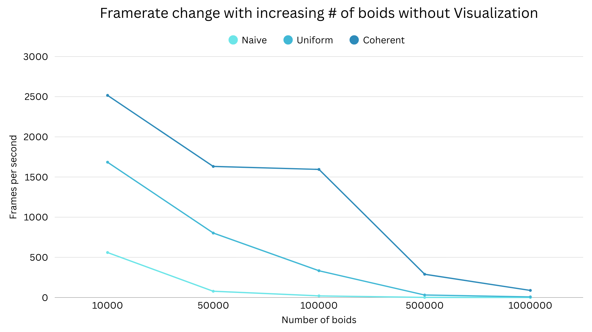
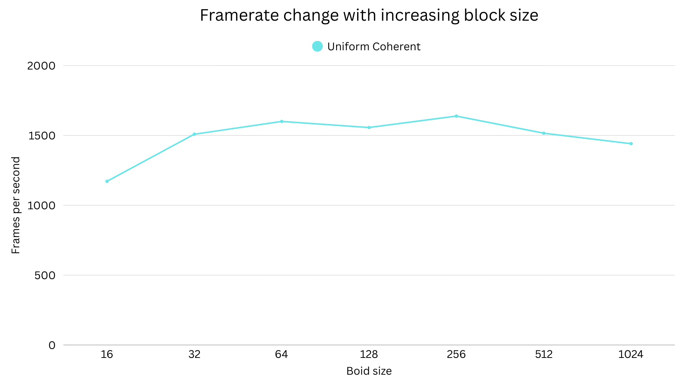
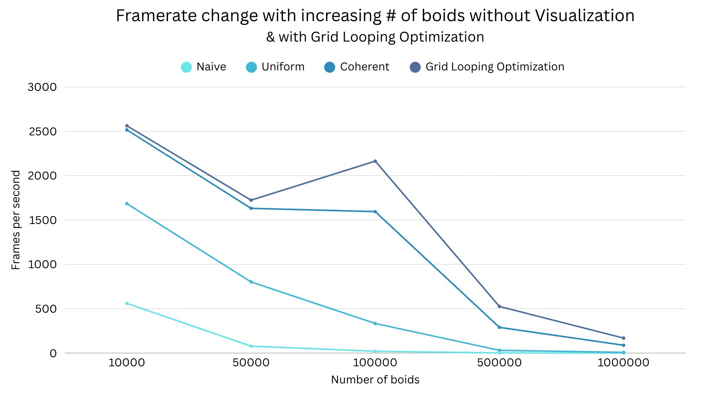

# **Project 1 - CUDA Flocking**
## **University of Pennsylvania, CIS 5650: GPU Programming and Architecture**

* Jefferson Koumba Moussadji Lu
  * [LinkedIn](https://www.linkedin.com/in/-jeff-koumba-0b356721b/)
* Tested on: Personal Laptop, Windows 11 Home, Intel(R) Core(TM) i9-14900HX @ 2.22GHz @ 24 Cores @ 32GB RAM, Nvidia GeForce RTX 4090 @ 16 GB @  SM 8.9 

<p align="center">
  
  <h1 align="center"><b>Welcome to the world of Boids!</b></h1>
</p>

## Overview

This project implements a massively parallel flocking simulation based on Reynolds' Boids algorithm using CUDA and the GPU. The implementation features three progressive optimization levels:

- Naive brute-force neighbor search: Each boid compares against all others with time complexity of (O(N²)).
- Uniform Grid spatial partitioning with scattered memory access: Bin boids into cells, sort by cell index, and only check nearby cells’ occupants.
- Coherent Grid with optimized memory layout: Like scattered, but reorders boid data in memory so neighbors are contiguous; improves memory coalescing and cache locality.
- Grid-Looping Optimization (Extra Credit) with dynamic search boundaries: removes the hard‑coded “8 or 27 neighbor cells” assumption and loops only over cells that actually intersect a boid’s interaction radius.

<p align="center">
     
  <p align="center">Visualization of 10,000 boids, 100,000 boids, and 1,000,000 boids from left to right and top to bottom</p>
</p>

## Techniques

### Naive

One CUDA thread per boid; each thread loops over all other boids and accumulates cohesion, separation, and alignment contributions per rule radius/scale

### Uniform grid scattered
Compute each boid’s grid cell index and sort (key = cell, value = boid index) using Thrust. Build gridCellStartIndices/gridCellEndIndices so each cell maps to a contiguous range in a sorted index buffer. Neighbor checks are limited to nearby cells (8 or 27, depending on grid width).

### Uniform grid (coherent)
After sorting, reorder positions/velocities into sorted order so cell members are also contiguous in the position/velocity arrays. This removes the extra indirection and yields coalesced memory access during the neighbor search kernel.

### Grid‑Looping Optimization (extra credit).
Instead of hard‑coding a list of neighbor cells (8 or 27), compute (per boid) the min/max cell indices along each axis that actually intersect the sphere of influence and loop only those cells. That is, bound your loop by (minCellX…maxCellX) × (minCellY…maxCellY) × (minCellZ…maxCellZ) for the current boid. It’s flexible and avoids unnecessary checks of far corner cells.


## Performance Analysis

### Impact of the Number of Boids on Performance

<p align="center">
  
  <p align="center">Framerate change with increasing number of boids for naive, scattered uniform grid, and coherent uniform grid with visualization</p>

<p align="center">
  
  <p align="center">Framerate change with increasing number of boids for naive, scattered uniform grid, and coherent uniform grid without visualization</p>

|   # Boids | Naive (Viz) | Naive (No Viz) | Uniform (Viz) | Uniform (No Viz) | Coherent (Viz) | **Coherent (No Viz)** |
| --------: | ----------: | -------------: | ------------: | ---------------: | -------------: | --------------------: |
|    10,000 |       240.1 |          559.9 |         240.0 |           1684.4 |          240.0 |            **2516.6** |
|    50,000 |        60.5 |           77.7 |         240.0 |            802.4 |          240.0 |            **1631.6** |
|   100,000 |        19.1 |           20.0 |         240.0 |            333.2 |          240.0 |            **1594.7** |
|   500,000 |         0.9 |            1.1 |          28.1 |             30.8 |      **238.0** |             **289.5** |
| 1,000,000 |         0.2 |            0.2 |           6.8 |              7.7 |       **75.6** |              **88.1** |

From the table, we can deduct that for performance, the lower number Boids is, the higher the FPS with or without visualization. 
- Naive declines sharply with N (quadratic work). At 10k, several hundred FPS; at 100k, tens; at 1M, ~0.2 FPS.
- Uniform (scattered) scales ~linearly with N (sort + limited neighbor checks). Hundreds to thousands of FPS for 10k–100k; tens for 1M.
- Coherent is the fastest at all N because coalesced memory reduces global memory traffic in the neighbor kernel.

With the rendering enabled, low counts are often vsync‑limited (~240 FPS on my setup). At higher counts, the compute becomes the bottleneck. We notice that coherent uniform remains much faster than the naive method, and significantly faster than scattered uniform at large N.

Coherent uniform achieves the highest simulation FPS at every size while the naive method collapses past ~50k boids. Turning viz off reveals true simulation throughput.

This makes sense since neighbor candidates are pruned by spatial binning (vs. O(N²)), and coherent access makes each candidate check cheaper.

### Impact of the Block Size and Block Count on Performance

<p align="center">
  
  <p align="center">Framerate change with increasing block size</p>

| Block size |     16 |     32 |     64 |    128 |    **256** |    512 |   1024 |
| ---------: | -----: | -----: | -----: | -----: | ---------: | -----: | -----: |
|        FPS | 1171.4 | 1508.7 | 1600.2 | 1556.8 | **1638.4** | 1515.9 | 1440.9 |

We can notice that the FPS peak around 256 threads/block on my RTX 4090 Laptop GPU and the framerate drops when the block size are too small or too big.

This can be explained by the fact that very small blocks under‑utilize warps and increase scheduling overhead while very large blocks reduce SM occupancy and may exhaust registers/shared memory, hurting latency hiding.

### Coherent uniform grid performance

Yes, coherent mode improved performance at medium and large N, which is what I expected. For example, we can see that at 10,000 boids, we have 2516.6 vs 1684.4 FPS, and at 100,000 boids we have 1594.7 vs 333.2 FPS.

By reordering positions and velocities so that boids in the same cell are contiguous, the neighbor kernel reads memory in a coalesced way. This reduces the number of global memory transactions per warp. The reorder costs extra work, so at very small N the benefit can be small or negative, but at scale the improvement dominates.

### 27 vs 8 neighboring cells

Using neighborhood‑sized cells (27 neighbors) did not slow things, often it was comparable or slightly faster. Although there are more cells to visit, each cell holds far fewer boids, so the total candidates can be lower than with 8 larger cells. The trade‑off depends on spatial distribution. With relatively uniform flocks, 27‑cell searches can reduce wasted distance checks while with highly clustered flocks, benefits shrink.

Performance depends on how many neighbors you actually evaluate, not just how many cells you loop over.

## Grid-Looping Optimization (Extra-credit)

### Goal
Goal: dynamically determine (minCell…maxCell) per axis that intersect the influence radius and iterate only those cells—no hard‑coded “8 or 27” list. 

See ```Boids::stepSimulationGridLoopOptimized``` and ```__global__ void kernUpdateVelNeighborSearchCoherentOptimized``` in kernel.cu.

To enable it, in main.cpp set:
```
#define UNIFORM_GRID 1
#define COHERENT_GRID 1
#define GRID_LOOP_OPTIMIZATION 1
```

<p align="center">
  
  <p align="center">Framerate change with increasing number of boids for naive, scattered uniform grid, and coherent uniform grid without visualization</p>

|   # Boids | **Grid‑Looping Optimized (FPS)** |
| --------: | -------------------------------: |
|    10,000 |                       **2562.9** |
|    50,000 |                       **1723.8** |
|   100,000 |                       **2163.9** |
|   500,000 |                        **525.5** |
| 1,000,000 |                        **168.4** |


When the radius intersects fewer than the full 3×3×3 set, we skip empty/out‑of‑range cells, reducing per‑boid work while keeping correctness

We can observe that Grid-Looping outperforms standard uniform coherent. 

At 10k–100k, Grid‑Looping does better than standard coherent grid by a healthy margin. Since fewer cells actually intersect, we have fewer candidate checks.

At 500k–1M, the gains narrow. Most nearby cells contain boids, sort/reorder costs dominate, and total neighbor counts are high regardless. It still performs better than uniform coherent grid at 1M (~168 FPS vs ~88 FPS) with a smaller gap.
