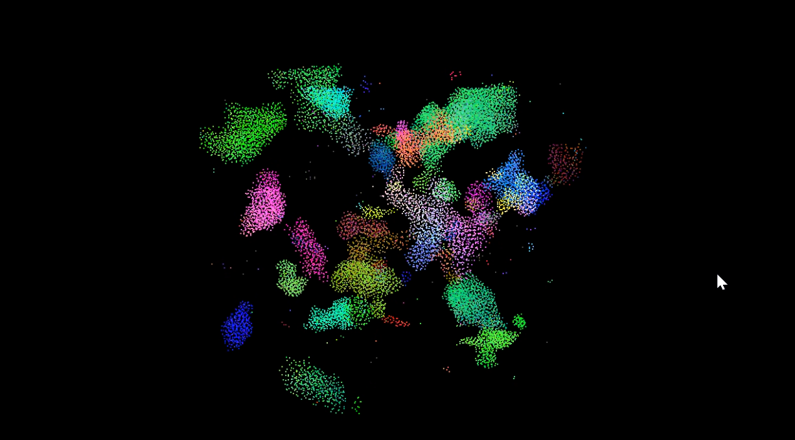
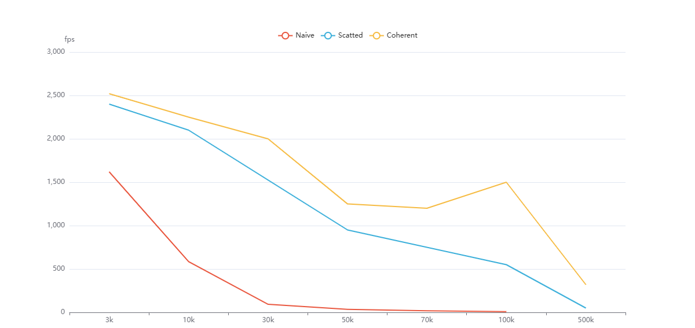
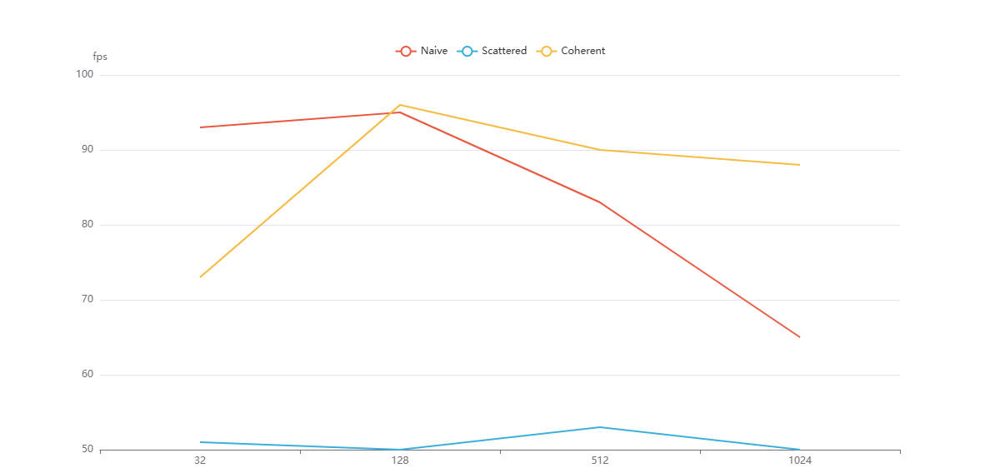
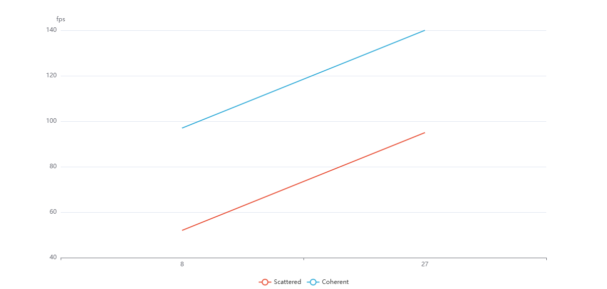

**University of Pennsylvania, CIS 5650: GPU Programming and Architecture,
Project 1 - Flocking**

* Bryce Joseph
* [LinkedIn](https://www.linkedin.com/in/brycejoseph/), [GitHub](https://github.com/brycej217)
* Tested on: Windows 11, Intel(R) CORE(TM) Ultra 9 275HX @ 2.70GHz 32.0GB, NVIDIA GeFORCE RTX 5080 Laptop GPU 16384MB

# CIS 5650 Project 1 - Boids

These are some gifs and screenshots of my boids implementation.

We can also increase the boids count, this one representing 100000 boids!

## Analysis
This boids implementation was tested on the machine specifications listed above with several configurations.

1. Number of Boids

As seen above the performance decreases with the number of boids being simulated. It increases most sharply for the naive implementation, likely due to the fact that checking every boid against one another becomes an exponential problem, 
one that the uniform and coherent grid implementations attempted to remedy, and as seen the dropoff in performance for these two becomes linear rather than logarithmic. Still as the number of boids increases the number of potential boids in 
each cell also increases, which causes performance issues for these implementations later on as well.

2. Block Size

As seen above the performance of the naive implementation was affected by block size, both too small a block size and too large a block size caused performance decrease, while block size did not seem to affect the performance of the uniform grid 
or coherent grid implementations. It is possible that with few too blocks, an SMs resources are not being fully utilized as we have partial warps being housed on the SMs. This can likely cause thread idling. On the other hand, too large a block size 
can likely cause resources to clog, hogging registers/shared memory. The uniform and coherent aren't as affected likely because these implementations only check local neighbors.

3. Coherent Grid Performance Gain
The coherent grid did not lead to any performance gain, but rather in its worst cases lead to performance decrease as compared to the uniform grid. This can be seen in the various charts above, the coherent grid performing worse at first, 
then following the performance dropoff of the uniform grid as the boid count increases. This was unexpected, as it would seem that more coherent memory access would lead to better performance, however, it seems that the overhead involved with 
the implementation offsets any potential benefits until the boid count increases, at which point the implementation seemingly performs just as well as the uniform grid.

4. 27 vs 8 Neighboring Cell Check

| Cell Counts | Uniform FPS | Coherent FPS |
|-------------|-------------|--------------|
| 8           | 2208.88     | 1509.68      |
| 27          | 1720.43     | 1476.28      |

As seen by the above data, checking more neighbors seemed to affect the uniform grid implementation more than the coherent implementation. By increasing the number of cells we check, we increase the total number of candidate boids that we need to check 
within those cells. The performance decrease then comes from the memory reads that must be performed in order to find the candidate's position and velocity data. With the coherent implementation, the cost of these memory accesses is less as we are able to 
iterate likely a few adjacent segments in memory rather than the random reads of the uniform implementation. Then, the cost of the memory read operation itself can be seen to be lessened by the coherent grid implementation.

### Extra Credit
I implemented the grid-looping optimization for the uniform/coherent implementations.