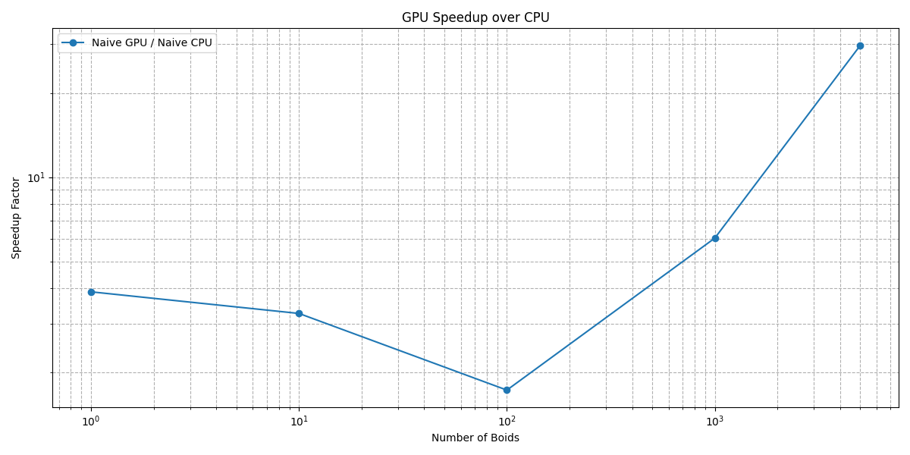
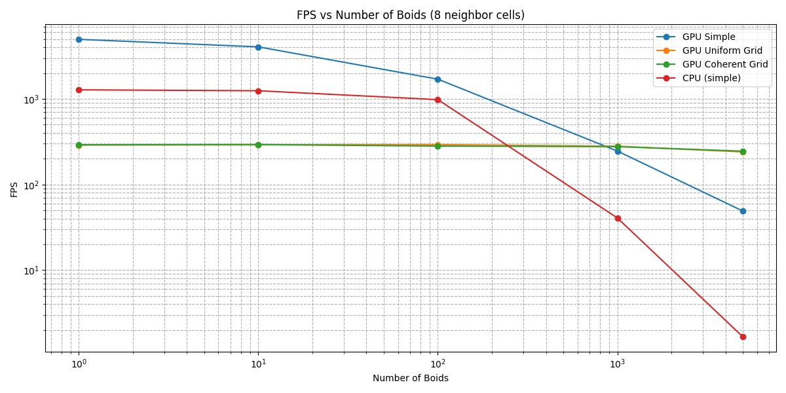
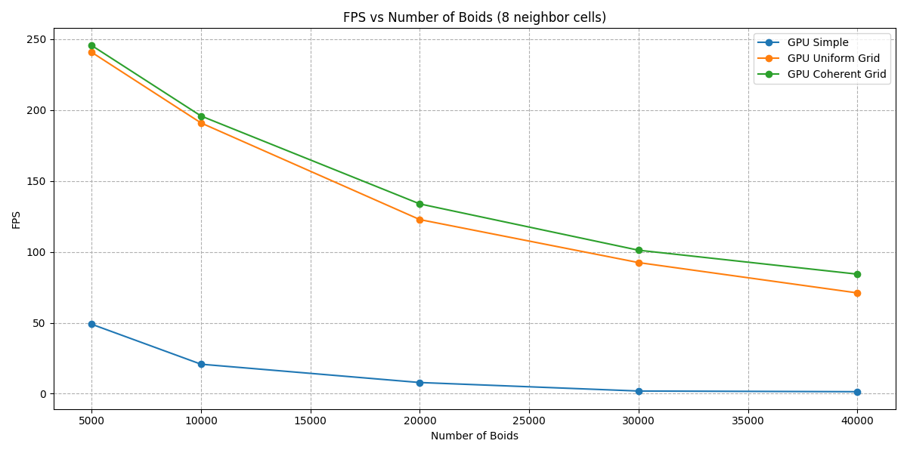
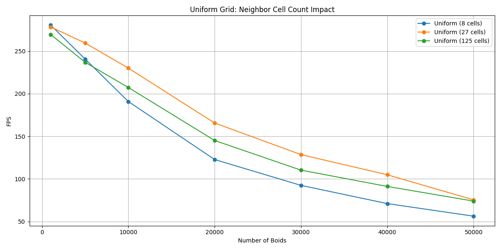
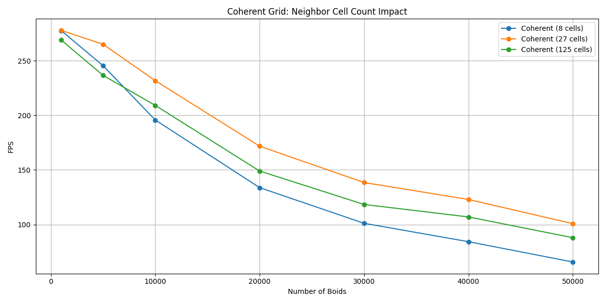
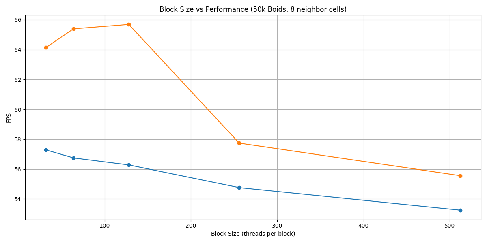
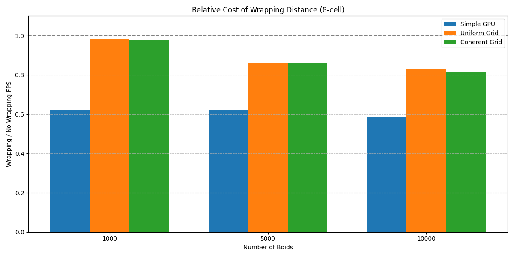

**University of Pennsylvania, CIS 5650: GPU Programming and Architecture, Project 1**

* Yannick Gachnang
  * [LinkedIn](https://www.linkedin.com/in/yannickga/)
* Tested on: Windows 10, EPYC 9354 @ 3.25GHz, 16GB RAM, RTX 2000 Ada 23GB VRAM

Project 1 CUDA Flocking
====================

## Implementation

As per the project instruction, I implemented three different Boid flocking simulations.
But there were some additional things I decided to implement for the sake of completeness and to get more information for the performance testing.

### Naive

In the naive version, we launch a kernel for each boid in which we iterate over all the other boids. Then we calculate the pairwise distance between all of them and check to see if any of the interaction rules need to be applied.
We can then apply the rules as per the pseudo-code in the instructions. Later down the line, I changed the distance calculation to use the squared distance using `glm::dot` because this way we avoid the `sqrt` operation which is expensive (and improved performance here by about 10%).

### Uniform Grid

Calculating the distance between each pair of boids is expensive with $O(n^2)$ time complexity. But we can assign all boids into the cells of a uniform grid and then we only need to check neighboring grid cells.
At `cellWidth >= 2 * maximumInteractionDistance`, we can get away with only checking 4 cells in total in 2D and 8 cells in 3D. For anything between `2 * maximumInteractionDistance > cellWidth >= maximumInteractionDistance`, we need to check 27 cells and for anything below that we need to check even more.
I will investigate the effect this has on performance later on in the performance section.

### Coherent Grid

The uniform grid approach cuts out a lot of unnecessary computation (in exchange for a slightly bigger memory footprint). But for the coherent grid, instead of only sorting the arrays that keep track of which grid cell a boid is located in, we directly sort the boid data for better memory coherence.
In theory this should improve performance even further, which is also something I investigate in the performance section.

### CPU Version

For the sake of completeness, I also implemented a naive CPU version to see what the approximate scale of the difference is when moving from CPU to GPU for a simulation like this.

### Periodic Boundary Conditions

Aside from using the squared distance for slightly faster computation, I wasn't sure whether the distance calculation and grid calculations should wrap around the seemingly periodic boundary.
Therefore I implemented both versions which can be toggled between using the `periodicDistance` variable in `kernel.cu`.

---

## Performance Testing

### Testing Methodology

For all performance testing I turned off visualization (`#define VISUALIZE 0`). Each run consisted of a 50 frame warmup and then precisely 1000 frames of simulation. I averaged the results over three runs to smooth out any noise.  
The measurements are in frames per second (FPS). For reference I also included a naive CPU version, but I stopped testing that one after 5000 boids because it became too slow to be practical.  

### CPU vs GPU Scaling

The first test was to get a direct comparison between the naive CPU and naive GPU versions. I ran this from 1 boid up to 5000 boids.

The CPU version falls off immediately. At 1000 boids it is already down to ~40 FPS and past 5000 boids it doesn't run withing a reasonable time anymore. The GPU version is still quadratic so the performance also falls off but not as much. At 1000 boids the GPU naive version is at ~246 FPS compared to ~40 FPS on CPU, which is already about a 6× speedup. By 5000 boids the GPU is still at ~49 FPS while the CPU has dropped to ~1.7 FPS, which comes out to almost a 30× speedup.  

### GPU Scaling

Next I compared only the GPU versions. Here I started at 5000 boids since the results below that are just dominated by overhead.

The simple GPU version holds up for a while but then quickly becomes unusable once we move past 10k boids. At 50k boids it is running at less than 1 FPS. The grid-based versions scale much better. The uniform grid is at ~56 FPS and the coherent grid is at ~66 FPS at 50k boids. Both versions stay relatively constant at around 290 FPS for very small boid counts (although uniform grid maintains a slight lead), but once the number of boids goes up the grid approaches clearly win. And the higher the boid count, the more the coherent grid approach tends to win compared to the uniform grid.

  
Raw Data

  
| # Boids | CPU (Simple) | GPU Simple | GPU Uniform Grid | GPU Coherent Grid |
| ------- | ----------- | --------- | ---------------- | ----------------- |
| 1       | 1279.04     | 4977.19   | 289.259          | 291.61            |
| 10      | 1247.77     | 4064.23   | 291.103          | 293.111           |
| 100     | 982.914     | 1703.77   | 292.752          | 281.58            |
| 1000    | 40.6428     | 246.089   | 280.477          | 277.506           |
| 5000    | 1.65784     | 48.9675   | 240.654          | 245.447           |
| 10000   | 0           | 20.789    | 190.832          | 195.736           |
| 20000   | 0           | 7.88235   | 122.728          | 133.772           |
| 30000   | 0           | 1.894     | 92.4222          | 101.134           |
| 40000   | 0           | 1.4212    | 71.0492          | 84.2812           |
| 50000   | 0           | 0.763     | 56.2822          | 65.6937           |
  

### FPS vs Neighbor Cell Count

I then tested the effect of different neighborhood sizes. I tested 8 cells, 27 cells, and 125 cells for both the uniform grid and the coherent grid. (Where 8 cells correspond to `cellWidth = 2 * maxDist`, 27 cells correspond to `cellWidth = maxDist` and 125 cells correspond to `cellWidth = 0.5 * maxDist`).

At small boid counts the 8-cell version is slightly faster, but once the boid count increases the 27-cell version becomes the best option. At 10k boids the uniform grid runs at ~230 FPS with 27 cells compared to ~191 FPS with 8 cells. At 50k boids the coherent grid with 27 cells is at ~101 FPS compared to only ~66 FPS with 8 cells. The 125-cell version usually sits in between. It often beats 8 cells at high boid counts but is slower than the 27-cell version. While the project instructions tells us to use an 8 cell version, 27 neighbor cells seems to be the sweet spot here. I believe this is because with overly large cells, we have more volume where boids can reside that are not in the interaction radius. But smaller cells require more iterations to go through so that we end up striking a balance between these two factors at 27 cells. 

  
Raw Data

| # Boids | Uniform (8 cells) | Uniform (27 cells) | Uniform (125 cells) | Coherent (8 cells) | Coherent (27 cells) | Coherent (125 cells) |
| ------- | ----------------- | ------------------ | ------------------- | ------------------ | ------------------- | -------------------- |
| 1000    | 280.477           | 278.347            | 269.481             | 277.506            | 277.683             | 268.857              |
| 5000    | 240.654           | 259.454            | 236.83              | 245.447            | 265.044             | 236.563              |
| 10000   | 190.832           | 230.032            | 207.283             | 195.736            | 231.7               | 209.085              |
| 20000   | 122.728           | 165.603            | 145.092             | 133.772            | 171.717             | 148.967              |
| 30000   | 92.4222           | 128.545            | 110.301             | 101.134            | 138.433             | 118.376              |
| 40000   | 71.0492           | 104.86             | 91.1693             | 84.2812            | 122.943             | 106.946              |
| 50000   | 56.2822           | 75.4032            | 73.9626             | 65.6937            | 100.785             | 87.9425              |
  

### FPS vs Block Size

I also tested the effect of block size. I used 50k boids and the 8-cell configuration for both the uniform and coherent grid. I tested block sizes of 32, 64, 128, 256 and 512.

For the uniform grid the results are basically flat across all block sizes, going from ~57 FPS at 32 threads to ~53 FPS at 512 threads. This indicates that performance here is dominated by scattered memory access rather than scheduling. I tried to profile the kernels to confirm whether this was the case for the uniform grid implementation using both Nsight Systems and Nsight Compute.
Nsight Systems only gave me timeline information without the memory throughput and occupancy metrics I needed. Nsight Compute unfortunately kept crashing (like in Project0), so I wasn’t able to see the occupancy or memory throughput. Because of this I can’t verify whether the memory access is the bottleneck, but the flat performance across block sizes for the uniform grid still strongly suggests that scattered memory access is the limiting factor here. For the coherent grid the block size actually makes a difference. It peaked at ~66 FPS with 128 threads per block and then dropped down again to ~55 FPS at 512 threads. This is more in line with what I expected, since small blocks tend to underutilize the GPU and large blocks tend to reduce occupancy.  

  
Raw Data

  
| Block Size | Uniform Grid | Coherent Grid |
| ---------- | ------------ | ------------- |
| 32         | 57.2895      | 64.1438       |
| 64         | 56.753       | 65.3993       |
| 128        | 56.2822      | 65.6937       |
| 256        | 54.763       | 57.7447       |
| 512        | 53.2541      | 55.5632       |
  

### FPS vs Wrapping Distance

Finally I tested the effect of calculating distance with periodic wrapping across the simulation boundary. I compared this against the standard distance calculation for the simple GPU version, the uniform grid, and the coherent grid. For all of these tests I used the 8-cell neighborhood configuration.

Despite some optimizations, the simple GPU version suffers the most from wrapping. At 1000 boids it drops from ~246 FPS to ~153 FPS and at 10k boids it goes from ~21 FPS to ~12 FPS. This makes sense since every extra branch in the distance check is executed $O(n^2)$ times. The uniform and coherent grid versions are hit less hard. At 10k boids the uniform grid drops from ~191 FPS to ~158 FPS and the coherent grid drops from ~196 FPS to ~160 FPS. The overhead is still there but since the number of distance checks is reduced by the grid, the effect is smaller. Overall, wrapping clearly adds extra cost, but the impact is only severe in the naive version. For the grid-based approaches the FPS loss is noticeable but not catastrophic. The intent behind adding this was to have a more "correct" implementation (since if the boids can move across the simulation boundaries, that implies a periodic simulation box), but I can't comment on how useful this actually is since the visual result doesn't show any meaningful differences between the two approaches.

  
Raw Data

| # Boids | Naive GPU (wrap) | Uniform Grid (wrap) | Coherent Grid (wrap) |
|---------|------------------|----------------------|-----------------------|
| 1000    | 153.47           | 275.796              | 271.108               |
| 5000    | 30.4568          | 206.807              | 211.191               |
| 10000   | 12.1871          | 157.989              | 159.727               |

  

---

## Q&A

**Q: For each implementation, how does changing the number of boids affect performance? Why do you think this is?**
A: On the CPU version, the performance falls off a cliff almost immediately. At around 1k boids it is already only ~40 FPS and after that it becomes unusable.
This makes sense since the time complexity is $O(n^2)$. On the GPU the simple version holds up a bit longer but it still drops very quickly once you get into the tens of thousands of boids, because it is still quadratic.
In comparison, the uniform and coherent grid versions scale much better. The FPS goes down roughly linearly with the number of boids and even at 50k boids the coherent grid still runs at about 100 FPS.
At small boid counts the grid versions sit at around 290 FPS no matter what because the kernel launch and memory overheads dominate. But once the boid count goes up the advantage of the grid approach becomes very clear.

**Q: For each implementation, how does changing the block count and block size affect performance? Why do you think this is?**
A: I tested 32, 64, 128, 256 and 512 threads per block at 50k boids. The uniform grid was basically flat in performance across all of them.
For the coherent grid the block size actually made a difference. It peaked at 128 threads per block and then dropped down at 512 threads. This is more in line with what I was expecting.
If the block size is too small you don’t get enough work per SM, but if it is too large you lose occupancy. The uniform grid doesn’t really show this because memory access is scattered and memory bandwidth is likely the bottleneck, so changing block size doesn’t really matter.

**Q: For the coherent uniform grid: did you experience any performance improvements with the more coherent uniform grid? Was this the outcome you expected? Why or why not?**
A: Yes, the coherent version is almost always faster than the scattered version, and the difference gets larger as the boid count goes up. With 8-cell neighborhoods the coherent grid is ~16% faster at 50k boids (65.7 vs 56.3 FPS). This is what I expected since the memory access is more coalesced when boids in the same cell are stored next to each other.
At small boid counts it doesn’t really matter because the overhead dominates, but at high boid counts it clearly makes a difference.

**Q: Did changing cell width and checking 27 vs 8 neighboring cells affect performance? Why or why not?**
A: Yes, and the effect is the opposite of what I expected. At low boid counts the 8-cell neighborhood is a bit faster, but once the boid count goes up the 27-cell version clearly pulls ahead.
The reason I suspect is that with smaller cells you check more of them, but each one contains fewer boids, so you end up doing fewer distance checks overall. 

