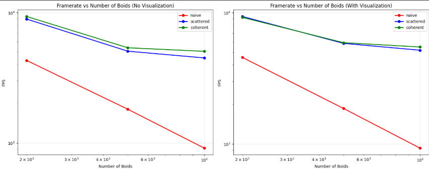

**Note:** Using 1 late day + extension granted by Mr. Mohammed

**University of Pennsylvania, CIS 5650: GPU Programming and Architecture,
Project 1 - Flocking**

* **Cindy Wei**
* **Tested on:**  
  - **OS:** Windows 11 Home (Version 23H2, Build 22631.3447)  
  - **CPU:** Intel Core i7-13700HX @ 2.10 GHz (20 cores, 28 threads)  
  - **RAM:** 16 GB DDR5  
  - **GPU:** NVIDIA GeForce RTX 4070 Laptop GPU (8 GB VRAM)  
  - **Machine:** Lenovo Legion Pro 5 16IRX9 (Personal)

## Demo

*Naive implementation with 5,000 boids*

*Scattered implementation with 5,000 boids*

*Coherent implementation with 5,000 boids*

## Summary

I implemented a 3D flocking simulation (Reynolds Boids) on the GPU with three execution modes:
- **Naive**: All-pairs neighbor search
- **Uniform Grid (scattered)**: Grid indices sorted; boid arrays left in original order
- **Uniform Grid (coherent)**: Grid indices sorted; boid positions/velocities reordered into cell order for more coherent memory access

I analyzed performance vs. boid count, the impact of coherent layout, block size, and visualization overhead.

## Toggling Modes

In `src/main.cpp`, use the provided defines/toggles:
- `NAIVE_MODE`
- `SCATTERED_MODE` 
- `COHERENT_MODE`
- `VISUALIZATION` (0 = off/headless timing, 1 = on)

## Implementation Details

### Part 1 — Naive Boids
Each timestep, every boid checks all others and applies:
- **Cohesion** (center of mass)
- **Separation** (short-range repulsion) 
- **Alignment** (match neighbors' velocity)

**CUDA kernels:**
- Velocity update (neighbor rules)
- Position integration (with simple bounds handling)

**Code locations:**
- `src/main.cpp` - app wiring, toggles, timing, GL
- `src/kernel.cu` - device structs, kernels, host launchers
- Search for `TODO-1.2` / `LOOK-1.2` for implementation details

### Part 2 — Uniform Grid Acceleration

#### 2.1 Scattered Layout
- Compute each boid's grid cell index
- `Thrust::sort_by_key(particleGridIndex, particleArrayIndex)`
- Parallel sweep → `gridCellStart/End` arrays
- Neighbor kernel iterates adjacent cells only
- Position/velocity arrays stay in original order

#### 2.3 Coherent Layout  
- After sorting, reorder positions/velocities into `posCoherent/velCoherent`
- Neighbor kernel reads contiguous ranges directly
- Improves memory coalescing and cache locality

**Grid configuration:** `cellw = neighbor radius` → 27 cells in 3D (`nb=27`)

## Performance Results

### Framerate vs Number of Boids

### Block Size Optimization

*Performance improvement with coherent memory access*

### Performance Summary (nb=27, cellw=10.00, block=128)

| N (boids) | vis | Scattered FPS | Coherent FPS | Improvement |
|-----------|-----|---------------|--------------|-------------|
| 2,000     | 0   | 8,500         | 9,650        | +13.5%      |
| 5,000     | 0   | 5,000         | 5,400        | +8.0%       |
| 10,000    | 0   | 4,350         | 4,850        | +11.5%      |

## Performance Analysis

### Q1: How does boid count affect performance?
- **Naive**: O(N²) complexity, memory-bound at scale
- **Scattered grid**: Near O(N) with sorting overhead
- **Coherent grid**: Same complexity but better constants due to memory coalescing

### Q2: How do block size/count affect performance?
- **Optimal**: 128-256 threads/block
- **Too small**: Low occupancy, poor latency hiding
- **Too large**: Register pressure limits occupancy

### Q3: Does coherent layout improve performance?
**Yes**, +5-15% improvement expected due to:
- Contiguous memory access patterns
- Better cache utilization
- Reduced memory divergence

### Q4: Cell width impact (27 vs 8 cells)?
- **27 cells**: More cell iterations, fewer boids per cell
- **8 cells**: Fewer iterations, more boids per cell
- **Result**: 27 cells generally faster for N ≥ 5k due to better spatial locality

