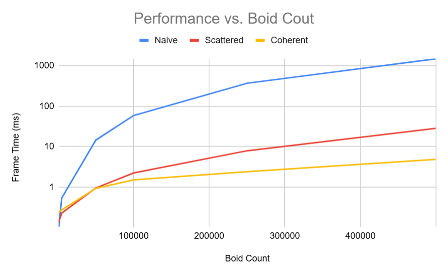
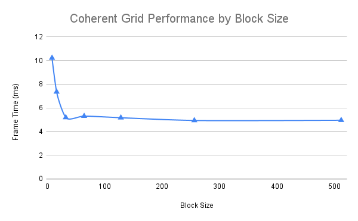

# CUDA Boids Implementation

This project is part of the University of Pennsylvania **CIS5650 – GPU Programming and Architecture**. It implements CUDA boids with three strategies: **Naive**, **Uniform Grid with Scattered Memory**, and **Uniform Grid with Coherent Memory**.

The project requires an NVIDIA graphics card to run.

# Performance Evaluation

## Boid Count

All three strategies were tested across increasing boid counts to evaluate their ability to scale.

### Data

### Findings

#### Best Overall: Coherent Uniform Grid

As expected, strategies that use a uniform grid to limit neighbor searches scale significantly better than the Naive strategy. The uniform grid outperforms Naive by restricting the search to boids in adjacent cells. Ensuring memory coherence further improves the uniform grid’s performance.

#### Exception: Naive Performs Best at Low Boid Counts

Surprisingly, the uniform grid strategy performed worse at the lowest boid count in the test (1000 boids). Inspecting individual kernel timings shows that the overhead of computing grid indices and sorting outweighs the benefits of the uniform grid at this scale.

Kernel Performance (Avg over 500 frames)
| Metric          | Naive        | Scattered    | Coherent     |
| --------------- | ------------ | ------------ | ------------ |
| `computeIndices`  | n/a          | 0.005 ms     | 0.005 ms     |
| `updateVelocity`  | 0.101 ms     | 0.020 ms     | 0.023 ms     |
| `updatePos`       | 0.004 ms     | 0.030 ms     | 0.024 ms     |
| `sortByKey`       | n/a          | 0.104 ms     | 0.230 ms     |
| `identifyCell`    | n/a          | 0.012 ms     | 0.017 ms     |
| **Total (GPU)** | **0.105 ms** | **0.171 ms** | **0.299 ms** |

## Block Size

Changing the block size alters the number of threads per block. Because each streaming multiprocessor (SM) can execute a limited number of threads at once (1024 on Ada Lovelace GPUs), block size also affects how many blocks can reside on an SM.

### Data

### Findings

#### No Performance Change with Regular Block Sizes (> 32)

There was no notable performance change with larger block sizes. This is expected because, regardless of block size, the GPU can schedule about 1024 threads’ worth of blocks per SM. This may not hold if each kernel has higher memory requirements; in that case, blocks per SM could become memory-bound, hurting performance.

#### Performance Decrease with Small Block Sizes (< 32)

Performance is worse with very small block sizes. Since 32 threads form a warp, the smallest unit of concurrent execution on the GPU, using a block size below 32 leaves the remaining threads in the warp inactive.

## Scattered vs. Coherent Memory

## Scattered vs. Coherent Memory

In the velocity-update kernel, we access positions and velocities of neighboring boids. The coherent memory strategy improves locality during this computation, which improves overall performance. See the **[Boid Count](#boid-count)** results. 

## Cell Width and Performance

### Data

| Cell width | 2×ruleDistance | 1×ruleDistance |
| ---------: | -------------: | -------------: |
|   Coherent |          4.986 |          3.491 |

### Findings

Changing the cell width alters how many neighboring cells must be queried to find neighbors. Larger cells require querying fewer,but larger, cells, whereas smaller cells require querying more,but smaller,cells.

In these tests, smaller cell width led to better performance. With smaller cells, most boids in the queried cells are close enough to influence the current boid. Conversely, larger cells include more boids outside the influence range, leading to wasted computation.

---

* Jacky Park

  * [LinkedIn](https://www.linkedin.com/in/soominjackypark/), [personal website](https://jackypark.com/)
* Tested on: Windows 11, i9-13900H @ 2.60, 32 GB, RTX 4070 Laptop GPU 8 GB (Personal Laptop)
