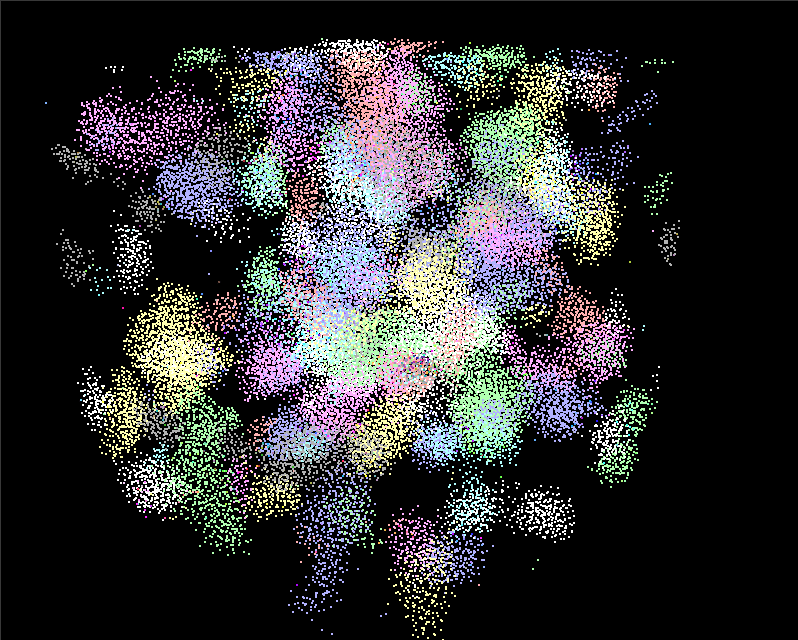
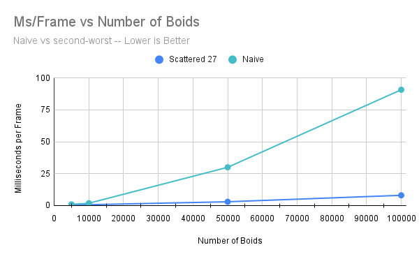
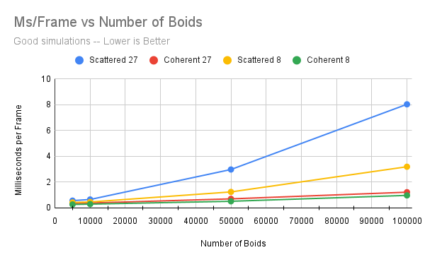
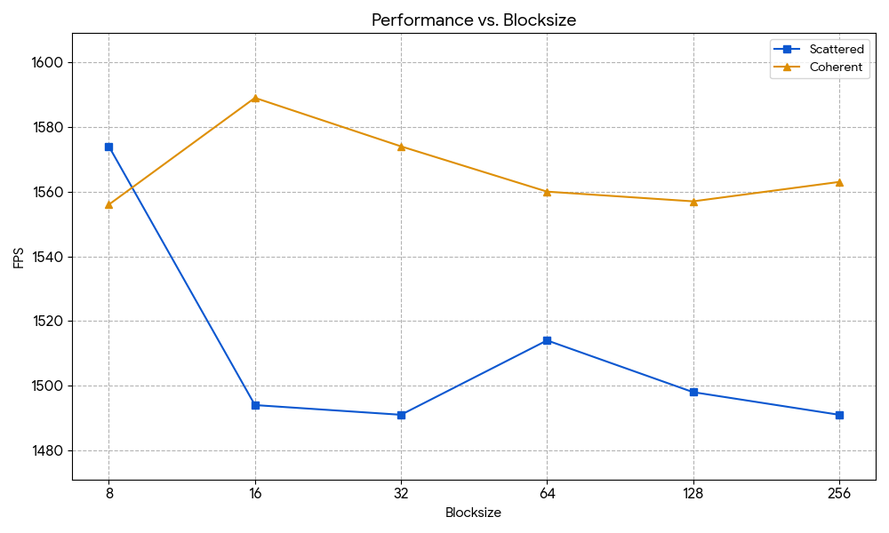

**University of Pennsylvania, CIS 5650: GPU Programming and Architecture,
Project 1 - Flocking**

* Nicholas Liu
  * [Linkedin](https://www.linkedin.com/in/liunicholas6/)
* Tested on: Linux Mint 22 Wilma, AMD Ryzen 7 5800X @ 2.512GHz, 32GB RAM, GeForce GTX 1660 Ti

## Performance Analysis
I used the difference in the GLFW timer before and after the simulation method (which happens once per frame) in order to get my benchmarks.

For each sample, I the ms/frame that I report is an average over a particular 1024 frame window. I know most people have been using fps as their metric, but I think that seconds per frame is a bit easier to interpret.

### Different Boid Counts

All of the following simulations were done at a block size of 128

I arbitrarily chose to let each sim run for 2 minutes, in the interest of making sure each sim had more or less converged into flocks. This seemed to be the case well before the 2 minute mark for all simulations except for the naive algorithm at larger boid counts (which was, as expected, by far the least efficient of the algorithms)

In the naive algorithm, the times for all the number of memory reads done by each thread increases by a linear factor already, and the number of threads dispatched also increases by a linear factor; thus the performance as a function of number of boids is expected to be far worse than linear

Similarly, the time for both the scattered and coherent grid is roughly linear (only slightly worse). We would only expect the number of memory accesses per grid cell to increase roughly linearly once the number of boids is on the same order of magnitude as the number of grid cells, but for the smaller numbers that our GPU can actually compute, each lane more or less just accesses other boids within the flock.

Generally, searching for 8 neighbors always outperformed searching all 27 neighbors. The 8 neighbor check only uses a very marginal amount of extra compute to access less global memory in a memory-bottlenecked program, and therefore is essentially a free optimization.

### Different Block Sizes

I tested different block sizes using the 8-cell coherent grid

For very small block sizes, we see very bad efficiency -- when a block is smaller than a warp, we lose parallelism, so we want our blocks to be of at least size 32. Beyond that, the block sizes all perform about equally efficiently and differences in runtime can likely be accounted for by variance.

