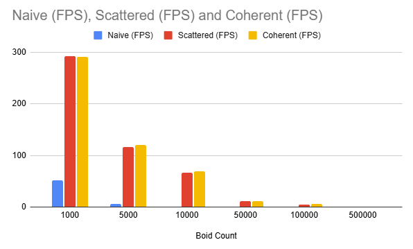
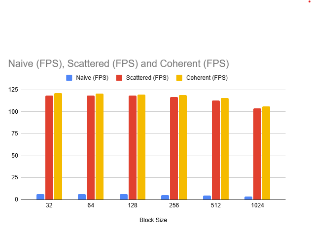
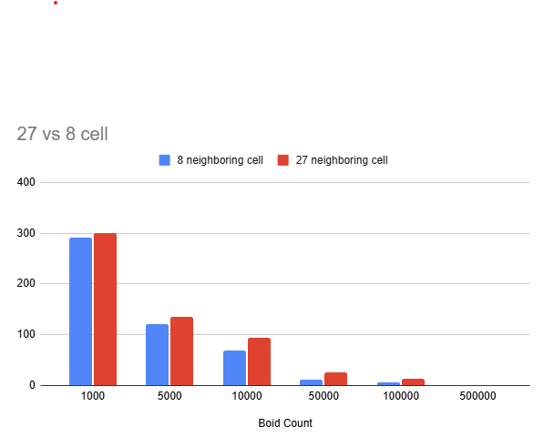

**University of Pennsylvania, CIS 5650: GPU Programming and Architecture,
Project 1 - Flocking**

* Name: Harry Guan (17885658)
* Tested on: Windows 11, Intel i7-14700 @ 2.10GHz 32GB, NVIDIA T1000 4GB (Moore 100B virtual labs)

### Introducton
In this project, I implemented a 3D Boids flocking simulation on the GPU using CUDA. Where each particle move around following the following three rules

1. Rule 1: Boids try to fly towards the centre of mass of neighbouring boids
2. Rule 2: Boids try to keep a small distance away from other objects (including other boids).
3. Rule 3: Boids try to match velocity with near boids.

This is based on Conard Parker's notes with slight adaptation.

### Visualizations

## Peformance Analysis

### Testing methodology
For testing, I developed a custom PerfTimer class to measure the performance of each boids simulation method. This class uses CUDA events to accurately time each simulation step on the GPU. The tests were run for a duration of 10 seconds per implementation, and the average frames per second (FPS) was calculated from the total frames rendered during that period. This approach provides a stable and reliable performance metric for comparing the naive, scattered grid, and coherent grid implementations.

### Performance with different number of boids 

| # of boids |FPS(Naive) | FPS(Scattered Grid) | FPS(Coherent Grid) |
| :--- | :--- | :--- | :--- |
| 1000 | 51.3 | 292.9 | 291 |
| 5000 | 6.3 | 116.6 | 120.4 |
| 10000 | 1.1 | 66.9 | 68.9 |
| 50000 | 0.4 | 12 | 11.9 |
| 100000 | 0.00929732 | 4.93 | 5.82 |
| 500000 | 0 | 0.281402 | 0.567018 |

### For each implementation, how does changing the number of boids affect performance? Why do you think this is?
The Naive implementation uses and O(N^2) method, in which every boid checks every other boid in the simulation to apply the flocking rules. So thus, as N grows the number of comparisons increases quadratically. This can be 
seen by the results, in which the data shows sharp and non-linear drops in performance as the number of boids increase. In particular, the jump from 1k -> 5k boids causes the FPS to plummet from 51.3 to 6.3.
Scattered and Coherent grid implementations show a much more gradual decrease in performance compared to brute force. This is because both approximates to an O(N) complexity because in the simulation, it divides the space into grids, thus each grid needs to only check its neighboring grid. Which drastically reduces its time complexity. Scattered and Coherent grids differ by the fact that Coherent grids have memory that are reordered, which means that boids that are close in the space are also closer in memory. This is why you can see in the grid, that the Coherent Grid performs better than Scattered grids. 

### Performance with different block sizes

| Block Size | FPS(Naive) | FPS(Scattered Grid) | FPS(Coherent Grid) |
| :--- | :--- | :--- | :--- |
| 32 | 6.3 | 118.4 | 121.3 |
| 64 | 6.4 | 118.3 | 120.9 |
| 128 | 6.2 | 118.6 | 119.5 |
| 256 | 5.4 | 116.6 | 118.8 |
| 512 | 5 | 113.1 | 115.9 |
| 1024 | 3.8 | 103.6 | 105.9 |

### For each implementation, how does changing the block count and block size affect performance? Why do you think this is?

There is an insignificant decrease in performance as block sizes increases, this is as a consequence of lower occupancy with increased block sizes and also resource strains. 

### For the coherent uniform grid: did you experience any performance improvements with the more coherent uniform grid? Was this the outcome you expected? Why or why not?

Yes although rather minor, you can see this through the data and it was expected due to the improvement in data locality by reordering boid data in memory to match their proximity within the simulation space.

### Did changing cell width and checking 27 vs 8 neighboring cells affect performance? Why or why not? Be careful: it is insufficient (and possibly incorrect) to say that 27-cell is slower simply because there are more cells to check!
Despite being more cells to check, the 27 neighboring cells outperforms the 8 neighboring cells. This is because, although there are more cells to check, each cell's width is smaller which means that there are fewer boids to check.