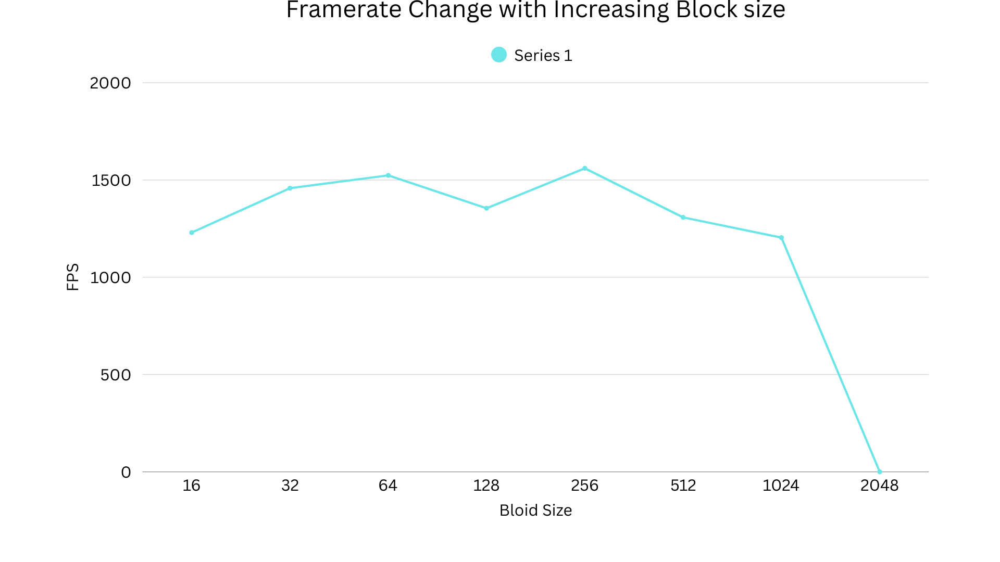
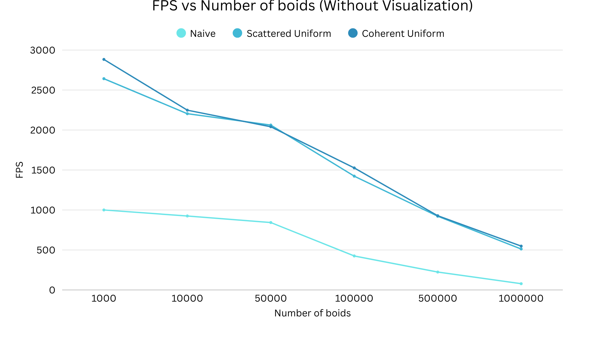
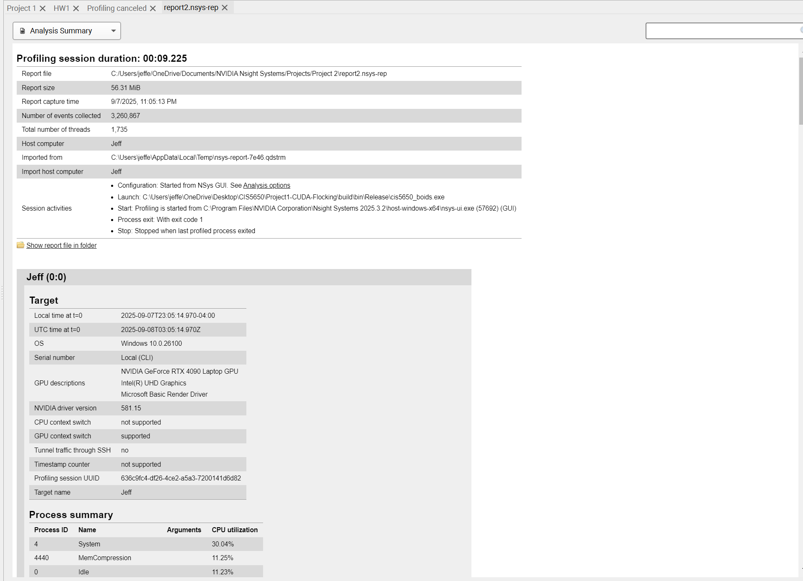
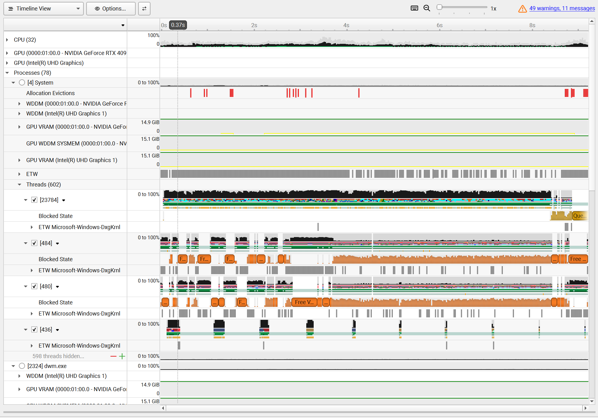

**University of Pennsylvania, CIS 5650: GPU Programming and Architecture,
Project 1 - Flocking**

* Jefferson Koumba Moussadji Lu
  * [LinkedIn](https://www.linkedin.com/in/-jeff-koumba-0b356721b/), [personal website](), [twitter](), etc.
* Tested on: Personal Laptop, Windows 11 Home, Intel(R) Core(TM) i9-14900HX @ 2.22GHz @ 24 Cores @ 32GB RAM, Nvidia GeForce RTX 4090 @ 16 GB @  SM 8.9 

***Performance Analysis***

CUDA Boids — Performance Analysis
How I measured

Build: Release mode, as required.

Visualization: Turned off (#define VISUALIZE 0) to avoid a 60 FPS cap and measure only the simulation. I also re-ran with visualization on to confirm visuals.

Modes tested:

Naive (UNIFORM_GRID 0, COHERENT_GRID 0)

Scattered uniform grid (UNIFORM_GRID 1, COHERENT_GRID 0)

Coherent uniform grid (UNIFORM_GRID 1, COHERENT_GRID 1)

Timing: FPS reported in the window title when VISUALIZE=0, plus CUDA event timing averaged over multiple steps for tighter kernel timing.

1) Effect of number of boids

Naive: Performance drops quadratically. Each boid checks every other boid, so doubling the number of boids roughly quadruples the work.

Scattered uniform grid: Performance still decreases as N grows, but more slowly. Each boid only checks nearby cells, so the number of neighbors per boid is closer to a constant instead of scaling with N.

Coherent uniform grid: Similar algorithm to scattered, but with reordered data. At medium and large N this gave me the best scaling and highest FPS because memory access during neighbor scans is more cache-friendly.

Why: Naive is O(N²). Grid methods reduce it to O(N · k + sort) where k is neighbors per cell. Coherent improves memory locality, which helps on GPUs that are often memory-bandwidth bound.

2) Effect of block count and block size

Using a block size that is a multiple of 32 (warp size) gave best results. 128–256 threads per block worked well.

Very small blocks under-utilize the GPU. Very large blocks can hurt occupancy due to register usage.

Having enough blocks to cover all SMs is important, but beyond that, performance is dominated by memory access patterns, not just raw block count.

Why: GPUs schedule in warps of 32 threads. Aligning block size to warp multiples avoids wasted lanes. Overall throughput depends on occupancy (enough warps in flight to hide latency) and coalesced memory access. For this project the kernels are memory-bound, so coalescing and coherent data layout matter more than just increasing block counts.

3) Coherent uniform grid performance

Yes, coherent mode improved performance at medium and large N, which is what I expected. By reordering positions and velocities so that boids in the same cell are contiguous, the neighbor kernel reads memory in a coalesced way. This reduces the number of global memory transactions per warp. The reorder costs extra work, so at very small N the benefit can be small or negative, but at scale the improvement dominates.

4) 27 vs 8 neighboring cells

Using 27 cells (with cell width equal to the neighborhood distance) can actually be faster than using 8 cells (with width twice the neighborhood distance).

With width 2r, you check 8 big cells covering about 64 r³ volume.

With width r, you check 27 small cells covering about 27 r³ volume.

Even though 27 > 8, the total search volume is smaller, so you often touch fewer boids. That can make it faster, especially in dense scenes.

Why: Performance depends on how many neighbors you actually evaluate, not just how many cells you loop over.

Summary

Naive: O(N²), drops quickly with N.

Scattered grid: Much better scaling, fewer neighbor checks.

Coherent grid: Adds memory coherence, usually the fastest at scale.

Block size: Use warp multiples (128–256). Memory access dominates.

27 vs 8 cells: Smaller cells can mean fewer actual neighbors, so 27 cells can outperform 8 despite the higher loop count.

