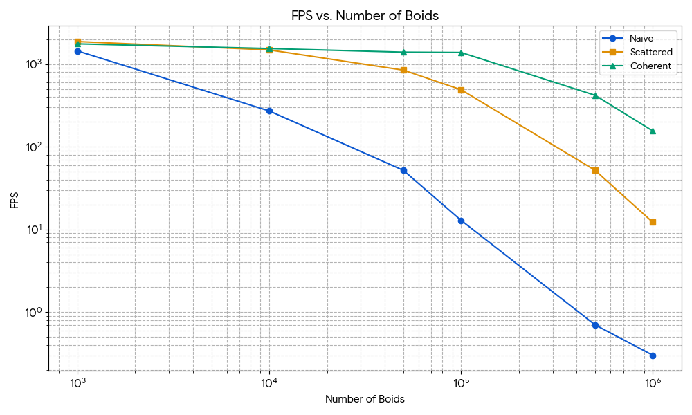

**University of Pennsylvania, CIS 5650: GPU Programming and Architecture**

# Project1-CUDA-Flocking 

* Xiaonan Pan
  * [LinkedIn](https://www.linkedin.com/in/xiaonan-pan-9b0b0b1a7), [My Blog](www.tsingloo.com), [GitHub](https://github.com/TsingLoo)
* Tested on: 
  * Windows 11 24H2
  * 13600KF @ 3.5Ghz
  * 4070 SUPER 12GB
  * 32GB RAM

# Overview

This is my first CUDA project focusing on the Boids flocking algorithm. This project implements a **naive** algorithm and also explores parallel optimization methods, including the **Scattered and Coherent Uniform Grid techniques**. The final implementation can support a simulation of **50,000 boids at 1,744 frames per second (FPS)**. The results, performance analysis, and the potential reasons for the speedups are discussed in this document.

# Performance  & Discussion

