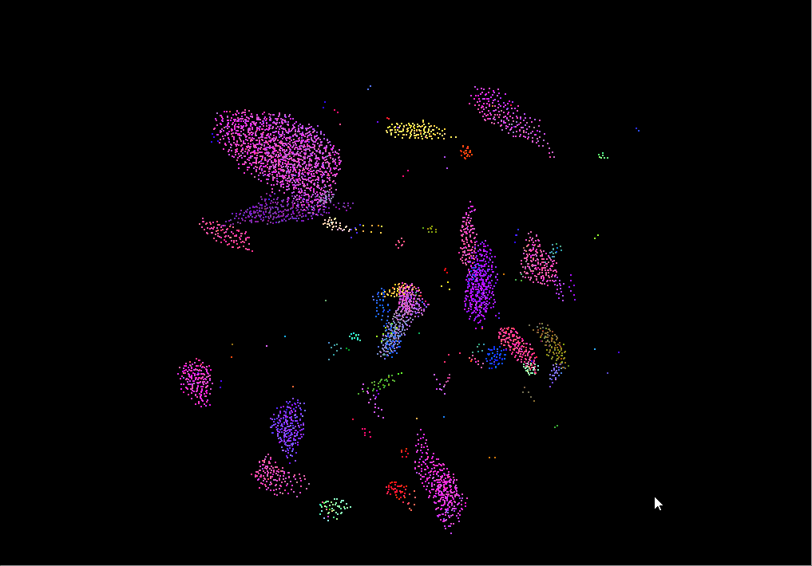
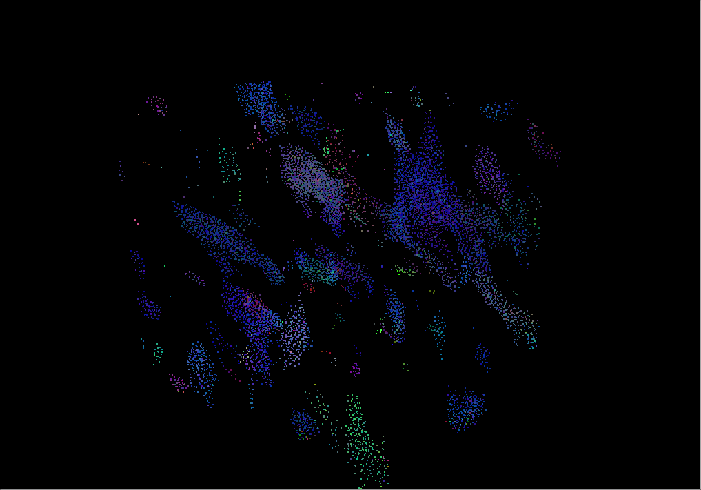
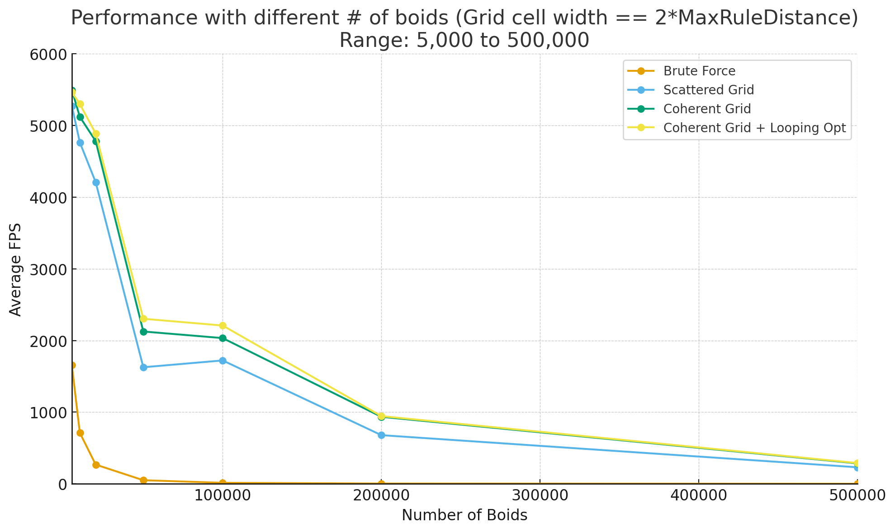
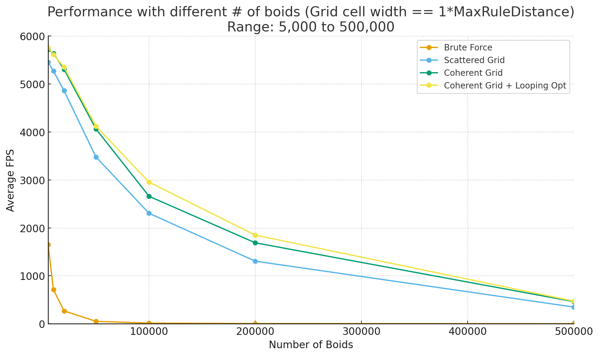
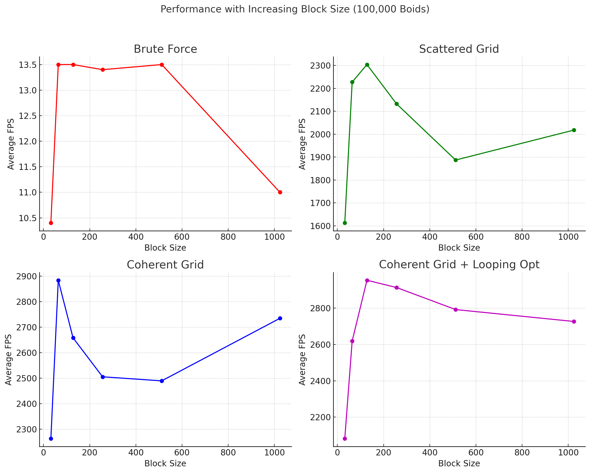
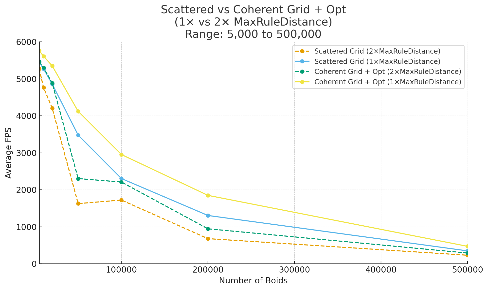

**University of Pennsylvania, CIS 5650: GPU Programming and Architecture,
Project 1 - Flocking**

* Calvin Lieu
  * [LinkedIn](www.linkedin.com/in/calvin-lieu-91912927b)
* Tested on: Windows 11, i5-13450HX @ 2.40GHz 16GB, NVIDIA GeForce RTX 5050 Laptop GPU 8GB (Personal)

### Showcase

NB: Average FPS calculated using harmonic mean (1000/mean(t) - where t = ms)
#### Figure 1: Performance with different # of boids (Grid cell width == 2*MaxRuleDistance)

| # of boids | Avg FPS(Brute force) | Avg FPS(Scattered Grid) | Avg FPS(Coherent Grid) | Avg FPS(Coherent Grid with grid looping optimization) |
| ---------- | -------------------- | ----------------------- | ---------------------- | ----------------------------------------------------- |
| 5000       | 1654.3               | 5272.6                  | 5494.8                 | 5465.8                                                |
| 10000      | 711.7                | 4764.8                  | 5122.4                 | 5301.7                                                |
| 20000      | 267.8                | 4208.8                  | 4782.5                 | 4888.1                                                |
| 50000      | 50                   | 1626.6                  | 2125.6                 | 2303.4                                                |
| 100000     | 13.5                 | 1721.8                  | 2033.6                 | 2208.9                                                |
| 200000     | 3.5                  | 678.8                   | 934.9                  | 944.7                                                 |
| 500000     | 0.6                  | 230.5                   | 284.9                  | 289.6                                                 |
| 1000000    | 0.1                  | 68.5                    | 87.1                   | 86.9                                                  |

#### Figure 2: Performance with different # of boids (Grid cell width == 1*MaxRuleDistance)

| # of boids | Avg FPS(Brute force) | Avg FPS(Scattered Grid) | Avg FPS(Coherent Grid) | Avg FPS(Coherent Grid with grid looping optimization) |
| ---------- | -------------------- | ----------------------- | ---------------------- | ----------------------------------------------------- |
| 5000       | 1649.2               | 5452.2                  | 5717.1                 | 5761.1                                                |
| 10000      | 710.1                | 5271.0                  | 5639.7                 | 5612.8                                                |
| 20000      | 268.3                | 4859.9                  | 5306.8                 | 5351.8                                                |
| 50000      | 50.1                 | 3478.7                  | 4063.8                 | 4122.1                                                |
| 100000     | 13.5                 | 2303.8                  | 2658.3                 | 2953.0                                                |
| 200000     | 3.5                  | 1305.0                  | 1688.1                 | 1848.8                                                |
| 500000     | 0.6                  | 347.8                   | 460.5                  | 470.4                                                 |
| 1000000    | 0.1                  | 132.4                   | 186.0                  | 187.0                                                 |

**1. For each implementation, how does changing the number of boids affect** **performance? Why do you think this is?**

In general, increasing the number of boids will cause the fps to decrease. This makes sense because increasing the number of boids increases the number of threads required to simulate them and consequently the load on hardware. and on a GPU with limited cores, this will take longer to process. 

Brute Force: FPS collapses qudratically as N rises as expected given the algorithm is O(N^2).
For the grid methods, FPS drops but not as quickly or sharply as the cost is O(N*k) where k is the local neighbour count.

Coherent grid algorithms perform better than scattered grid at every point with the grid-loop optimised method slightly outperforming the one without.
Overall the grid methods scale much better than the naive implementation primarily due reduced neighbour checking.

---

#### Figure 3: Performance with increasing block size (100000 boids)

| BlockSize  | Avg FPS(Brute force) | Avg FPS(Scattered Grid) | Avg FPS(Coherent Grid) | Avg FPS(Coherent Grid with grid looping optimization) |
| ---------- | -------------------- | ----------------------- | ---------------------- | ----------------------------------------------------- |
| 32         | 10.4                 | 1612.6                  | 2262.8                 | 2081.8                                                |
| 64         | 13.5                 | 2227.3                  | 2884.3                 | 2618.7                                                |
| 128        | 13.5                 | 2303.8                  | 2658.3                 | 2953.0                                                |
| 256        | 13.4                 | 2132.5                  | 2505.4                 | 2913.1                                                |
| 512        | 13.5                 | 1887.1                  | 2489.5                 | 2791.7                                                |
| 1024       | 11.0                 | 2017.7                  | 2735                   | 2726.3                                                |

**2. For each implementation, how does changing the block count and block size affect performance? Why do you think this is?**
### Why **too small** a block size hurts

- **Not enough warps in flight (low occupancy).**  
  Each SM hides memory/texture latency by swapping to another ready warp. With tiny blocks (e.g., 32–64 threads), you can hit the max blocks per SM limit before the max warps/threads per SM, leaving warp slots unused, resulting in weaker latency hiding.

- **Scheduling/tail overhead.**  
  More, smaller blocks means more block dispatches and longer “tail” phases where a few tiny blocks keep the grid alive while most SMs are idle.

- **Poor load balancing within a block.**  
  A small block has only 1–2 warps. If one warp stalls on memory, there may be no other ready warp in that block to run.

---

### Why **too large** a block size hurts

- **Resource throttling → fewer resident blocks.**  
  Residency per SM is capped by registers, shared memory, max threads, and max blocks. Big blocks (e.g., 1024 threads) magnify per-thread register use into large per-block footprints. Result: 1–2 blocks/SM instead of 3–8 -> fewer independent blocks -> lower effective occupancy.

- **Less freedom for the scheduler.**  
  With only 1–2 big blocks per SM, if their warps hit the same long-latency path or diverge similarly, there’s nothing else to interleave. More, smaller blocks give the SM more independent work to juggle.

- **Cache / LD/ST pressure clumping.**  
  A huge block can concentrate many similar accesses at once, sometimes creating bursts of L1/L2 pressure, with no other blocks to fill the gaps.

Brute Force: Performance was mostly flat because the kernel is already compute/latency bound. Blocksize of 32 was too small and saw a ~20% performance reduction for reasons outlined above. A dip occurred at 1024 perhaps due to lower effective occupancy.

Scattered: Peaks at 128 blocksize. Larger blocks could mean less ability to hide latency and higher register usage -> lower occupancy.

Coherent: Performance decreases from 64 up, but slightly recovers at 1024. This could be because at 1024 the large block helps caching and coalescing enough to offset occupancy loss.

Coherent Grid Loop Opt: Decreases from 128 up but noticeably smoother performance decrease than normal coherent. The grid-loop opt adds per-thread control work and very large blocks can increase divergence and pressure.

---

**3. For the coherent uniform grid: did you experience any performance improvements with the more coherent uniform grid? Was this the outcome you expected?**
**Why or why not?**

Coherent grid performed notiecable better than scattered at every boid count and for both cell wiidths. At 100k in 2 x Maxdist coherent was 18% better and grid-loop was 28% better than scattered. At 1 x Maxdist, 15% and 28% respectively. Sorting and reordering makes position/velocity read contiguous within each cell and the neighbour sweep checks cells in 1d increasing order, boosting cache hit rate and memory coalescing as expected.

The grid-loop optimisation offers a slight boost to performance. The 8-cell heuristic for coherent tends to check up to 8 cells regardless of whether the true neighbourhood would fit in fewer cells whilst grid-loop computes the span from the actual radius in cell units. When compared to the 27-cell heuristic the performance improvement is not as obvious. However, the flexibility offered by this method means that if we set R < gridcellwidth < 2R then grid loop opt will scan exactly the number of cells within the radius whilst the 27 cell heuristic will always scan 27 cells even if they aren't in the radius (except at domain edges i.e. edges of the simulation, then reduced to 2 instead of 3 cells in that axis). The arithmetic overhead of computing the bounds with grid loop opt is negligible compared to the memory traffic saved. If it happens that many of the extra cells that 27-cell would have checked are empty then the benefit is not as defined, but if they're full of boids then we avoid many wasted boid reads.

---

**4. Did changing cell width and checking 27 vs 8 neighboring cells affect performance?**
**Why or why not? Be careful: it is insufficient (and possibly incorrect) to say**
**that 27-cell is slower simply because there are more cells to check!**

To my surprise, with 1 x MaxDist cell width (27 cells to check max), FPS was better across the board than 2 x maxDist cell width (8 cells to check max). This is because even though more cells are examined, each cell holds fewer boids so the heavy inner loops shrink a lot and there are less boids that need to be checked. Also, when cell width is twice the rule distance, there will likely be more boids not within the actual rule distance that we check.
