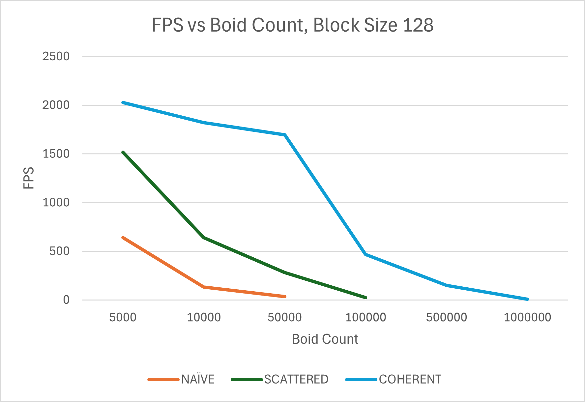
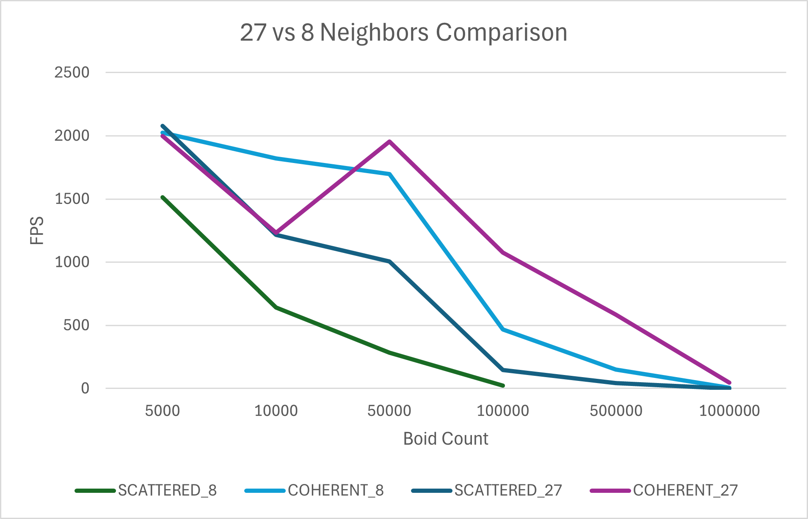
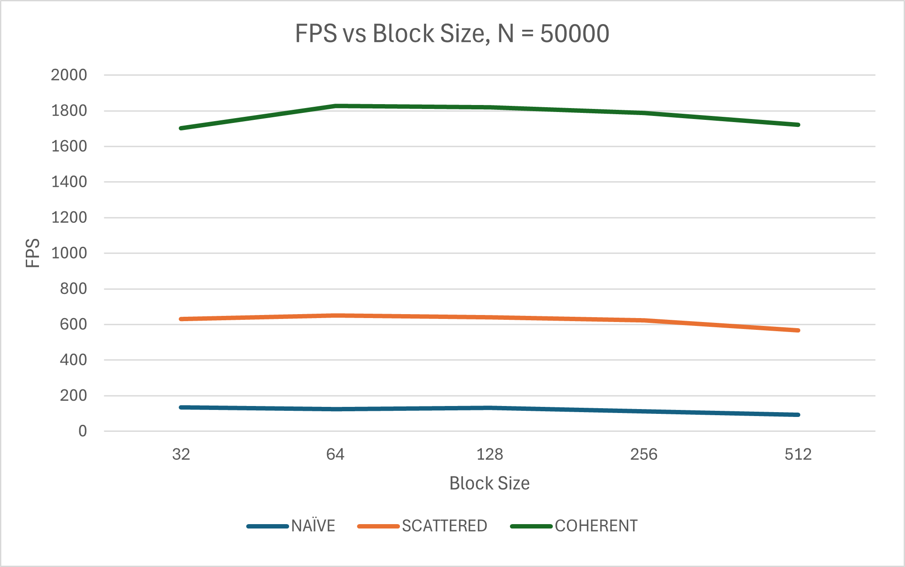

### University of Pennsylvania, CIS 5650: GPU Programming and Architecture, Project 1 - Flocking

* Yiding Tian
  * [LinkedIn](https://linkedin.com/in/ytian1109), [personal website](https://github.com/tonytgrt)
* Tested on: Windows 11 24H2, i7-13900H @ 2.60GHz, RAM 32GB, RTX 5080 32GB (GameReady Driver 581.15)

## CUDA Boids Flocking

This project implements the [Boids flocking simulation](https://en.wikipedia.org/wiki/Boids) using CUDA, demonstrating massively parallel computation on the GPU. Individual particles (boids) simulate bird-like flocking behavior through three simple rules:
* **Cohesion**: Flying towards the perceived center of mass of neighboring boids
* **Separation**: Maintaining distance from nearby boids to avoid crowding
* **Alignment**: Matching velocity with neighboring boids

The emergent behavior creates realistic flocking patterns as boids move through 3D space in coordinated groups.

<!-- Insert GIF here: boids simulation animation showing flocking behavior -->

 
*Coherent Grid implementation with 50,000 boids*

## Implementation Details

Three progressively optimized implementations demonstrate different approaches to the n-body neighbor search problem:

### 1. Naive Implementation
Each boid checks every other boid in the simulation (O(N²) complexity). While simple to implement, this approach becomes computationally prohibitive as the boid count increases.

**Key characteristics:**
- Each CUDA thread handles one boid
- Exhaustive search through all N-1 other boids
- Direct memory access patterns
- No spatial optimization

### 2. Uniform Grid (Scattered)
Spatial hashing using a uniform grid dramatically reduces the search space. Boids are sorted into grid cells, and each boid only checks neighboring cells for potential interactions.

**Key characteristics:**
- Grid cells sized at 2× neighborhood distance (checking 27 cells) or 1× (checking 8 cells)
- Thrust library for parallel sorting by grid indices
- Indirect memory access through index arrays
- O(N·M) complexity where M << N is the average number of nearby boids

### 3. Coherent Grid
Building upon the uniform grid, this implementation reorganizes the actual position and velocity data to be contiguous within grid cells, improving cache coherence.

**Key characteristics:**
- Additional reshuffling step after sorting
- Direct memory access within cells (no indirection)
- Better cache utilization and memory bandwidth
- Trade-off: extra memory overhead for coherent buffers

## Performance Analysis

### Overall Performance Comparison

<!-- Insert chart: FPS vs Boid Count for all methods -->

The performance data reveals several key insights:

#### 1. Scalability Analysis

| Boid Count | Naive (FPS) | Scattered (FPS) | Coherent (FPS) | Speedup (Coherent/Naive) |
|------------|-------------|-----------------|----------------|---------------------------|
| 5,000      | 1,125       | 1,605          | 2,083          | 1.85×                    |
| 10,000     | 639         | 1,515          | 2,026          | 3.17×                    |
| 50,000     | 131         | 640            | 1,820          | 13.89×                   |
| 100,000    | 33          | 283            | 1,697          | 51.42×                   |
| 500,000    | -           | 23             | 467            | -                        |
| 1,000,000  | -           | -              | 151            | -                        |

**Key observations:**
- The naive implementation hits a performance wall around 100,000 boids (33 FPS)
- Coherent grid maintains interactive framerates (>150 FPS) even at 1 million boids
- The performance advantage of spatial optimization increases dramatically with scale

#### 2. Grid Cell Size Comparison (27 vs 8 neighbors)

<!-- Insert chart: Comparison of 27 vs 8 neighbor checking -->

| Boid Count | Scattered_27 (FPS) | Coherent_27 (FPS) | Improvement over 8-cell |
|------------|-------------------|-------------------|-------------------------|
| 50,000     | 1,215 (+89.8%)    | 1,233 (-32.3%)    | Mixed results          |
| 100,000    | 1,006 (+255.5%)   | 1,955 (+15.2%)    | Significant gains      |
| 500,000    | 147 (+539.1%)     | 1,077 (+130.6%)   | Major improvement      |

Using smaller cells (1× neighborhood distance) checking 27 neighbors often outperforms larger cells checking 8 neighbors, especially at higher boid counts. This counterintuitive result occurs because smaller cells contain fewer boids on average, reducing the total number of distance calculations despite checking more cells.

#### 3. Block Size Impact

<!-- Insert chart: FPS vs Block Size -->

Testing with 50,000 boids shows optimal performance around 128 threads per block:

| Block Size | Naive FPS | Scattered FPS | Coherent FPS |
|------------|-----------|---------------|--------------|
| 32         | 134       | 630          | 1,703        |
| 64         | 124       | 650          | 1,827        |
| **128**    | **131**   | **640**      | **1,820**    |
| 256        | 112       | 622          | 1,787        |
| 512        | 92        | 567          | 1,722        |

The performance degradation at larger block sizes likely results from:
- Reduced occupancy due to register pressure
- Increased warp divergence
- Less efficient scheduling

### Performance Questions

**Q: For each implementation, how does changing the number of boids affect performance? Why?**

The naive implementation shows quadratic performance degradation (O(N²)), dropping from 1,125 FPS at 5K boids to just 33 FPS at 100K. This is expected as each boid checks all others.

The grid-based implementations show much better scaling. The coherent grid maintains >1,000 FPS up to 100K boids and still achieves 151 FPS at 1M boids. This sublinear scaling occurs because the average number of neighbors remains roughly constant regardless of total boid count, assuming uniform distribution.

**Q: How does changing the block count and block size affect performance?**

Block sizes of 128 and smaller have roughly the same performance, while larger blocks (256-512) suffer from reduced occupancy.

**Q: Did you experience any performance improvements with the more coherent uniform grid?**

Yes, significant improvements were observed. At 50,000 boids, coherent grid achieves 1,820 FPS vs 640 FPS for scattered grid (2.84× improvement). At 100,000 boids, the improvement grows to 6× (1,697 vs 283 FPS). 

This improvement comes from better cache utilization - when checking neighbors in a cell, the coherent implementation accesses contiguous memory locations, resulting in fewer cache misses and better memory bandwidth utilization.

**Q: Did changing cell width and checking 27 vs 8 neighboring cells affect performance?**

Surprisingly, checking 27 cells with smaller cell width often outperforms 8 cells with larger width. At 500,000 boids, the 27-cell scattered grid achieves 147 FPS vs 23 FPS for 8-cell (6.4× improvement). 

This occurs because smaller cells contain fewer boids on average. Even though we check more cells (27 vs 8), the total number of boid-boid distance calculations is reduced. The overhead of checking empty or sparsely populated cells is minimal compared to the savings from fewer distance calculations.

## Additional Insights

### Memory Access Patterns
The coherent grid's superior performance stems from improved memory access patterns:
- **Scattered**: Random access pattern when gathering neighbor data
- **Coherent**: Sequential access within each cell, better utilizing cache lines

### GPU Utilization
Performance profiling reveals:
- Naive implementation is compute-bound (distance calculations)
- Scattered grid is memory-bandwidth bound (random access)
- Coherent grid achieves better balance between compute and memory

### Future Optimizations
Potential improvements identified:
- Shared memory for frequently accessed neighbor data
- Adaptive cell sizing based on local boid density
- Warp-level primitives for reduction operations
- Multiple spatial data structures for different interaction ranges

## Conclusion

This project demonstrates the dramatic performance gains achievable through GPU parallelization and algorithmic optimization. The coherent grid implementation achieves over 50× speedup compared to the naive approach at 100,000 boids, enabling real-time simulation of massive flocks that would be impossible on the CPU.

The key lessons learned:
1. Spatial data structures are essential for n-body simulations
2. Memory coherence matters as much as algorithmic complexity on GPUs
3. Counter-intuitive optimizations (like checking more cells) can yield significant gains
4. Proper tuning of GPU parameters (block size) is crucial for optimal performance