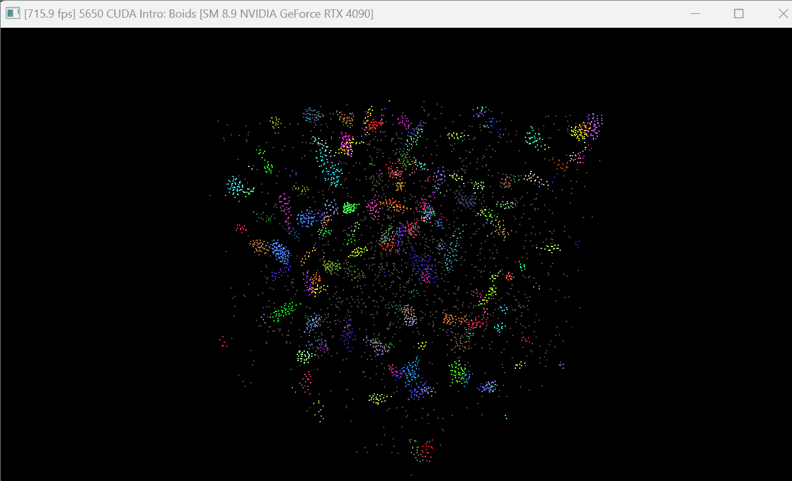

**University of Pennsylvania, CIS 5650: GPU Programming and Architecture,
Project 1 - Flocking**

* Jiahang Mao
  * [LinkedIn](https://www.linkedin.com/in/jay-jiahang-m-b05608192/)
* Tested on: Windows 11, i5-13600kf @ 5.0GHz 64GB, RTX 4090 24GB, Personal Computer

## Visual Results
5000 boids

## Performance Results

Performance testing config 
* Avg FPS measured between 2 seconds and 7 seconds after program start, calculated as total_fps / total_duration
* run in Release model

#### Visualization OFF

| Method            | Number of Boids | Block Size | Avg FPS |
|:--------          |:---------------:|:----------:|:-------:|
| Naive (baseline)  | 5000            | 128        | 878      
| Naive             | 5000            | 1024       | 603        
| Naive             | 50000           | 128        | 135
| Naive             | 50000           | 1024       | 86
| Uniform           | 5000            | 128        | 1582
| Uniform           | 5000            | 1024       | 1617
| Uniform           | 50000           | 128        | 1279
| Uniform           | 50000           | 1024       | 1213
| Coherent          | 5000            | 128        | 1571
| Coherent          | 5000            | 1024       | 1555
| Coherent          | 50000           | 128        | 1027
| Coherent          | 50000           | 1024       | 1030

#### Visualization ON

| Method            | Number of Boids | Block Size | Avg FPS |
|:--------          |:---------------:|:----------:|:-------:|
| Naive (baseline)  | 5000            | 128        | 715
| Naive             | 5000            | 1024       | 526
| Naive             | 50000           | 128        | 130
| Naive             | 50000           | 1024       | 84
| Uniform           | 5000            | 128        | 1226
| Uniform           | 5000            | 1024       | 1133
| Uniform           | 50000           | 128        | 961
| Uniform           | 50000           | 1024       | 880
| Coherent          | 5000            | 128        | 1042
| Coherent          | 5000            | 1024       | 1070
| Coherent          | 50000           | 128        | 764
| Coherent          | 50000           | 1024       | 773
