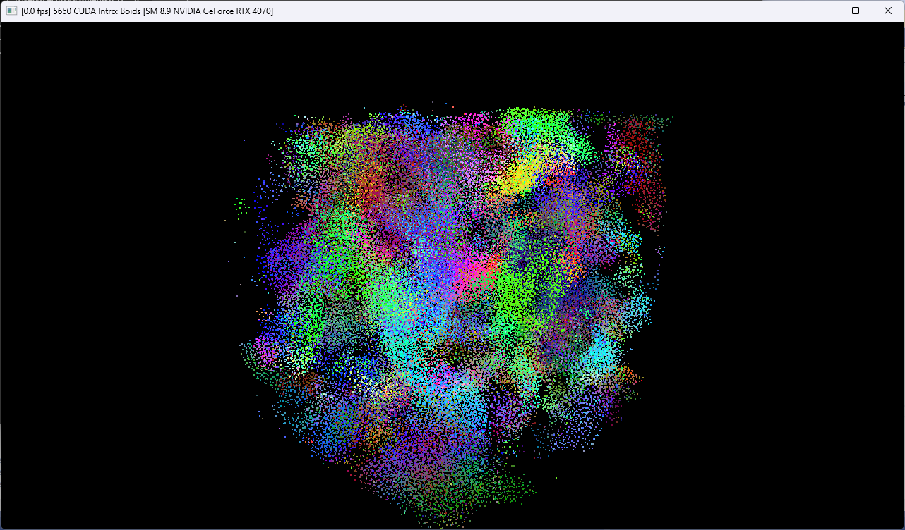
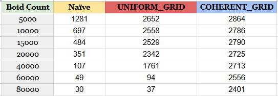
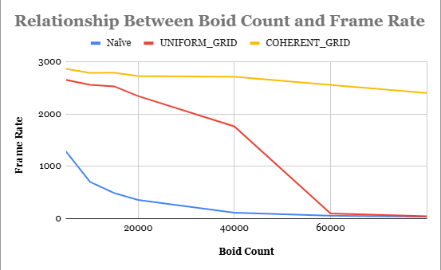
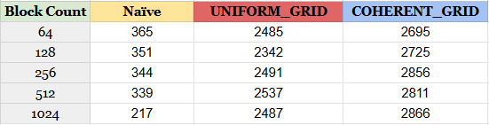
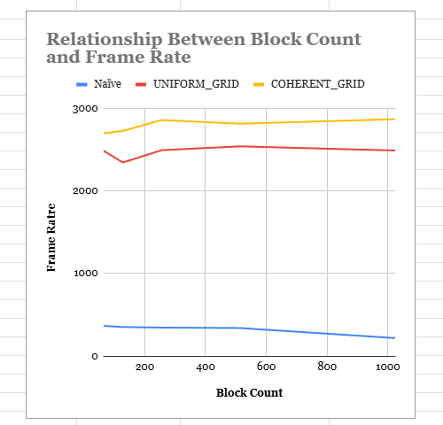

**University of Pennsylvania, CIS 5650: GPU Programming and Architecture,
Project 1 - Flocking**

* Cecilia Chen 
  * [LinkedIn](https://www.linkedin.com/in/yue-chen-643182223/)
* Tested on: Windows 11, i7-13700F @ 2.1GHz 16GB, GeForce GTX 4070 12GB (Personal Computer)

### README

**Overview**

**Flocking of the boids**
* 80000 boids flocking using COHERENT_GRID method

**Performance Analysis** 

To evaluate performance, we record the average frame rate over the first 10 seconds for comparison.

(I was using 8 neighboring cells at this stage)

* how does changing the number of boids affect performance? 

To evaluate performance, we record the average frame rate over the first 10 seconds for each method and boid count (5k–80k). We compare a naïve all-pairs implementation against two grid-based neighbor searches: a uniform grid and a coherent grid.

The naïve method degrades quickly as N grows: from 1281 FPS at 5k to 30 FPS at 80k. This is probably because the near-quadratic work of checking every pair. Therefore, frame time rises sharply with N, making the approach unsuitable beyond small scenes.

The uniform grid helps substantially at modest sizes—e.g., at 20k boids it reaches 2342 FPS (~6.7× faster than naïve’s 351 FPS). However, it hits a scalability cliff at high N (94 FPS at 60k and 37 FPS at 80k). This pattern is typical when neighbor loops still touch many scattered memory locations or when cells get too dense: indirect, non-coalesced reads start to dominate, and the benefit of culling fades.

The coherent grid is both fastest and most stable. It sustains ~2.9k FPS at small N and still delivers 2401 FPS at 80k—only ~17% down from the 5k case and ~80× the naïve baseline at 80k. Reordering positions/velocities into cell-sorted order keeps neighbor reads contiguous, so cache and bandwidth are used efficiently and the per-boid neighbor cost remains bounded.

* how does changing the number of blocks affect performance? 

We also swept the CUDA block size (threads per block) from 64 to 1024 while keeping the workload fixed. For both grid-based implementations, performance is largely insensitive to block size. The uniform grid stays in a tight band around 2.35–2.54k FPS, and the coherent grid sits slightly higher at roughly 2.70–2.87k FPS. In other words, once the algorithm keeps neighbor reads localized, the exact block size matters far less than data layout and memory access patterns.

The naïve kernel tells a different story: it slows down as blocks get very large—about 365 FPS at 64 threads per block, falling to 217 FPS at 1024. With huge blocks, the launcher produces fewer blocks overall, which can reduce SM-level parallelism and occupancy; higher per-block register/shared-memory pressure can also limit active warps. Since the naïve approach is already memory-inefficient, these scheduling effects show up more clearly.

In practice, a warp-aligned block size in the 256–512 range is a solid default for these kernels. Extremely large blocks (e.g., 1024) can hurt simpler kernels like the naïve version without providing tangible benefits. More importantly, the results reinforce that algorithm and memory layout dominate: the coherent grid remains the fastest option regardless of block size.

**Performance improvements with the more coherent uniform grid**

Moving from a plain uniform grid to a coherent uniform grid gave a clear, consistent speedup, and that’s exactly what I expected.

With the plain uniform grid, each boid still reads neighbors through an index indirection (pos[indices[j]]/vel[...]). Those accesses are scattered across global memory, so as the flock grows and cells get denser, the GPU spends cycles on cache misses and extra memory transactions.

On the other hand, the coherent version reorders the boid arrays after sorting-by-cell, so boids in the same (and adjacent) cells sit next to each other in memory. Neighbor loops then walk contiguous ranges: reads are coalesced, cache lines are reused, and the hardware prefetcher actually helps.

**27 vs 8 neighboring cells**

Switching from checking 8 neighboring cells to 27 (the full 3×3×3 neighborhood in 3D) actually improved performance. 

This is because it we switch to a smaller grid cells—about the size of the largest interaction radius 𝑅. With only 8 cells, we're forced to use larger cells to be safe, which stuffs many more boids into each cell. To be specific, it is a 4𝑅 * 4𝑅 * 4𝑅  cube while the other one is a 3𝑅 * 3𝑅 * 3𝑅 cube range. Smaller cells + 27 checks dramatically reduce that candidate set (we cover roughly the true spherical neighbor region) and keep memory access local and contiguous in the coherent layout, which improves cache/coalescing and load balance across warps. 