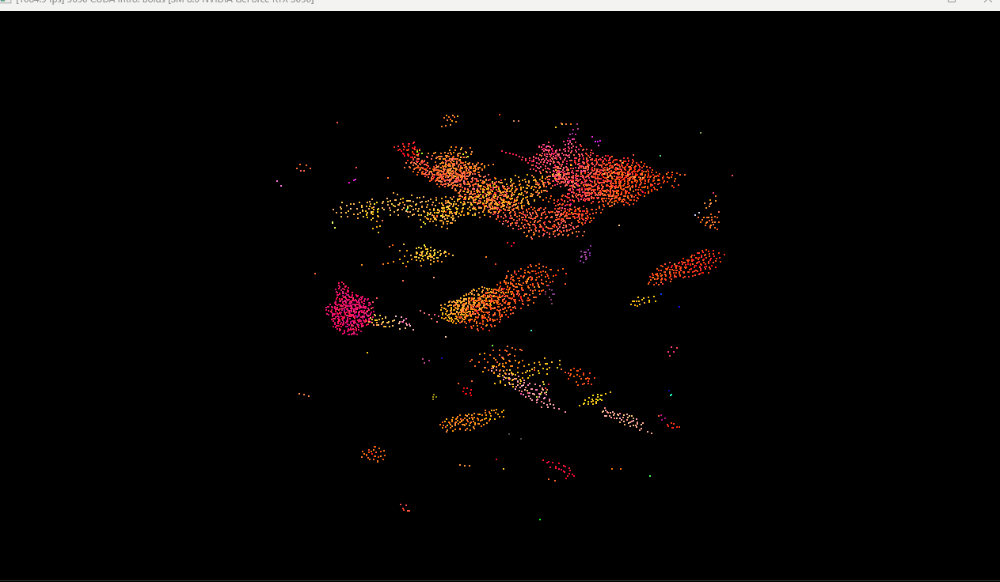

**University of Pennsylvania, CIS 5650: GPU Programming and Architecture,
Project 1 - Flocking**

* Griffin Evans
  * gpevans@seas.upenn.edu, [personal website](evanses.com/griffin)
* Tested on lab computer: Windows 11 Education, i9-12900F @ 2.40GHz 64.0GB, NVIDIA GeForce RTX 3090 (Levine 057 #1)

### My Readme

#### Benchmarking Methodology:

Using CUDA events (drawing from [this article](http://developer.nvidia.com/blog/how-implement-performance-metrics-cuda-cc/)) I tracked the number of milliseconds that the simulation step took in each loop, and summed that value over a set number of frames so that I could determine the mean length of a simulation step over those frames. I tracked this information for a variety of configurations and copied it into a spreadsheet to graph and compare.

#### Performance Analysis:

- For each implementation, how does changing the number of boids affect performance? Why do you think this is?

%20vs.%20Boid%20Count.png)

For all three implementations, increasing the boid count would slow the simulation, increasing the time each step took to complete. The rate at which this change affected each of them varied between the implementations however, with the implementations that ran already slower with the initial 5000 boids also worsening more severely with increased boids. For example, increasing boid count from 5,000 to 10,000, the naïve implementation has the time taken per simulation step increase from 1.65487 ms to 4.06693 ms (a 145% increase), while the non-coherent uniform grid implementation goes from 0.219143 ms to 0.250066 ms (a 14.1% increase) and the coherent uniform grid implementation goes from 0.162406 ms to 0.18808 ms (a 15.8% increase). Increasing to 50,000 boids the naïve implementation continues to drastically slow while both grid implementations see only slight changes, but once increasing to 100,000 the non-coherent uniform grid implementation starts to slow significantly (step time of 0.299942 ms to 0.691533 ms, a 131% increase) while the uniform grid suffers only a slight drop in performance (step time of 0.211083 ms to 0.227745 ms, a 7.89% increase). Once we increase the boid count again to 500,000 the coherent grid implementation begins to suffer more drastic performance losses as well, going from 0.227745 ms to 1.4712 ms per simulation step (a 546% increase).

The naïve implementation being the most severely affected by the increased boid count is to be expected as in that implementation every thread needs to loop through all of the boids in the simulation, so for example by doubling the number of boids (such as from 5,000 to 10,000) we double both the number of threads and how many iterations each of them needs to make to finish, leading to the simulation step length more than doubling. The grid implementations, where each thread only needs to iterate through the boids within the neighboring cells, seem to only have severe slowdown once the number of boids passes some threshold; this appears to occur for a lower number of boids in the non-coherent implementation. Since we're increasing the number of boids without changing the number of cells (leaving the scene scale and neighborhood radii consistent), the density of boids in each cell increases, meaning even with a thread only checking the boids in 8 neighboring cells, it still has to iterate through an increasing number of boids. This leads to longer-running threads, which eventually seem to become a bottleneck and cause stalls. This happens slightly sooner for the non-coherent uniform grid implementation as the scattered memory structure slows the threads further—we both have more reads from global memory (reading the index array alongside the other arrays) and the reads are less efficient as they require accessing very disjunct regions in memory.

- For each implementation, how does changing the block count and block size affect performance? Why do you think this is?

%20vs.%20Block%20Size%20with%205,000%20Boids.png)

%20vs.%20Block%20Size%20with%2050,000%20Boids.png)

In my testing, the block size seemed to have relatively little effect on the performance in most cases, but some apparently inconsistent effects in particular instances. For example, when testing with 5,000 boids and varying block sizes (hence varying the block count in inverse proportion to the block size), the naïve implementation performed significantly worse with the greatest block size of 1024 than with any of the other sizes. With an increase to 50,000 boids, however, the 1024 block size case performed similarly to most of the other sizes in the naïve approach, with the block size of 32 (the smallest size tested, being the number of threads in a warp) instead being the one to perform noticeably worse. The coherent uniform grid saw seemingly inconsistent performance within tests with the same boid count—when using 5,000 boids, a size of 32 ran significantly faster than the other sizes (with an average per-simulation-step time of 0.165077 ms) but oddly the second and third fastest sizes were the middle-ground size of 192 (per-step time of 0.18743 ms) and the highest value of 1024 (with 0.191162 ms), with sizes in between these three appearing worse, such as the size of 64's 0.219539 ms simulation steps. For the 5,000 boid tests, the non-coherent uniform method appeared to perform most consistently, though when changing to 50,000 boids seemed to perform best with the middle block sizes, with the lowest size of 32 and the highest sizes of 512 and 1024 performing the worst. The coherent uniform grid implementation similarly had its best performance with the middle sizes for 50,000 boids, particularly 192, but overall its differences were much less pronounced in the 50,000 boid case compared both to its performance in the 5,000 boid case and to the performance variation of the other two implementations.

This apparent variety in results suggests a need for balance in selecting block size. There is a tradeoff in that having a high block size means we have fewer blocks that need to be processed but each of the blocks has a heavier use of resources—potentially only having a very small portion of the warps in a block being able to be run simultaneously. It seems that how much a particular size benefits or detriments performance is hence variable with the resources and runtime required by each individual thread. For example, the naïve implementation is the most resource-intensive, requiring many reads from memory, and it suffers the most dramatic decreases in performance, particularly for the block size of 1024 with 5,000 boids. In that case we only have 5 blocks (that being ceil(5000/1024)), but due to the allocation of resources it's likely very few of the warps and thus threads within each of these blocks is actually being processed at a time, meaning many threads are simply waiting for most of the execution. For the other two implementations, when we have just 5 blocks, the individual threads/warps are running much faster with less memory usage, and hence we don't have such a bottleneck. In the 50,000 boid case, the naïve implementation seeming to perform worst at a block size of 32 perhaps has an opposite reason—now having many more blocks (1563 = ceil(50000/32)) we have many whole blocks which will have to wait to be executed, even if within each block's processing we have little waiting as we have just one warp.

- For the coherent uniform grid: did you experience any performance improvements with the more coherent uniform grid? Was this the outcome you expected? Why or why not?

The coherent uniform grid performed better than the non-coherent uniform grid in the vast majority of cases, with this improvement becoming more pronounced for greater numbers of boids (in fact taking roughly 1/65 the time per simulation step with 5,000,000 boids). The one exception to this was in testing very sparse sets of boids relative to the number of grid cells as in the figures in the section below—note particularly the 27-cell implementations for 5,000 boids and the 8-cell implementations for 500,000 boids at scene scale of 1,000. Both of these cases have a very large number of cells, and in both of them the coherent uniform grid implementation appears to perform worse than the non-coherent one, though not necessarily by much. This seems like logical behavior to me—I'd expected that in general the performance would be better for the coherent method, especially as we increase the number of boids, as when we increase the number of boids we will also be increasing the number of memory reads, hence meaning the data being coherently stored is more and more beneficial. In the two cases mentioned above however, the boids being sparse relative to the number of cells means that each time we calculate the new velocity we require far fewer reads as there are fewer boids in the neighboring cells, meaning that this benefit diminishes. Conversely the process of reordering the data to be sorted becomes more of a detriment, seemingly becoming a bottleneck that now outweighs the diminished memory-read benefits, and is potentially further exacerbated in the time it takes by the increase in number of grid cells. Essentially, the time we spend to reorganize the data is negligible compared to the performance benefit from fewer and faster memory reads in our velocity computation in most cases, but when we already have few reads in our velocity computation, it becomes unncessary additional work.

- Did changing cell width and checking 27 vs 8 neighboring cells affect performance? Why or why not? Be careful: it is insufficient (and possibly incorrect) to say that 27-cell is slower simply because there are more cells to check!

%20vs.%20Boid%20Count%20for%20Different%20Cell%20Checking%20Methods.png)

Given a fixed scene scale, for the coherent uniform cell implementation, the 8-cell version seemed to perform better with smaller numbers of boids, up to 50,000, while beyond 50,000 the 27-cell version performed better. I suspect this is due to the increased density of boids once we get to those higher numbers—each individual cell will have more boids in it, and hence with the 8-cell version, since each indiviudal cell is larger (having double the side length) we are checking many more boids each time we need to compute velocity. In the smaller-boid-count cases, there are fewer additional boids we're checking because the cells are less densely filled, so this is less of a bottleneck. However, since we have a 3x3x3 grid of cells we're checking instead of a 2x2x2 one, we have more discontinuous regions of memory to check (one axis of those are adjacent in the buffers but the rest aren't necessarily, so I believe we'll usually have 9 and 4 disparate regions to check respectively), hence the 8-cell case performing better when we have less boids in the coherent implementation. In the non-coherent implementation, this discontinuity is not relevant as our memory is not organized that way regardless, and instead the 27-cell version seems to perform at least slightly better in each of the tested cases, because even if we're checking more cells those cells are still smaller and fewer boids need to be tested against.

%20vs.%20Scene%20Scale%20for%20Different%20Cell%20Checking%20Methods.png)

I also analyzed how this varied for a fixed number of boids (500,000) with varying scene scales, which hence vary the number of cells since the cell size remains based on the same neighborhood radii. Here the non-coherent uniform grid implementation again has the 27-cell version perform better with the scale of 100, but as the scene scale increased the 8-cell version performed better. I assume this is connected to how the total number of cells increases much more drastically for the 27-cell version—having 64,964,808 cells with a scale of 1,000 versus the 8-cell version's 8,242,408. Since our arrays of cell data start/end pointers have to match the cell count in length, it could be that the reading/writing to this array becomes a bottleneck as it takes up larger and larger regions of memory. For the coherent case the recorded behavior seems more strange—looking at just the 100 and 500 scales, it seems to behave similarly to the non-coherent implementation, having 8-cell better with 500 and worse with 100, but then 8-cell becomes drastically worse again once we increase the scale to 1,000. I'd guess this has something to do with the contiguousness of memory being less important as the boids become more rare within the grid cells, as e.g. if we have just one boid per grid cell we'd need many separate regions of memory anyway. That doesn't totally explain why the 27-cell version doesn't see a similar hit in performance though—perhaps there's some balance in which having many cells with just a few is much worse than having many cells with none at all.
