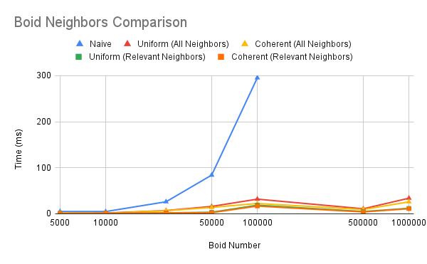
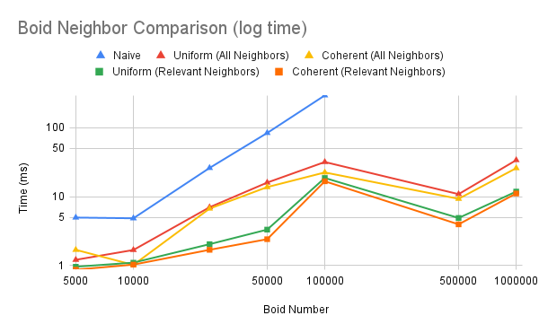
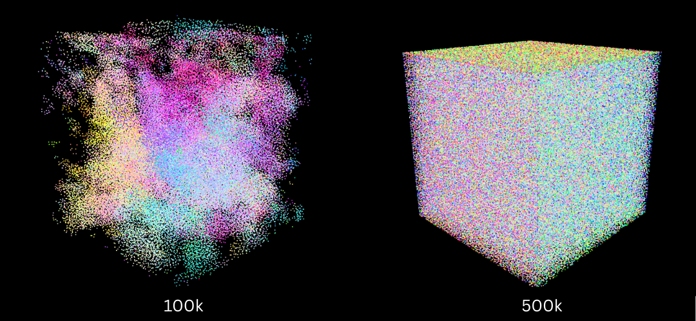
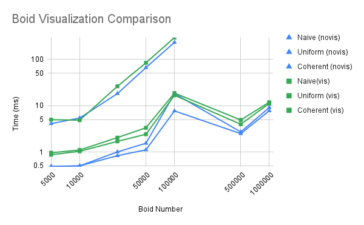
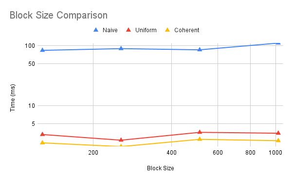
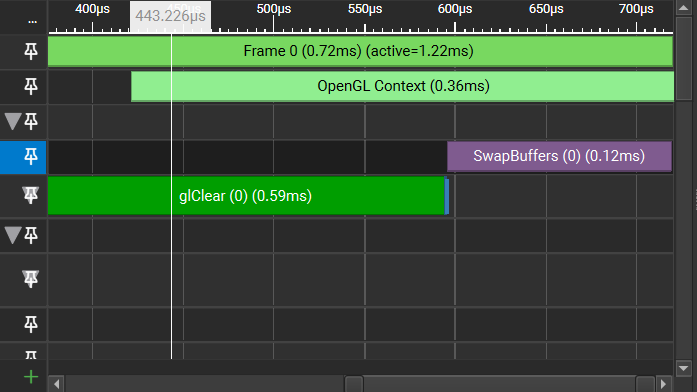

**University of Pennsylvania, CIS 5650: GPU Programming and Architecture,
Project 1 - Flocking**

* Avi Serebrenik
  * [https://www.linkedin.com/in/avi-serebrenik-a7386426b/](), [https://aviserebrenik.wixsite.com/cvsite]()
* Tested on: Windows 11, i7-13620H @ 2.4GHz 32GB, RTX 4070 8GB

### Results
 
 
 This gif was recorded on the machine described above with 50000 boids and a timestep of 0.02 to make the animation smooth.
 It uses the Coherent Grid algorithm, which provides the fastest results by sorting boid positions and velocities by grid cell index,
 making the lookup of boids in a grid cell much faster than the Uniform Grid algorithm, which does not make this optimization.
 Both of these algorithms only search for boids in grid cells that could have a "neighboring" boid--as defined by the neighbor distance
 of the main flocking algorithm--as compared to the naive method, which checks against every boid in every grid cell.

 I have plotted the runtime of these algorithms (in ms) with varying boid counts at 0.2s dt to see the difference these optimizations make,
 however I would focus on the comparisons between the algorithms and not the specific values, as I had other applications open, and my method
 for getting the milliseconds was counting to 5 in my head and then capturing an Nsight GPU Trace.
 The plots also compare searching all neighboring cells VS only searching neighboring cells that could have boids in the flocking distance.
 These plots have the same data, but the bottom one uses a log scale for time to see the differences between the fast algorithms clearly.
 The naive method also can not handle more than 100k boids on my laptop, which is why its data points end there.
 The block size was 128 for these plots and the data was visualized. For different block size comparisons and non-visualization performance
 comparisons, please see the graphs further down.
 
  
  
  
 As we can clearly see, the naive implementation is by far the worst; optimizing neighboring cell searches provides a significant boost in
 performance; and the Coherent Grid algorithm is faster than the Uniform Grid one. However, the difference between Uniform and Coherent grids
 is quite small when dealing with a small number of boids, and Uniform is actually faster when searching all the neighbors. Furthermore,
 besides the naive algorithm, they all experience quite a considerable performance boost between 100k and 500k boids.
 For the first result, I believe that this is due to memory searches still not being that far off when dealing with these lower numbers,
 and the Coherent algorithm relies on two extra kernels to sort and unsort my position and velocity arrays, leading to slightly more operations.
 However, as boid numbers increase, these operations pay off and we can clearly see the increase in performance.
 For the second result, I am a little baffled. I only have a hypothesis, which might be a little nonsensical. My theory is that after a certain
 number of boids (somewhere between 100k and 500k), we overload the grid cells to such a degree that the boids become relatively evenly distributed
 in each cell. This means that each thread will have to generally check the same number of boids, and thus they rarely stall. However, with 100k, we
 we still have some sparse areas which lead to some threads having much more work than others, creating some massive stalling. We can see these
 boid values in the image below:
 
  
  
  When comparing between visualizing VS not visualizing, we see the expected result that not rendering the visuals speeds up the simulation.
  This is consistent accross the non-naive implementations and is about a factor of 2. For the naive implementation, the difference is quite
  minimal, since the algorithm is throttled by other problems, to the point where visualizing came out faster for 10k boids.
  
  
  
  When comparing block size, the performance stays consistent. I was curious about why this was the case and checked in Nsight. I found that
  my bottlenecks were glClear and swapping buffers, which are not affected by block size changes, so this lack of perfomance change is expected.
  
  
  
 
### Question Answers

