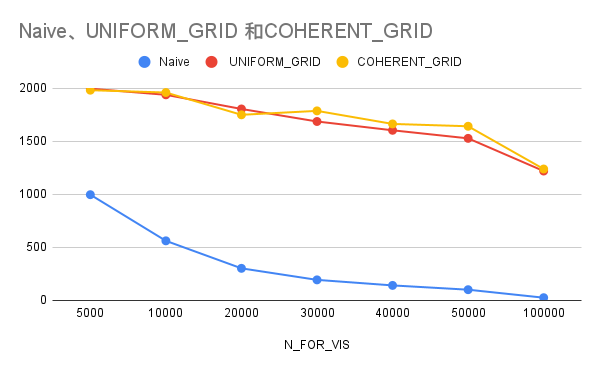
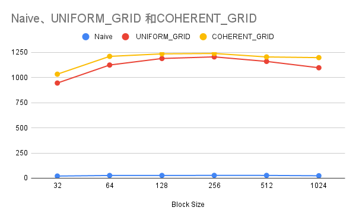

**University of Pennsylvania, CIS 5650: GPU Programming and Architecture,
Project 1 - Flocking**

* Jiangman(Lobi) Zhao
  * [Lobi Zhao - LinkedIn](https://www.linkedin.com/in/lobizhao/), [Lobi Zhao - personal website](https://lobizhao.github.io/).
* Tested on: Windows 11 Pro, i5-10600KF @ 4.10GHz 32GB, RTX 3080 10GB

### Performance Analysis and Question

#### Performance Analysis

** 100K Boids  UNIFORM_GRID VISUALIZE**

** 100K Boids Naive VISUALIZE**

** 100K Boids COHERENT_GRID VISUALIZE**

** Fps With Number of Boids **

  

#### Performance Analysis

Test Conditions:

    GPU: NVIDIA RTX 3080

    Implementations Tested: Naive, Uniform Grid (Scattered), Coherent Grid

    Particle Count (N_FOR_VIS): Ranged from 5,000 to 100,000

Summary of Results:

This report analyzes the framerate (FPS) of three different Boids simulation implementations as the number of particles increases.

The Naive implementation's framerate remains under 1000 FPS for all tested scenarios and drops significantly to approximately 20 FPS when simulating 100,000 particles, clearly demonstrating its O(N²) complexity bottleneck.

Comparison of Optimized Implementations:

Both optimized approaches leverage a uniform spatial grid to reduce the neighbor search space, resulting in a dramatic performance improvement over the Naive method.

The Uniform Grid (Scattered) approach partitions boids into a spatial grid by sorting their original indices (particleArrayIndices) based on a calculated grid cell ID (particleGridIndices). While this correctly limits the search to adjacent cells, it introduces a layer of memory indirection: to get a particle's data, the kernel must first read its original index from the sorted array, and then use that index to access the actual position and velocity arrays.

The Coherent Grid implementation eliminates this indirection. After sorting, it adds a data reshuffling step which physically reorders the position and velocity arrays in global memory to match the sorted grid order. This "cuts out the middleman" and ensures that threads processing boids within the same grid cell access a contiguous block of memory. This leads to a more cache-friendly and coalesced memory access pattern.

** Fps With Block Size **

This chart illustrates the impact of CUDA block size on the performance (in Frames Per Second) of the Naive, Uniform Grid, and Coherent Grid implementations.

The Naive method shows consistently low performance, indicating it is limited by the algorithm's complexity. In contrast, both the Uniform and Coherent Grid methods are highly sensitive to the block size, with performance peaking at a block size of 128 and 256. The Coherent Grid consistently outperforms the Uniform Grid, highlighting the additional benefit of optimizing for memory access patterns.

#### Question

- Coding Part 1.2 - Record the new velocity into vel2. Question: why NOT vel1?

      To avoid a race condition and ensure the calculation is deterministic.

- Coding Part 2.1 

      int *dev_particleGridIndices; 
      Purpose: This array acts as the "key" for sorting. Each element dev_particleGridIndices[i] will store the grid cell ID for the i-th particle.

      int *dev_particleArrayIndices;
      Purpose: This array acts as the "value" for sorting. It initially holds the original index of each particle (0, 1, 2, ... N-1). When dev_particleGridIndices is sorted, this array is rearranged in the exact same way, so you always know the original identity of each particle.

- For each implementation, How does changing the number of boids affect performance?

      For Naive method. The performance gets crushed really fast. It’s an O(N²) algorithm, so if you double the boids, you get four times the work.
      For Uniform Grid method. It handles way more boids gracefully. The slowdown is much more gradual (closer to O(N)) because each boid only worries about its immediate neighbors.

- For each implementation, how does changing the block count and block size affect performance?

      It's all about finding the "sweet spot" for GPU occupancy.
      Too small: Not enough threads running at once to keep the GPU busy while it's waiting on memory.
      Too large: A single block eats up too many resources, so you can't run enough blocks at the same time.
      The optimal size (usually 128 or 256) keeps the GPU's cores fed with work, giving you the best performance.

- For the coherent uniform grid: did you experience any performance improvements with the more coherent uniform grid? 

      Yes, it gave a nice little boost, which was expected.
      The first optimization (Scattered) still has to "chase pointers"—it looks up an index in one list to find the data in another. The Coherent version physically shuffles the data so everything is in order. This means the GPU can grab big, continuous chunks of memory, which is much faster.

- Did changing cell width and checking 27 vs 8 neighboring cells affect performance? Why or why not? 

      Big cells: Easy to find all your neighbors (they're all in the 3x3x3 grid around you), but you have a longer list of boids to check inside each cell.
      Small cells: The list of boids inside each cell is shorter and faster to check, but you might have to check more cells to find all your neighbors.

