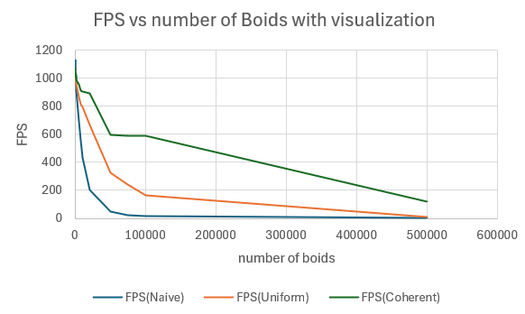
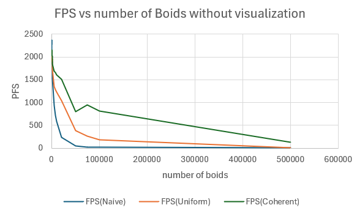
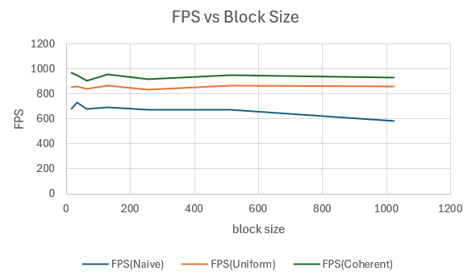

**University of Pennsylvania, CIS 5650: GPU Programming and Architecture,
Project 1 - Flocking**

* Lijun Qu
  * [LinkedIn](https://www.linkedin.com/in/lijun-qu-398375251/), [personal website](www.lijunqu.com), etc.
* Tested on: Windows 11, i7-14700HX (2.10 GHz) 32GB, Nvidia GeForce RTX 4060 Laptop

## Results

**50000 boids**  

## Performance Analysis

### 1. Fps vs. Number of Boids

Setup. Release build, blockSize = 128, VISUALIZE = 1 or 0 (so FPS includes rendering for VISUALIZE = 1 will be lower then VISUALIZE = 0), V-Sync off. Uniform (scattered & coherent) used cellWidth ≈ 2×max rule radius and a 3×3×3 (27) cell stencil in 3D. The plot shows FPS vs #boids for Naive, Uniform (scattered), and Coherent.

Naive. FPS drops the fastest as N grows because each boid scans all others (≈O(N²)). With visualization on, the renderer adds fixed overhead, but the all-pairs neighbor pass still dominates—hence the steep falloff and early saturation in the curve.

Uniform (scattered). FPS declines much more gently: per-step work is “build indices + radix sort + N·k,” where k (avg neighbors) stays roughly constant at fixed density. For very small N, the fixed sort/start-end overhead can make it similar to or slightly worse than naive, but as N increases it clearly outperforms naive. Memory access is still indirect (particleArrayIndices[k]), so the neighbor pass is bandwidth-limited.

Uniform (coherent). Highest FPS across the range. Reordering positions/velocities into cell order makes neighbors contiguous, so global loads are coalesced and the indirection disappears. At small N the reorder cost can hide the gain, but as N grows (and the neighbor pass dominates) the coherent curve stays well above scattered—matching the green line’s shallower slope in the figure.

Why 27 cells, and cellWidth choice. With cellWidth ≈ max(rule radii), a 3×3×3 stencil is both correct and usually faster than using fewer—but larger—cells: checking “more cells” can still mean fewer total candidates because each cell holds fewer boids. Performance is driven by candidate count and memory locality, not just the raw number of cells visited.

Block size. Kept at 128 for all runs; that sits near the typical occupancy sweet spot for these memory-bound kernels.

### 1. Fps vs. Block size

Setup. Release build, VISUALIZE = 1, V-Sync off, N = 5000 boids. Block size swept from small (≈64) to large (≈1024). Uniform (scattered & coherent) use grid cell width ≈ 2×max rule radius.

Naive. FPS is highest at small–mid blocks and then falls steadily as block size grows (≈700 → ≈580). Larger blocks reduce the number of active blocks per SM and increase register pressure, so there’s less latency hiding and more impact from divergence.

Uniform (scattered). Curve is fairly flat with a soft peak around mid blocks (≈128–512), staying ~850–900 FPS. Work is largely memory-bound (sort + neighbor pass), so moderate blocks give enough occupancy to hide memory latency; very small blocks under-occupy, very large blocks don’t help and can hurt.

Uniform (coherent). Fastest across all block sizes (≈900–1000 FPS). Reordering makes neighbor reads coalesced, so performance is less sensitive to block size; still, there’s a small dip at the extremes (very small → under-occupancy, very large → register/active-block limits).

Takeaways. For this GPU and N=5000, 128–256 threads/block is a safe sweet spot (512 also fine). Avoid 1024 unless profiling shows otherwise. Coherent uniform grid consistently delivers the best FPS and is comparatively robust to block-size choice.