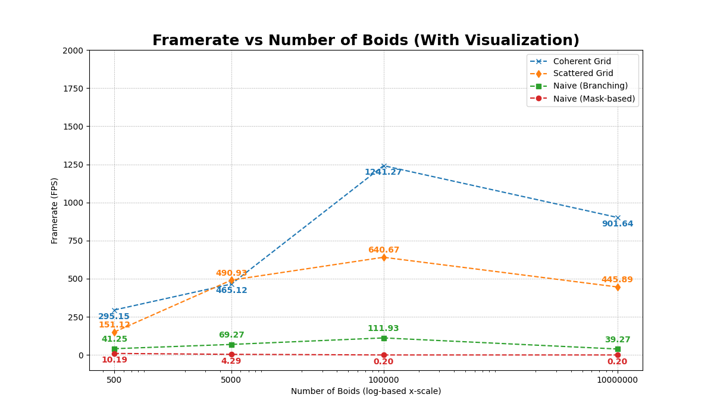

# Boid Flocking in CUDA


University of Pennsylvania, CIS 5650: GPU Programming and Architecture, Project 1

- Amy Liu
  - Personal Website, LinkedIn, Github.
- Tested on: Fedora 42 KDE Plasma, Wayland Protocol, Optimus GPU (Intel(R) Core(TM) Ultra 9 275HX 32GiB, NVIDIA GeForce RTX 5070Ti 12227MiB)

## Overview

This project implements a real-time 3D flocking simulation in CUDA C++ based on [Craig Reynolds’ 1987 Boids algorithm](https://team.inria.fr/imagine/files/2014/10/flocks-hers-and-schools.pdf).

To summarize it, the Boids algorithm is governed by three simple behavioral rules: cohesion (move toward the average position of neighbors), separation (avoid crowding too closely), and alignment (match the velocity of nearby boids).

The codebase progresses through three implementations of increasing efficiency: a naïve all-pairs neighbor search, a uniform grid spatial partitioning approach to reduce unnecessary comparisons, and an optimized coherent grid variant that improves memory access locality. 

Alongside implementing these kernels, the project emphasizes GPU performance analysis by measuring and comparing execution times, evaluating scalability with varying boid counts, and exploring how block sizes and grid structures affect efficiency.

This project was completed for **CIS 5650**, a master’s-level course in GPU programming at the University of Pennsylvania.

Notably, the final optimized implementation achieved **1800 fps** runtime with **100000 particles** simulated every frame.

## Demo Media

Simulations are handled using a combination of GLFW, GLEW, and OpenGL.

**10,000 Boids Simulation**


Here, observe the "flocking" behavior in smaller clusters of boids.

**100,000 Boids Simulation**


Note that colors are mapped to particle velocity.

**1 Million Boids Simulation**


Though unrealistic, the simulation can efficiently handle upwards of 1 million particles.

## Data Collection

Data was collected to understand the effect of different variables on the framerate of the simulation, where higher frames per second (FPS) signifies better performance.

**Graph 1: Framerate vs Number of Boids (With Visualization)**


Note, I included data from my first attempt at implementing the naive / brute-force calculation of boid behavior. In this attempt, I used a mask-based approach to a branching situation, as we studied that branching can be inefficient on the GPU. 

```python
for each neighbor j:
    d = distance(pos[i], pos[j])
    mask1 = (d < rule1MaxDist) ? 1 : 0
    mask2 = (d < rule2MaxDist) ? 1 : 0
    mask3 = (d < rule3MaxDist) ? 1 : 0
    cohesion   += mask1 * rule1Factor
    separation += mask2 * rule2Factor
    alignment  += mask3 * rule3Factor
```

However, this implementation actually led to less than optimal results, as shown in the graph data. This first draft implementation is located [here](https://github.com/CIS5650-Fall-2025/Project1-CUDA-Flocking/blob/1d94c9d44171d3223b58e458969b70508d2585a0/src/kernel.cu#L259C1-L304C2) for perusal.

Switching to a more standard `if-then` format showed an incredible performance improvement.

```python
for each neighbor j:
    d = distance(pos[i], pos[j])
    if d < rule1MaxDist:
        cohesion   += rule1Factor
    if d < rule2MaxDist:
        separation += rule2Factor
    if d < rule3MaxDist:
        alignment  += rule3Factor
```

Looking into it, I learned that in many cases the compiler and thread scheduler often predict simple if bodies, albeit their classification as "branching". In future coding, I will keep an eye out for this slight gotcha.

---

Furthermore, toggling off visualization in the program can eliminate GL-related operations. This effectively allows us to isolate and measure the efficiency of our CUDA implementation.

**Graph 2: Framerate vs Number of Boids (No Visualization)**


Furthermore, I was introduced to the notion of "Blocks" in CUDA for this project. Briefly, a block refers to a number of threads that are grouped together within a program's execution. Threads within a block can cooperate by sharing data through shared memory and synchronizing their execution. However, blocks can further be grouped into a "Grid", but these blocks have no ability to cooperate or communicate with each other (share memory, exchange data, synchronize execution, etc).

In this graph, I measure how choosing different block sizes will affect framerate in execution. From my observation, the performance improvement is logarithmic in nature.

**Graph 3: Framerate vs CUDA block size (No Visualization)**


## Other Performance Analysis

#### For each implementation, how does changing the number of boids affect performance? Why?
- Naive (all-pairs): Falls off fast as boids increase. Expected, with the very large NxN comparison overhead.

- Uniform grid (scattered): Big improvement over naive, then flattens out. This is because we effectively cut the search space, but indirection (needing particleArrayIndices) hurts performance still.

- Uniform grid (coherent): Best. Reordering makes neighbors mostly contiguous in memory, so reads are coalesced even as N grows. You can see the jump at 100K boids in the plots, and maintained optimal performance even at 1 million boids.

#### For each implementation, how do block count and block size affect performance? Why?
Bigger blocks help up to around 256–512 threads per block, then it levels off.
I believe initial improvement comes from the impact of higher occupancy and better memory coalescing, but after that, register/memory pressure and scheduling overhead cap that improvement.

#### For the coherent uniform grid: did you experience any performance improvements with the more coherent uniform grid? Was this expected? Why or why not?

Yes—generally faster than scattered, especially at higher boid counts. This was expected: by reshuffling pos/vel into cell order, neighbor loops turn into mostly sequential reads, where GPUs specialize. The O(N) reshuffle cost gets amortized. There’s a small-N case where the reshuffle overhead can briefly outweigh the gains

#### Did changing cell width and checking 27 vs 8 neighboring cells affect performance? Why or why not?

It mattered more in the scattered version and was roughly neutral in the coherent version.
In scattered, more cells mean more cache-unfriendly indirect reads, so overhead adds up. In coherent, those neighbors live contiguously, so even with more cells, accesses are sequential and cheap. It’s the access pattern—not the raw number of cells—that really drives performance.

## Build Instructions

Prerequisites:
- NVIDIA GPU
- NVIDIA Driver (r580+)
- CUDA toolkit (13.0+)
- CMake

See `run_linux.sh` for a simple template on building and running the program.