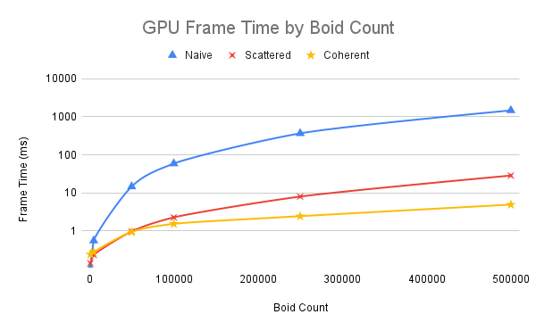

# CUDA Boids Implementation

# Project Introduction
> University of Pennsylvania **CIS5650 – GPU Programming and Architecture**  
> - Jacky Park  
> - Tested on: Windows 11, i9-13900H @ 2.60 32 GB, RTX 4070 (Laptop GPU) 8 GB (Personal Machine: ROG Zephyrus M16 GU604VI_GU604VI)

This project implements a **Boids simulation**, inspired by [Conrad Parker’s pseudocode](https://vergenet.net/~conrad/boids/pseudocode.html) with several custom adaptations.

Boids is a crowd simulation algorithm originally developed by Craig Reynolds in 1986, designed to mimic the natural flocking behaviors observed in birds, fish, and other swarming creatures. At its core, the algorithm is governed by three simple rules:

- **Cohesion**: Each boid moves toward the perceived center of mass of its neighbors.

- **Alignment**: Each boid steers in the direction of the average heading of nearby boids.

- **Separation**: Each boid maintains a comfortable distance from others to avoid crowding.

Together, these local interaction rules produce emergent, lifelike group movement without the need for centralized control.

The boids are then rendered using OpenGL. 

*Simulation with 500,000 boids.*

## Implementation Approaches

### 1. Naive
Function: `kernUpdateVelocityBruteForce`

The simplest way to update boids is to just have each one check against *every* other boid.  
- That means for each boid, we loop over the whole list, apply the three rules, and update its velocity.  
- On CUDA, this translates to one thread per boid, with a second kernel to apply the position updates.  
- It works, but it’s **O(N²)**, really slow once the number of boids grows.

### 2. Uniform Scattered Grid
Function: `kernUpdateVelNeighborSearchScattered`

We can do much better by using a grid. Since boids only care about neighbors within a certain radius, we don’t need to compare them against the entire flock.  
- We split space into a uniform grid, where each cell size is set to **twice the search radius**.  
- This guarantees a boid only needs to look at its own cell plus the 8 neighbors around it.  
- Implementation details:  
  - A kernel computes which grid cell each boid belongs to.  
  - We use `thrust::sort_by_key` to sort boids by their grid index.  
  - Start/end indices for each cell are stored so we can quickly find boids in that cell.  
- Each boid checks *way* fewer neighbors, and performance improves significantly.

### 3. Uniform Coherent Grid
Function: `kernUpdateVelNeighborSearchCoherent`

We can push the grid idea even further by making **memory accesses more efficient**.  
- In the scattered grid, threads bounce around in memory to find neighbor data. That’s slow on the GPU.  
- Instead, we **reorder the actual boid data** so positions and velocities are stored contiguously by grid cell.  
- This makes memory access *coherent*, so the GPU can cache data more effectively.  
- Even though it’s just a small change, the performance boost is significant.

# Performance 
## Scalability by Flock Size

To test scalability, all three approaches were benchmarked with flock sizes ranging from **1,000 up to 500,000 boids**.  
- The naive approach quickly hit a wall beyond 500,000 boids, it struggled to produce results.  

### Average Frame Time (ms)

| Boid Count | Naive   | Scattered | Coherent |
| ---------- | ------- | --------- | -------- |
| **1,000**   | **0.105** | 0.141     | 0.241    |
| **5,000**   | 0.550   | **0.233** | 0.279    |
| **50,000**  | 14.604  | 0.963     | **0.941** |
| **100,000** | 58.832  | 2.260     | **1.529** |
| **250,000** | 366.550 | 7.963     | **2.431** |
| **500,000** | 1469.482| 28.458    | **4.900** |

#### Best Overall: Coherent Uniform Grid
As expected, strategies that use a uniform grid to limit neighbor checks scale dramatically better than the naive method.  
- The uniform grid reduces the search space to just nearby cells.  
- Reordering data for memory coherence gives an additional boost, making the **coherent grid the top performer overall**.

#### Exception: Naive Wins at Very Low Counts
Interestingly, at just **1,000 boids**, the naive method actually outperforms the grid-based strategies.  
- The overhead of computing grid indices and sorting ends up costing more than the savings at this small scale.  
- Kernel timings confirm that most of this overhead comes from sorting and cell identification:  

| Metric            | Naive        | Scattered    | Coherent     |
| ----------------- | ------------ | ------------ | ------------ |
| `computeIndices`  | n/a          | 0.005 ms     | 0.005 ms     |
| `updateVelocity`  | 0.101 ms     | 0.020 ms     | 0.023 ms     |
| `updatePos`       | 0.004 ms     | 0.030 ms     | 0.024 ms     |
| `sortByKey`       | n/a          | 0.104 ms     | 0.230 ms     |
| `identifyCell`    | n/a          | 0.012 ms     | 0.017 ms     |
| **Total (GPU)**   | **0.105 ms** | **0.171 ms** | **0.299 ms** |

## Impact of Block Size on Performance

Changing the block size alters the number of threads per block. Since each streaming multiprocessor (SM) can run up to **1024 threads at once** (on Ada Lovelace GPUs), block size also impacts how many blocks can be scheduled per SM.

#### Benchmark Results

#### No Impact for Regular Block Sizes (> 32)
Larger block sizes didn’t show any notable performance differences.  
- This is expected, since the GPU can schedule about 1024 threads per SM regardless of block size.  
- The only exception would be kernels with high memory usage, where SM occupancy could become memory-bound.

#### Degradation for Very Small Block Sizes (< 32)
Performance drops significantly when block size falls below 32.  
- A warp consists of 32 threads, the smallest execution unit on the GPU.  
- If a block has fewer than 32 threads, the unused lanes in the warp sit idle, wasting compute capacity.

## Scattered vs. Coherent Memory

One optimization applied to the uniform grid strategy was improving memory layout in the velocity update kernel.  
- During the preprocessing step each frame, the position and velocity buffers are **reordered by grid index**.  
- This makes neighboring boids stored contiguously in memory, improving cache locality and reducing indirection.  
#### Benchmark Results

This optimization directly explains the performance gap observed in the **[Scalability by Flock Size](#scalability-by-flock-size)** results.

## Cell Width and Performance

Changing the cell width directly affects how many neighboring cells are searched during the velocity update. With a width of **2× the rule distance**, only 8 neighboring cells need to be checked. Reducing the width to **1× the rule distance** increases this to 27 neighboring cells. Because neighbor lookups are central to the uniform grid strategy, this choice has a noticeable impact on performance.

### Benchmark Results

| Cell Width         | 2× ruleDistance | 1× ruleDistance |
| ------------------ | --------------- | --------------- |
| **Frame Time (ms)**| 4.986           | 3.491           |

In these tests, the smaller cell width (**1× ruleDistance**) produced better performance. I'm guessing that this could be explained by how cell size influences the distribution of boids:  

- **Larger cells** → fewer but bigger cells to search, often containing many boids outside the influence radius → wasted computation.  
- **Smaller cells** → more but tighter cells, with most boids actually inside the influence radius → less wasted work.  

