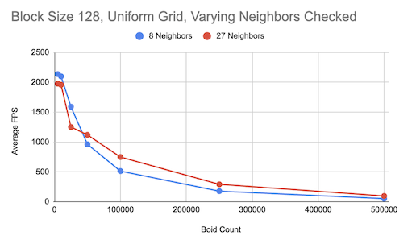

**University of Pennsylvania, CIS 5650: GPU Programming and Architecture,
Project 1 - Flocking**

* Marcus Hedlund
  * [LinkedIn](https://www.linkedin.com/in/marcushedlund/)
* Tested on: Windows 11, Intel Core Ultra 9 185H @ 2.5 GHz 16GB, NVIDIA GeForce RTX 4070 Laptop GPU 8GB (Personal Computer)

# CUDA Boids Flocking Simulation
||
|:--:|
|10000 Boids simulation using naive approach|

# Overview

In this project I implement a 3D flocking simulation in CUDA based on the Reynolds Boids algorithm. The simulation models flocking behavior through particles called boids (bird-oid) using three rules:

* Cohesion - move toward the center of nearby boids
* Separation - avoid getting too close to nearby boids
* Alignment - try to match the velocity of nearby boids

A boid updates its velocity at each timestep by applying these rules to its neighboring boids within a defined distance for each rule (the largest of which we'll call the neighborhood distance). This means that two boids can only influence eachother if they are within a neighborhood distance of eachother.

I developed the algorithm in three progressively optimized implementations:
1. Naive Approach - every boid checks if every other boid is within its neighborhood distance
2. Uniform Spatial Grid - boids are preprocessed into spatial grid cells so boids only have to check their own cell and neighboring cells
3. Uniform Spatial Grid with Semi-Coherent Memory Access (Coherent Grid) - extends the uniform spaciall grid by ensuring positions and velocity data for boids in the same cell are contiguous in memory.

||  |  |
|:--:|:--:|:--:|
| *10000 Boids simulation using naive approach* | *25000 Boids simulation using uniform grid* | *100000 Boids simulation using coherent grid* |

# Performance Analysis

### Collecting Data

I collected frame rate data during the first 12 seconds of simulation. The first two seconds were discarded because they were often abnormally high during the simulation's startup, and the remaining 10 were averaged to get the final result. The data was then logged to a csv and processed in the [data](https://github.com/mhedlund7/Project1-CUDA-Flocking/tree/main/data) folder for analysis.

### Varying Boid Count
||||
|:--:|:--:|:--:|
| *5000 Boids* | *100000 Boids* | *500000 Boids* |

As we would expect, in these graphs we can see that increasing the number of boids in the simulation decreases the average fps. This makes sense because as the number of boids goes up, every additionaly boid needs to have its velocity be recomputed every timestep, and also each boid will likely have more boids in its neighborhood, increasing the per-boid computation time as well.

Additionally we can see that the uniform and coherent grid implementations significantly improve over the naive approach. For example at 250,000 boids and a block size of 128 the naive simulation drops to around 3 FPS while the uniform grid stays at 177 fps and the coherent grid is all the way at 744 fps. We also see that at high boid counts the coherent grid greatly outperforms the coherent grid while at low boid counts their frame rates are around the same. This is the outcome I expected, but I did not expect it to have such a large impact. The increase though does make sense because the contiguous memory has much better memory locality when accessing position and velocity data which greatly increases cache hit rates when compared to the scattered accesses in the normal uniform grid.

### Varying Block Size
||||
|:--:|:--:|:--:|
| *5000 Boids* | *100000 Boids* | *500000 Boids* |

For each implementation changing the block size had no noticeable impact on performance. This was surprising to me, but I think it is likely because we're computing enough boids that the GPU is already saturated and has enough warps to hide memory latency so increasing block size doesn't improve performance further. The block size only ends up changing how the threads are grouped without actually increasing parallelism.

### Neighborhood Size Comparison

||
|:--:|
|Comparing Frame Rates of Checking 8 vs 27 neighbors|

I also compared the strategies of usign a grid width of twice the neighborhood distance and checking the eight grid cells surrounding the boid for neighbors versus using a grid width of exactly the neighborhood distance and checking the 27 cells surrounding the boid.
Surprisingly in the graph we can see that checking the 27 surrounding cells worked better. I initially expected that increasing the density of the cells would lead to an increase in computation overall, but because the 27 cells form a 3x3x3 cube with side length 3 neighborhood distances whereas the 8 cells form a 2x2x2 cube with side length 4 neighborhood distances, the increase in simulation space we need to check ends up meaning the 8 neighbor version takes longer. This is because the increased simulation space means we have to check more boids that are outside the current boids neighborhood distance, taking a longer time.

### Optimized Grid Looping

I additionally implemented an optimized grid-looping strategy:
* Grid width can be set to a scalar multiple of the neighborhood distance instead of being hardcoded along with the number of neighbor cells to check
* The algorithm only checks cells that have part of them within the boid's neighborhood sphere, avoiding unnecessarily checking full cubes of space where the corner cells might be entirely outside of the boid's neighborhood

||
|:--:|
|Comparing Frame Rates of Optimized Grid-Looping with Varying Grid Widths|
From the graph we can see that the optimized grid looping with a grid width of 1 neighborhood distance worked the best. This is likely because as the grid width decreases, the increased number of cells we have to iterate through increases the computation enough to outweigh the reduced search area. 
