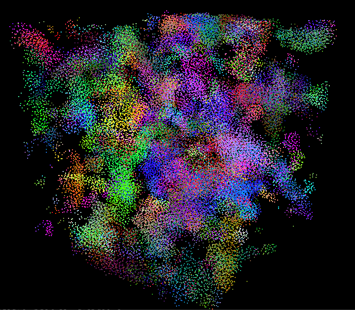
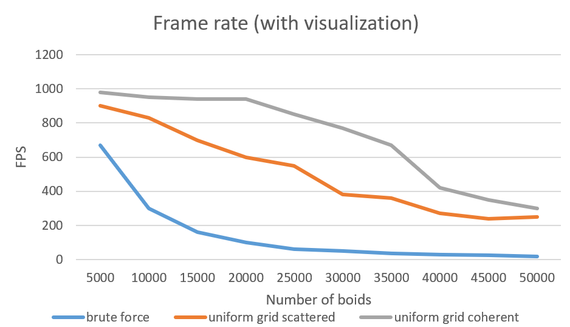

**University of Pennsylvania, CIS 5650: GPU Programming and Architecture,
Project 1 - Flocking**

* Anya Agarwal
  * [LinkedIn](https://www.linkedin.com/in/anya-agarwal/)
* Tested on: Windows 11, AMD Ryzen 7 260 @ 380GHz 16GB, RTX 5060

# CUDA Flocking

  
  
Simulation with Coherent Grid; 50000 Boids

     
  
Screenshots of 5000 boids, 10000 boids, and 50000 boids respectively

## Overview

The goal of this project was to implement a flocking simulation based on the Reynolds Boids algorithm, as well as optimize this process using different gridding techniques. This project is implemented using CUDA kernels. 

### Naive Approach

I first started off implementing the naive algorithm for flocking. This involved three rules:
- Cohesion - boids move towards the perceived center of mass of their neighbors
- Separation - boids avoid getting too close to their neighbors
- Alignment - boids generally try to move with the same direction and speed as their neighbors

This was done without any optimization, meaning that for each timestep, every boid would have to check every other boid to see if it's within a neighborhood distance, and then calculate its new velocity accordingly. The naive approach therefore causes a lot of slowdowns, especially with an increase in the number of boids, as there are exponentially more boid checks to be done.

### Scattered Grid Approach

The first optimization was to change the way that neighboring boids were found. Instead of checking every single boid as in the naive approach, the scattered grid approach would separate the 3D cube into a grid, and classify every boid into a corresponding cell. Now, I only had to check neighboring cells to find all the neighboring boids, which would speed up the process of calculating velocities for each boid.

### Coherent Grid Approach

The coherent grid approach takes the previous optimization to the next level. For the implementation of the scattered grid approach, it required multiple levels of memory access, as the positions and velocities of boids needed to be accessed from information about the grid cell. The coherent grid approach allows for more coherent memory access and cuts out a level of work to be done, which allows for more direct memory access. 

## Performance Analysis

To test and analyze performance, I used CUDA events to record times, and corresponding FPS values for different parameters. A lower FPS, or framerate change, will indicate a slower performance. 

### Number of Boids

 

| Number of Boids (With Visualization) | Coherent Grid | Scattered Grid | Naive  |
| ------------------------------------ | ------------- | -------------- | ------ |
| 1000                                 | 716.48        | 788.79         | 542.26 |
| 5000                                 | 672.61        | 727.26         | 390.34 |
| 10000                                | 707.3         | 639.7          | 386.92 |
| 20000                                | 622.01        | 642.52         | 206.39 |
| 50000                                | 470.08        | 477.384        | 54.67  |

| Number of Boids (Without Visualization) | Coherent Grid | Scattered Grid | Naive   |
| --------------------------------------- | ------------- | -------------- | ------- |
| 1000                                    | 1329.19       | 1462.95        | 546.76  |
| 5000                                    | 1303.13       | 1148.57        | 473.4   |
| 10000                                   | 1300          | 1271.41        | 365.464 |
| 20000                                   | 1270.02       | 1253.46        | 185.17  |
| 50000                                   | 694.36        | 636.99         | 48.23   |

The first graph was generated using FPS values with the visualization toggled on, and the second was with it toggled off. To test the effect of the amount of boids on performance, I ran the simulation for the three implementations - naive, scattered grid, and coherent grid - using five different boid amount values: 1000, 5000, 10000, 20000, and 50000. I kept the block size consistent at 128. As we can see, the FPS in general is a lot faster without the visualization, as rendering it will slow down the performance. Also, looking at both graphs, we can see that both the scattered and coherent grid do indeed optimize the naive implementation. It's interesting to note that the extra optimization from switching from scattered to coherent is also visible in the graphs, although less stark. Looking at the boid numbers, the FPS stays somewhat consistent until 20000 boids, where it then starts a steady decrease in framerate change. So looking at the graph, it would seem that the most optimal number of boids are 20000 and below.

### Block Size

| Block Size | Coherent Grid | Scattered Grid | Naive  |
| ---------- | ------------- | -------------- | ------ |
| 32         | 1142.5        | 1174.49        | 436.08 |
| 64         | 1241.75       | 1064.93        | 464.62 |
| 128        | 1357.06       | 1083.75        | 408.09 |
| 256        | 1201.58       | 1251.4         | 430.09 |
| 512        | 1181.46       | 1299.19        | 452.76 |

To test the effect of block size on performance, I once again toggled between the three different implementation to test five different block sizes: 32, 64, 128, 256, and 512. I set the number of boids to be 5000 throughout every simulation. The block size was originally set to 128, so I was curious to see how both decreasing and increasing it would affect the framerate change. Once again, we can see that both the scattered and coherent grid still have substantially better performances than the naive implementation. Interestingly, as the block size increased, it seems that the scattered grid performed slightly better than the coherent grid, which isn't expected on the surface. Looking at performance based on the block size, performance tends to slightly improve as the block size increases, with the exception of the coherent grid. However, the increase in FPS is slight, with the best numbers being either 128 or 256, so changing block size doesn't create as much of an impact as changing the number of boids.

## Answers to Further Questions

**For each implementation, how does changing the number of boids affect performance? Why do you think this is?**

As I noted with the two graphs above, it seems that the FPS of the simulation greatly decreases after 20000 boids. Other than a seemingly random sharp decrease for the scattered grid at 5000 boids, the FPS for the scattered and coherent grids decrease very gradually until 20000 boids where there is a sharper dropoff. The drop in performance is less from 20000 boids to 50000 boids for the naive implementation, but the FPS at 50000 boids is 48.23, which is extremely low performing. In general, it was expected to see that the overall performance decreases as the number of boids decreases. This is because for each extra boid, there is another check that might have to be done to change the velocity of the current boid. For the naive implementation, this could mean that the performance worsens exponentially as the number of boids increases, as every boid will have to check the position of every other boid. For the scattered and coherent grid implementations, the decrease in performance might not be as dramatic since extra boids will only affect boids within its neighborhood distance, but there will still be a decrease in performance due to these extra checks.

**For each implementation, how does changing the block count and block size affect performance? Why do you think this is?**

As mentioned above with the graph, it seems that increasing the block size increases FPS slighly for the naive and coherent grid implementation, while increasing the block size decreases FPS slightly for the scattered grid implementation. It's interesting to see that the performance graph for the naive implementation is the most flat of them all, which means that block size has very little impact on it. This could be due to the fact that there are no optimizations with the naive code, so changing the number of threads being run at a time won't really affect the base level code. The block size might affect the scattered and coherent grid implementations more because of their added optimization of only checking some boids instead of all. If the block size was increased, then more threads may run at once, meaning that there may be more of a slowdown if many threads and their subsequent boids had vastly different numbers of neighbors to check. This could explain the slight dip in performance for the coherent grid. However, the performance of the scattered grid seems to get better with the increase in block size, meaning that there might be less of a scheduling cost happening with more threads running, which could offset the slowdown of threads and their boids having different neighbor amounts.

**For the coherent uniform grid: did you experience any performance improvements with the more coherent uniform grid? Was this the outcome you expected? Why or why not?**

I did in fact experience slight performance improvements with the more coherent grid as opposed to the scattered grid. This was the outcome I expected, since the coherent grid cuts out a layer of memory accesses, making information about the boids slightly faster to retrieve. This could be due to more efficient caching since the information is less scattered in memory. I was initially expecting a greater improvement in performance going from the scattered grid to the coherent grid, until I was able to graph and visualize performance for the three implementations. Looking at the graphs, there is indeed an improvement, but it is very slight and almost unnoticable when viewing the visualization.

**Did changing cell width and checking 27 vs 8 neighboring cells affect performance? Why or why not?**

After performing a few iterations of the simulation using 8 neighboring cells versus 27 neighboring cells, it seems that there is actually not much of a different in performance. In fact, for smaller boid amounts, the 27 neighboring cell check seemed to have a very slight performance advantage over the 8 neighboring cells, by around 30-50 FPS. This was interesting to me, as I would have expected that checking less cells would create better performance as there is less work to do. Increasing the number of boids seems to switch that, with 27 neighboring cells having a slightly worse performance than the alternative, but the differences were still miniscule. The similarities in performance could be due to the fact that there actually isn't that much more overhead involved in checking another set of neighboring cells. Since the size of the cells is exactly at the maximum neighborhood radius value, there's a greater chance that the neighboring cells may not even have that many more boids. So checking those extra cells may not in fact have much of an effect at all on the total overall performance. 