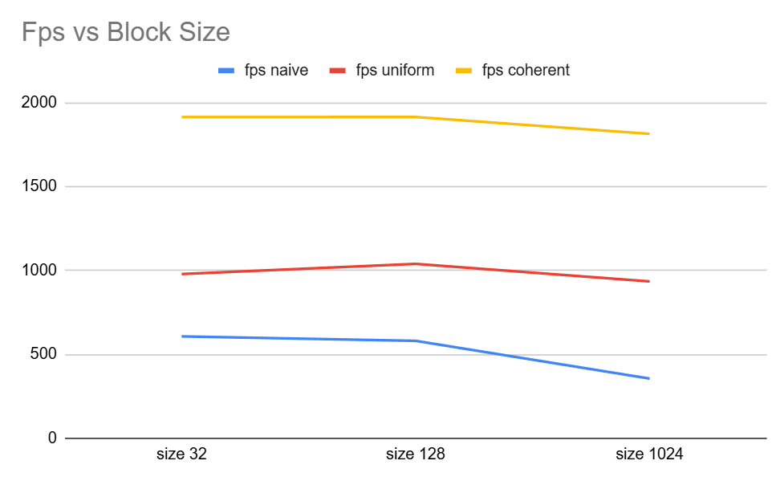

**University of Pennsylvania, CIS 5650: GPU Programming and Architecture,
Project 1 - Flocking**

* Haralambos Kokkinakos
  * [LinkedIn](https://www.linkedin.com/in/haralambos-kokkinakos-5311a3210/), [personal website](https://harriskoko.github.io/Harris-Projects/)
* Tested on: (09/07/2025) Windows 24H2, i9-12900H @ 2.50GHz 16GB, RTX 3070TI Mobile

### Boid Simulation

### Performance Analysis

1. in every implementation, increasing number of boids decreases fps but also decreases the time it takes for the simulation to converge and for all boids to begin motion. it makes sense at low number of boids that it takes longer for the simulation to converge. Each boid is on average further apart, meaning it takes longer for boids to find each other. It also makes sense that increasing number of boids decreases fps. With more boids needing to be calculated, the GPU has.

2. for each implementation, block size of 1024 has a huge performance drop. This is likely due to the increased overhead on each SM, decreasing the number of warps the scheduler can interweave. the changes in lower block counts dont affect the performance as much due to the decreased overhead on each SM. we would expect if block size got too low, there should be a performance decrease as we see in the uniform one. This is because the GPU would not be able to schedule enough warps to fully utilize GPU parallelism.

3. I did expect a performance improvement with the coherent uniform grid. Overall, optimizing/organizing GPU memory should decrease te overhead of accessing global/shared memory on the GPU even if only slightly.

4. The performance of the 27-cell neighbor check depends heavily on boid density. In the 8-cell implementation, many unnecessary checks for boids outside the search radius are avoided, reducing computational overhead. However, in cases of very low boid density, the 27-cell approach can perform roughly the same or even slightly better, since most of the extra cells are empty and incur little cost. Overall, the 8-cell approach is generally faster, but the 27-cell method can still be acceptable in certain low-density scenarios.
