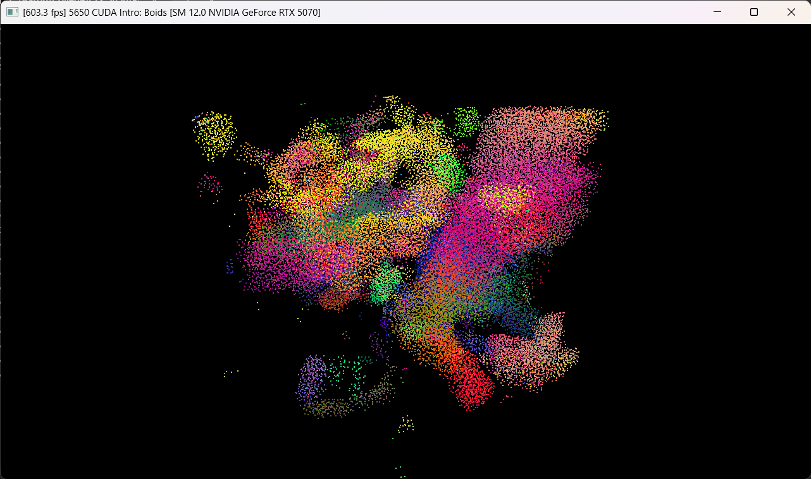

**University of Pennsylvania, CIS 5650: GPU Programming and Architecture,
Project 1 - Flocking**

* Oliver Hendrych
  * [LinkedIn](https://www.linkedin.com/in/oliver-hendrych/)
* Tested on: Windows 11, i7-14700K @ 3.4GHz 32GB, RTX 4070 SUPER 12GB (Personal)

## Performance

* For each implementation, how does changing the number of boids affect performance? Why do you think this is?
  * Generally, increasing the number of boids decreases the performance across all implementations. At low boid numbers, the naive implementation performs best. However, the number of boids has the clearest effect on the naive implementation, with the frame rate dropping quickly as the number of boids increases. This would be because every boid has to calculate its distance to every other boid, which would scale with O(n^2). With the uniform grid implementations, the frame rate remains steady until it starts decreasing with very high boid counts. This would be because the main operations performed (calculating which cells to check and iterating through them) stay relatively constant for each boid across small numbers of boids (scaling with O(n)), but as the number of boids gets very high, the number of boids in each cell increases, and so does the associated computations (again, scaling with O(n^2) as with the original naive implementation).
* For each implementation, how does changing the block count and block size affect performance? Why do you think this is?
  * Testing at 10,000 boids for the naive implementation, block size does affect performance, with the optimal being 32 on my system. With very small block sizes, the overhead due to scheduling might be too great, which degrades performance. With large block sizes, the differnet threads may end up competeing with resources on the SM. This doesn't seem to appear massively before 1024, with block sizes from 16 to 512 having comparable performances. Testing at 500,000 boids for the uniform implementations, block size again has a noticable impact. With the scattered uniform grid, the optimal was around 8, while with the coherent uniform grid, the optimal was about 512. This is likely because the coherent uniform grid can share much more memory between threads easier than the scattered implementation, since adjacent threads should usually be in the same or nearby grid cells, and likely need to check many of the same grid cells, so global memory fetches can be cached, and that cache can be effective across threads placed on the same SM. With smaller block sizes, this effect is reduced. With the scattered grid, due to the global random memory accesses, and that adjacent threads are not likely to be close/share many grid cells to check, each thread is instead aided by having additional resources for itself on the SM. At especially low block sizes, scheduling overhead may again be an issue.
* For the coherent uniform grid: did you experience any performance improvements with the more coherent uniform grid? Was this the outcome you expected? Why or why not?
  * At higher boid counts, there is a definite and noticable performance improvement with the coherent uniform grid, but at lower boid counts, it performs slightly worse (with them being equal around 5000 boids on my system). I was expecting it to be faster, but not as much faster as it turned out to be at higher boid counts (196 vs. 25 fps at 1,000,000 boids without visualization). At low boid counts, there is extra overhead introduced by having a kernel for (and having to schedule) the rearrange operation, which would degrade some performance. However, at higher boid counts, the consecutive memory accesses and shared global memory retrievals across threads in a block massively increase the performance over the scattered implementation.
* Did changing cell width and checking 27 vs 8 neighboring cells affect performance? Why or why not?
  * Changing the cell width and changing the checked cells accordingly actually increased performance for both the scattered and coherent uniform grid implementations (at 500,000 boids and 256 block size), almost doubling performance for both. This is not the result I expected, but is likely due to the reduction of search space for both implementations. Instead of searching (2\*2)^3=64 neighborhood volumes, (1\*3)^3=27 neighborhood volumes are searched, meaning less than half the volume (and, therefore, less than half the number of boids) needs to be iterated over. With less boids to be checked for every boid, it greatly increases performance.

### Graphs

#### Framerates (without (and with) Visualization) for Different Number of Boids and Implementations

| #Boids    | Naive       | Scattered Uniform Grid | Coherent Uniform Grid |
|-----------|-------------|------------------------|-----------------------|
| 1         | 5400 (2240) | 2990 (1970)            | 2620 (2130)           |
| 10        | 5260 (2240) | 2720 (1980)            | 2610 (1990)           |
| 100       | 4990 (2280) | 2630 (2200)            | 2730 (1930)           |
| 1,000     | 3390 (1930) | 2750 (2070)            | 2680 (1880)           |
| 5,000     | 1380 (950)  | 2670 (1930)            | 2680 (1960)           |
| 10,000    | 790 (620)   | 2660 (1750)            | 2550 (1820)           |
| 100,000   | 31 (30)     | 940 (730)              | 2390 (1610)           |
| 1,000,000 | 0.4 (0.3)   | 25 (24)                | 196 (160)             |

#### Framerates (without Visualization) for Different Block Sizes and Implementations

| Block Size | Naive | Scattered Uniform Grid | Coherent Uniform Grid |
|------------|-------|------------------------|-----------------------|
| 4          | 370   | 76                     | 147                   |
| 8          | 685   | 124                    | 245                   |
| 16         | 770   | 119                    | 389                   |
| 32         | 833   | 98                     | 575                   |
| 64         | 803   | 97                     | 593                   |
| 128        | 790   | 98                     | 595                   |
| 256        | 780   | 98                     | 610                   |
| 512        | 750   | 99                     | 620                   |
| 1024       | 570   | 99                     | 610                   |

## Extra Credit

**Grid-Looping Optimization**

Grid-Looping Optimization was performed by creating a bounding box around the boid, stretching maxRuleDistance in every direction, then checking through the grid cells that intersect with that box. Special care is given to the bounds to make sure they do not exceed the grid. Each axis is iterated through individually. This made switching to half the grid cell width very simple.