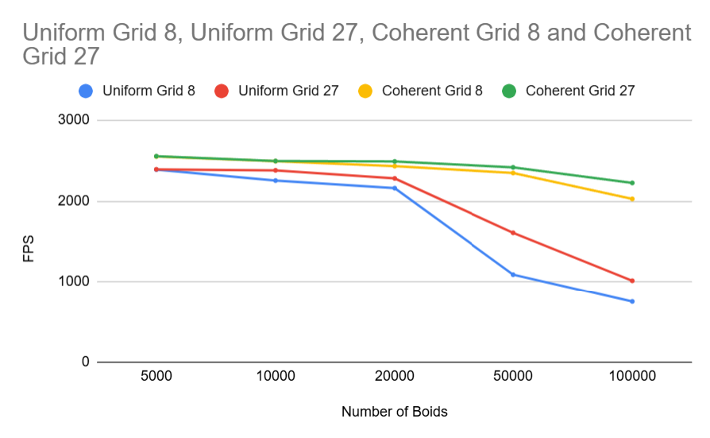

**University of Pennsylvania, CIS 5650: GPU Programming and Architecture,
Project 1 - Flocking**

  
   
  <b>Figure 1:</b> Boids Simulation using Coherent Grids

* Yuntian Ke
  * [LinkedIn](https://www.linkedin.com/in/yuntian-ke-8ab193325/), etc.
* Tested on: Windows 11, Intel Core Ultra 9 275HX @ 2.70GHz 32GB, RTX 5070 Ti 30160MB

## Visualized Result

  
   
  <b>Figure 2:</b> Coherent Grids with 50000 Boids

  
   
  <b>Figure 2:</b> Uniform Grids with 20000 Boids

  
   
  <b>Figure 2:</b> Coherent Grids with 10000 Boids

## Extra Credit: Grid-Looping Optimization
To enable this setting, you can just set "GridLoopingOptimization==1".

## Performance Analysis
I turned off Vertical Sync and recorded the FPS after it became quite stable.

  
   
  <b>Figure 3</b>  

### 1. For each implementation, how does changing the number of boids affect performance? Why do you think this is?
I test this using the number of boids from 5000 to 1000000.   
🔵 **Naive FPS**
- **Trend:** It drops sharply, and when number of boids is quite large, FPS goes close to 0.
- **Reason:** The Naive method checks every pair of boids to update the velocity, so that it gets Complexity $O(N^2)$. As $N$ grows, the computations it needs increase quadratically.  

🔴 **Uniform Grid FPS**
- **Trend:** It has much higher FPS than Naive Method, and FPS also decreases as number of boids increasing.
- **Reason:** Since it only checks the nearby cells instead of checking all pairs of boid as Naive Method did, it improve the performance, and FPS is higher than Naive Method. However, it still has a poor cache efficiency, so that when $N$ goes very large, FPS will still drops quickly.

🟡 **Coherent Grid FPS**
- **Trend:** Best performance overall. It has the highest FPS among all three methods, and FPS also decreases as number of boids increasing.
- **Reason:** By sorting particle data by cell index, memory access becomes coherent. This improves GPU cache and memory throughput, so even with many boids, lookups are efficient. The scaling is closer to linear than quadratic, so it outperforms the other methods.

  
  
   
  <b>Figure 4:</b> Left:N=50000, Right:N=10000  

### 2. For each implementation, how does changing the block count and block size affect performance? Why do you think this is?
I test this using $N = 50000$ adn $N = 10000$. The reason I test block size's influence on performance twice is FPS barely changed at the first time. So, I thought this may due to a large $N$, where the performance will be dominated by neighbor checks. Then I test at a smaller $N$. However, the result is still similar. For all three methods, it will only have a clear drop when I increased block size to 1024. I think this is because Warp size is 32. Any block size that’s a multiple of 32 gives similar scheduling behavior. Going 64→128→256 just changes how many warps the SM juggles—not the cost per boid. Uniform/Coherent grid updates spend most time doing global loads of neighbor data. When a kernel is bandwidth/latency bound, more threads per block rarely helps; the SMs are already waiting on memory.

### 3. For the coherent uniform grid: did you experience any performance improvements with the more coherent uniform grid? Was this the outcome you expected? Why or why not?
Yes — I observed a clear performance improvement with the coherent uniform grid compared to the naive or non-coherent uniform grid. The FPS stayed much higher as the number of boids increased.  
This outcome was expected. The main difference is that the coherent grid sorts boids by cell index, which makes neighbor data stored contiguously in memory. That improves memory coalescing and cache utilization on the GPU. Since the simulation kernels are memory-bound (spending most time loading neighbor positions/velocities), improving memory access efficiency leads directly to higher performance.

  
   
  <b>Figure 5:</b> check 8 vs 27 neighboring cells 

### 4. Did changing cell width and checking 27 vs 8 neighboring cells affect performance? Why or why not?

Short answer — Yes. No matter use Uniform Grids Method or Coherent Grids Method, checking 27 neighboring cells will have a higher performance. This is because even the number of cells need to be checked is increasing, the volume that needed to be checked is actually decreasing. For example, if we have "cellWidth = R" for 27 neighboring cells case, the volume it checks every time is $27R^3$, compared with the volume 8 neighboring cells need to check is $(2R)^3 * 8 = 64R^3$. Thus, we are actually check fewer boids every time through 27 neighboring cells method compared to 8 neighboring cells method.

