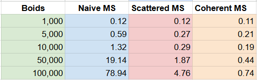
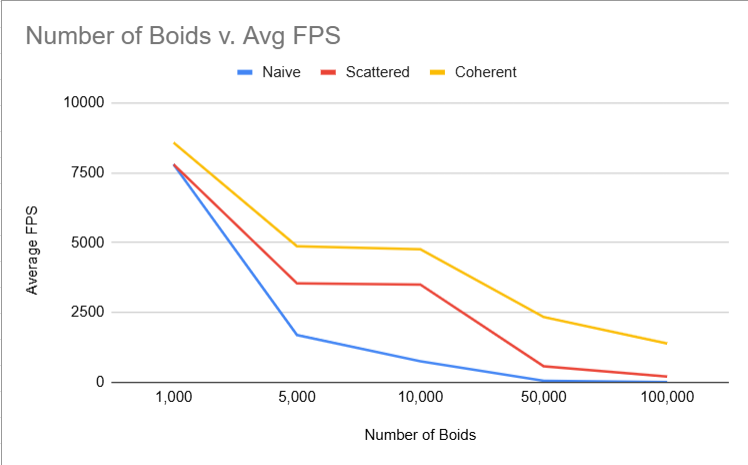

**University of Pennsylvania, CIS 5650: GPU Programming and Architecture,
Project 1 - Flocking**

* Christina Qiu
  * [LinkedIn](https://www.linkedin.com/in/christina-qiu-6094301b6/), [personal website](https://christinaqiu3.github.io/), [twitter](), etc.
* Tested on: Windows 11, Intel Core i7-13700H @ 2.40GHz, 16GB RAM, NVIDIA GeForce RTX 4060 Laptop GPU (Personal laptop)

## Overview

This is an implementation of a flocking simulation based on the Reynolds Boids algorithm. This project involved writing CUDA kernels, using them, and analyzing their performance. 

1. Naive boids simulation.
2. Scattered boids simulation on uniform grid.
3. Coherent boids simulation on uniform grid.

## Naive Boids

At every timestep, a boid looks at each of its neighboring boids and computes the velocity change contribution from each of the three rules:

1. cohesion - boids move towards the perceived center of mass of their neighbors
2. separation - boids avoid getting to close to their neighbors
3. alignment - boids generally try to move with the same direction and speed as their neighbors

Thus, a brute force implementation has each boid check every other boid in the simulation.

  
  

boids = 50,000, blockSize = 128, no visualization, dt = 0.2

Runtime O(n^2)

## Scattered Uniform Grid

Each boid is assigned to a grid cell based on its position. We store an array of particle indices, which are sorted by their grid cell. The actual position and velocity data remain in their original arrays so we must look up the sorted index to access a boid's data. This enables fast neighbor search but can cause memory access inefficiencies due to scattered data.

  
  

boids = 50,000, blockSize = 128, no visualization, dt = 0.2

Runtime O(n) * neighbors

## Coherent Uniform Grid

The coherent uniform grid improves on the scattered version by also reordering the position and velocity arrays so that boids within the same grid cell are stored contiguously in memory. This cuts out the middle-man and noticeably improves performance, especially on large numbers of boids.

  
  

boids = 50,000, blockSize = 128, no visualization, dt = 0.2

Runtime O(n) * neighbors

## Runtime Analysis

1. Hypothesis: Implementing a coherent uniform grid will significantly improve the performance of the Boids simulation compared to the scattered uniform grid and naive implementation, due to more efficient memory access and reduced unnecessary comparisons.

### Average Kernel Time change with increasing # of Boids Graph

blockSize = 128, no visualization, dt = 0.2

### Framerate change with increasing # of Boids Graph

blockSize = 128, no visualization, dt = 0.2

Conclusion: Naive performance decreases significantly as the number of boids increases. Scattered Uniform Grid performance scales better. Coherent Uniform Grid has the theoretical complexity as scattered but is faster in practice due to coalesced memory access.

##

2. Hypothesis: Best performance will be observed at block sizes of 128 and 256. Very small or very large block sizes lead to underutilization of GPU available cores or lead to increased register use per threat which will reduce the number of active warps and thus lower performance.

### Average Kernel Time change with increasing Blocksize Graph

boids = 50,000, no visualization, dt = 0.2

### Framerate change with increasing Blocksize Graph

boids = 50,000, no visualization, dt = 0.2

Conclusion: In testing, block sizes of 128 and 256 generally performed better. That said, the runtime data was somewhat noisy, making it difficult to draw firm conclusions. More controlled testing or averaging over a larger number of runs may be needed for more definitive insights.

##

3. Hypothesis: coherent uniform grid will have performance improvements over the scattered uniform grid. 

Conclusion: Yes there was a notable improvment, which was expected because the coherent grid improves memory access patterns by storing position and velocity data contiguously in memory.

##

4. Hypothesis: changing cell width and checking 27 vs 8 neighboring cells will affect performance because ... 

Conclusion: When cell width was too small, more cells were needed to cover the same neighborhood radius, which increased the number of neighbor cells to check. This added overhead and reduced performance.

When cell width was too large, more boids ended up in each cell, increasing the number of pairwise checks per cell and reducing the benefits of spatial partitioning.

The ideal cell width was around twice the max rule distance, as suggested (covers interaction range efficiently with minimal overlap).