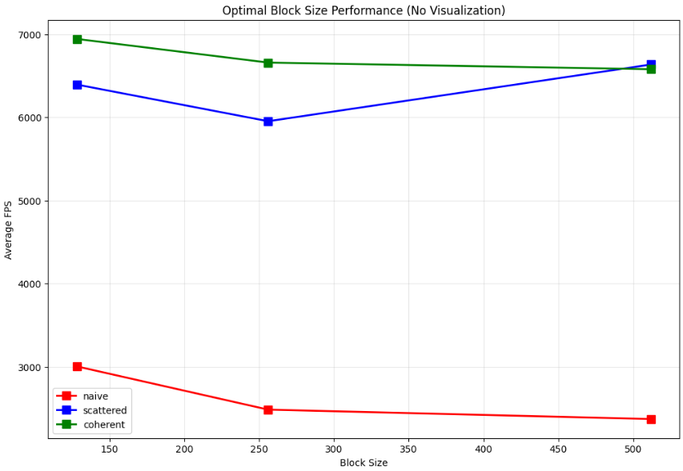

**University of Pennsylvania, CIS 5650: GPU Programming and Architecture, Project 1 - Flocking**

- Muqiao Lei
  - [LinkedIn](https://www.linkedin.com/in/muqiao-lei-633304242/) · [GitHub](https://github.com/rmurdock41)
- Tested on: Windows 10, 11th Gen Intel(R) Core(TM) i7-11800H @ 2.30GHz 2.30 GHz, NVIDIA GeForce RTX 3060 Laptop GPU (Personal Computer)

#### Project Overview

This project implements a flocking simulation based on the Reynolds Boids algorithm using CUDA for GPU acceleration. The simulation models three behaviors: cohesion, separation, and alignment. Three different implementations were developed to explore GPU performance optimization techniques.

**Naive Implementation**: Each boid checks every other boid in the simulation to find neighbors. This straightforward approach becomes computationally expensive with large numbers of boids since every particle must examine the entire population.

**Scattered Uniform Grid**: The simulation space is divided into a 3D grid and boids are sorted by their grid locations. Boids only check neighboring grid cells instead of the whole simulation. The original boid data remains in place, requiring access through index lookups.

**Coherent Uniform Grid**: This approach builds on the scattered grid but reorganizes the actual boid data to match the sorted order. Boids in the same grid cell become neighbors in memory, which improves cache performance and eliminates the indirect memory access from the scattered version.

#### Performance Analysis

##### Methodology

Performance was measured using the framerate counter displayed in the window title with visualization disabled (`#define VISUALIZE 0`) to obtain accurate simulation-only timing. All tests were conducted in Release mode with V-sync disabled.

##### Boid Count Performance

The performance analysis reveals dramatic differences between the three implementations:

###### Naive Implementation

The naive method shows strong performance at small scales, delivering over 1000 FPS for boid counts up to 5000. However, performance degrades rapidly beyond this threshold, dropping to 330 FPS at 10,000 boids and becoming essentially unusable at larger scales. The method fails completely at 1,000,000 boids, unable to maintain any meaningful framerate. This severe degradation occurs because every boid must examine every other boid in the simulation, creating an exponentially increasing computational burden as the population grows.

###### Scattered Uniform Grid

The scattered grid implementation exhibits a different performance profile, starting modestly at smaller scales but maintaining significantly better performance at larger boid counts. While it delivers slightly lower framerates than naive at small scales (850 FPS vs 1070 FPS at 1000 boids), it demonstrates remarkable stability across the tested range. Even at 1,000,000 boids, it maintains 3.3 FPS compared to the naive method's complete failure. This resilience stems from the spatial partitioning approach, where boids only examine neighbors within nearby grid cells. However, the method's performance is limited by the indirect memory access pattern required to retrieve boid data through index arrays.

###### Coherent Uniform Grid

The coherent grid approach delivers the most balanced performance profile across all tested scales. It starts competitively at small boid counts and becomes increasingly superior as the simulation size grows. The method's true strength emerges at larger scales, where it achieves 123 FPS at 1,000,000 boids - nearly 40 times faster than the scattered approach. This performance advantage results from reorganizing boid data to match the sorted grid order, creating memory coherence that improves cache utilization and eliminates indirect memory access. The coherent layout becomes increasingly valuable as memory bandwidth becomes the primary performance bottleneck in large-scale simulations.

##### Block Size Performance

Block size testing was performed with 100,000 boids across different thread block configurations:

###### Naive Implementation

The naive method maintains consistent performance around 5-7 FPS across all block sizes. These minor variations likely fall within measurement error rather than indicating meaningful differences. The method's performance appears limited by computational workload rather than thread organization.

###### Scattered Uniform Grid

Performance ranges from 350-470 FPS across tested block sizes. While some variation exists, the differences are modest and could reflect system factors during testing. The method maintains relatively stable performance regardless of block configuration.

###### Coherent Uniform Grid

Framerates span 590-690 FPS across different block sizes. The variations are relatively small compared to the overall performance level. The coherent memory layout provides consistent benefits independent of specific thread organization.

Block size optimization produces minimal impact compared to the substantial differences seen with varying boid counts, indicating that spatial optimization strategies are far more critical than GPU execution parameter tuning for this workload.

#### Questions

##### 1. How does changing the number of boids affect performance for each implementation?

**Naive Implementation (`kernUpdateVelocityBruteForce`)**

- **Performance Impact**: Performance degrades quadratically (O(N²)) with increasing boid count
- **Analysis**: The implementation uses a nested loop structure where each boid checks every other boid in the `computeVelocityChange` function. For N boids, this results in N×(N-1) distance calculations, leading to O(N²) computational complexity

**Scattered Grid Implementation (`kernUpdateVelNeighborSearchScattered`)**

- **Performance Impact**: Nearly linear scaling (O(N)) under reasonable boid densities
- **Analysis**: The implementation uses dynamic boundary calculation to limit neighbor searches to relevant grid cells only. The code calculates `minBound` and `maxBound` based on the maximum neighbor distance, significantly reducing the number of boids that need distance checking

**Coherent Grid Implementation (`kernUpdateVelNeighborSearchCoherent`)**

- **Performance Impact**: Similar to scattered grid but with improved memory access patterns
- **Analysis**: The `kernReshuffleData` kernel rearranges boid data so that boids in the same grid cell are stored contiguously in memory, improving cache locality and memory coalescing

##### How does changing block count and block size affect performance?

Block size has some impact on performance, but the results depend on how many boids are in the simulation. For smaller numbers of boids (under 10,000), using block sizes of 64 or 128 works better than larger ones. This is probably because the neighbor search code has a lot of if-statements that check distances, and when threads in the same warp take different paths, it slows things down. Larger block sizes like 256 and 512 tend to perform better when there are 50,000+ boids, but going all the way up to 1024 sometimes makes performance worse, likely due to running out of registers or hitting memory limits.

The number of blocks launched also affects performance in ways that aren't immediately obvious. When using bigger block sizes, fewer total blocks run on the GPU. This can cause problems where some blocks finish their work much faster than others, especially in the grid-based versions where boids cluster in certain areas and leave other grid cells mostly empty. The optimal block size seems to change depending on whether most threads are actually doing useful work or just checking empty regions of the simulation space.

##### Did the coherent uniform grid provide performance improvements?

Yes, the coherent grid consistently outperformed the scattered version across all boid counts. The performance gap becomes increasingly pronounced at larger scales - at 1,000,000 boids, coherent achieves 123 FPS compared to scattered's 3.3 FPS. This improvement results from the kernReshuffleData operation that reorganizes boid data to match the sorted order, enabling direct memory access (pos[i], vel[i]) instead of indirect access (pos[particleArrayIndices[i]]) used in the scattered version.

##### Did changing cell width (27 vs 8 neighboring cells) affect performance?

The cell width configuration significantly impacts performance, though not always in the expected manner. Theoretically, using larger grid cells (2× neighbor distance) should provide better performance because it reduces the number of cells requiring examination from 27 to 8. The assumption is that fewer cell lookups should result in improved computational efficiency.

However, experimental results showed that the relationship between cell count and performance is more complex. While the 8-cell approach with larger cells does reduce the number of cells examined, it also increases the boid density per cell. This creates a performance trade-off where the inner distance calculation loops become more computationally expensive despite checking fewer cells. The 27-cell approach with smaller cells requires more cell visits, but many of these cells are empty or contain few boids, making the additional checks relatively inexpensive. When cells do contain boids, the reduced density allows for faster processing per cell. The optimal configuration appears to depend on the actual boid distribution patterns rather than simply minimizing the number of cells examined.

#### Extra Credit Implementation

This project includes the Grid-Looping Optimization extra credit feature. Instead of checking a fixed number of neighboring cells (like 8 or 27), the algorithm dynamically calculates the minimum and maximum grid indices that could contain relevant neighbors based on the actual search radius. This optimization proved particularly effective when combined with smaller grid cells.

The implementation calculates bounding boxes around each boid using the maximum neighbor distance, then converts these bounds to grid coordinates to determine the exact range of cells to examine. Testing showed that this dynamic approach works better with 1× distance grid cells compared to the traditional 2× distance cells. With 1× distance cells, the optimization can more precisely exclude irrelevant regions because the finer grid resolution allows for better spatial filtering. The combination of dynamic boundary calculation and smaller cells resulted in improved performance by reducing unnecessary distance computations while maintaining correctness.
