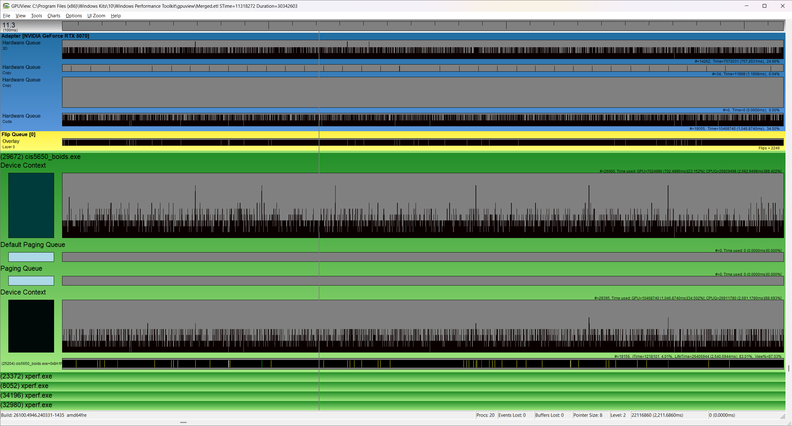
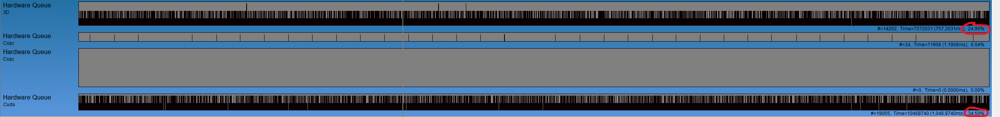
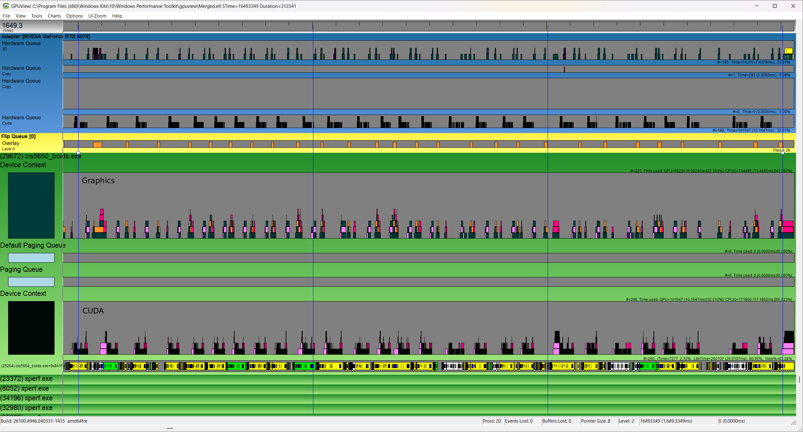
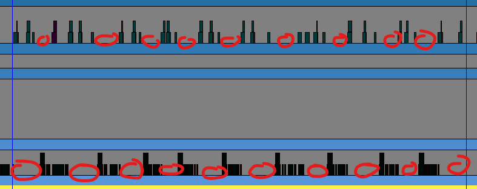

**University of Pennsylvania, CIS 5650: GPU Programming and Architecture,
Project 1 - Flocking**

* Aaron Tian
  * [LinkedIn](https://www.linkedin.com/in/aaron-c-tian/), [personal website](https://aarontian-stack.github.io/)
* Tested on: Windows 22H2 (26100.4946), Intel Core Ultra 7 265k @ 3.90GHz, 32GB RAM, RTX 5070 12GB (release driver 581.08)

# CUDA Boids Flocking

This project implements the [Boids flocking simulation](https://en.wikipedia.org/wiki/Boids) using CUDA. Individual particles (boids) are simulated in parallel using CUDA kernels. By following three simple rules:
* flying towards center of mass of neighboring boids
* separating from neighboring boids
* aligning with velocity of neighboring boids

we can achieve flocking behavior such that the boids move together as groups through space, somewhat like birds (hence the name Boid: bird-oid).


<br>
<sub>*GIF of Uniform Grid implementation with 50,000 boids.*</sub>

## Implementation Details

There are three separate implementations of the Boids simulation in the project.

### Naive

Each boid is updated by a separate thread in the CUDA kernel. For each boid, it naively iterates over all other boids in the simulation. If the boid is within neighborhood distance, the corresponding rules are applied to the current boid.

### Uniform Grid

To accelerate the naive implementation, a uniform grid is used to quickly filter boids that may potentially be in the neighborhood space. For each boid, it is assigned to a grid cell based on its position. This array of grid cell IDs is used to sort an array of boid indices. The number of and which boids are in each cell is tracked by keeping a start and end index in the sorted boid indices array: since grid cell IDs are sorted, when the value changes in the array we know the start and end of the range of boids that belong to that cell.

For each boid, we determine the minimum and maximum cells its neighborhood overlaps with. We then iterate over these overlapping cells (at most 8 assuming the cell width is twice the size of the neighborhood distance) and apply the rule checking for each boid in each cell. By using the stored start and end indices, we can iterate through all the boids in the cell without needing dynamically sized storage.

### Coherent Grid

This approach is the same as the uniform grid, except that the positions and velocities of each boid are directly sorted according to the grid cell they belong to. Thus during the iteration over boids in a given cell, there should theoretically be better cache coherency (of course to verify this you would need to measure cache hits/misses via some profiler).

## Performance Audit

As a first step in collecting performance data, I measured the time it took to render each frame across a ten second period for each implementation across a variety of boid counts. The results below are captured using NVIDIA's [FrameView](https://www.nvidia.com/en-us/geforce/technologies/frameview/). FrameView is an app for measuring framerates and many other performance metrics for games. I will be using the average framerate along with the milliseconds taken for each frame (MsBetweenPresents). FrameView's stats are gathered or calculated from ETW events in Windows (`DXGI` or `DxgKrnl` events for Windows DX graphics interface or graphics kernel respectively) so they are accurate at a operating system level. While FrameView is not open source, it is based off Intel's open source [PresentMon](https://github.com/GameTechDev/PresentMon) project, which should specifically be listening for some DXGI Present event (in GPUView, presents of this app show up as `D3D9 - Present` shortly after each Vsync interval). The framerate is calculated from the time between each present event (i.e. a new frame).

All spreadsheets with raw data are contained in the `data` folder, which are organized in folders by implementation, then by number of Boids used.

Before diving in, here are answers to a couple questions I anticipate you reading this to have:

*Q: This app uses OpenGL and CUDA. Why is a D3D event being used to measure framerate?*  
A: Remember that the operating system (Windows in this case) is responsible for scheduling GPU work and compositing/presenting frames/windows. The swapchain in a non-DX API (OpenGL, Vulkan) is always going to be layered on top of a OS native method, or in the case of Vulkan you can use a DXGI swapchain directly.

*Q: What is GPUView?*  
A: GPUView is a profiling tool for Windows made by Microsoft. It is very useful for analyzing the performance interaction between the CPU, GPU, and OS. It is probably not always the right kind of profiler for this class, but I like using the tool as I am familiar with it. In this project, [I use GPUView to give insights into what part of the application could be further optimized](#performance-investigation-gpuview).

**All stats are collected at a resolution of 3440x1440 in exclusive fullscreen mode. Each FrameView session was ran for 10 seconds.** Exclusive fullscreen mode is necessary as otherwise Windows compositer will cap the framerate to my monitor's refresh rate which will mess with FrameView's data collection.

---

<div align="center">


<table>
  <tr>
    <td></td>
    <td></td>
    <td></td>
  </tr>
</table>

</div>

Using average FPS as the metric, increasing the amount of boids degrades the performance but not linearly. More boids in the simulation is simply more work, even though we are in parallel, we likely have more neighbors to check per boid due to increased density: the amount of work per boid is increasing.

The coherent grid implementation is faster than the regular uniform grid, again likely due to expected improved cache coherency as theorized earlier. The deltas are quite significant: 


Above table is also in the spreadsheet `charts.xlsx` in the `data` folder.

Two interesting things to note and my theories on why they are happening:
1. Coherent grid is faster than the regular uniform grid, but the difference is less pronounced at less boids (50,000).
   - Coherent grid improves cache coherency which makes neighbor searches more efficient. This gain outweighs the loss from needing to perform a couple extra array sorts. However, with fewer boids like 50,000 we are doing less neighbor searches so the speedup is not as noticeable: we are not bottlenecked by cache misses yet.

2. Both uniform and coherent grid implementations had higher average FPS at 75,000 boids compared to 50,000 boids.
   - Slightly confusing as this is just with 50,000 vs 75,000 boids (downwards trend returns once we increase past 75,000) but I think the specific count of 75,000 causes the boids simulation to act in a certain way such that they stay further apart and thus reduce the number of neighbor interactions.

---

Changing uniform grid from <=8 to <=27 neighbors by making cell width equal to neighborhood distance:

<div align="center">
<table>
  <tr>
    <td></td>
    <td></td>
  </tr>
  <tr>
    <td colspan="2"></td>
  </tr>
</table>
</div>

Above table is also in the spreadsheet `charts.xlsx` in the `data` folder.

Changing the cell width and checking <=27 neighboring cells increased performance by a significant amount for almost all boid counts (62% at 200,000 boids). I suspect this is because the smaller cell size means less boids are bucketed into each cell on average, so during the neighbor iteration we are checking *less total boids* than compared with <=8 neighboring cells. In other words, the performance difference comes from the number of neighboring boids needing to iterate and compare over, not the number of cells. 

---

Changing the number of threads and corresponding block size with 50,000 boids:


<div align="center">
<table>
  <tr>
    <td></td>
    <td></td>
    <td></td>
  </tr>
</table>
</div>

For the naive and uniform grid implementations increasing number of threads and corresponding block size starting from 32 improves the average FPS but this gain is lost going from 64 to 128. In all implementations increasing the block size at some point causes average FPS to fall off (but it may recover), so it seems certain larger sizes may incur some kind of overhead, probably due to scheduling pressure.

## Performance Investigation (GPUView)

When I was looking at a frametime graph for the coherent grid, I noticed some sudden short spikes:


Since they are so short (one frame duration), I suspect this is just due to something going on with the operating system, rather than some issue with the Boids application itself. To try and check, I inspected a GPUView capture. The view focused on the Boids process (`cis5650_boids.exe`) is here: 



The queue for compute (dark blue, "HW Queue") has some short peaks in it, which suggests the quantity of work submitted per frame is not always consistent.



Another thing to note is that if we expand the adapter graph it looks like the GPU is only at 36.98% utilization (circled in red) in this time period view, which suggests we could give the GPU more work.

Looking at the locations of all the present events, they seem to be evenly spaced and I can't find/reproduce these sudden spikes.

Since I'm already here, I'm curious about what this workload looks like to the OS. Going on a detour and zooming in on a set of three frames:



Each frame is separated by a vertical blue bar, which is the Vsync interval: my monitor is a 100hz panel. I've labeled each HW queue. The present queue only contains the small orange present packets, and the work in the graphics queue is less than compute because this is mostly a CUDA bound application. In the original trace, I can't fit all the HW queues vertically on my monitor at once so I've merged two screenshots together in image editing software.

In both graphics and compute, we can count eight or nine groups of queued work per Vsync interval. There are also eight or nine present packets in the present queue so this translates to ~8*100=800 FPS in the instant moment.

One thing I notice is that there are a lot of empty bubbles between each group of work in both the graphics and compute queues. I've highlighted the bubbles in the graphics queue:


For every bubble in graphics, the time interval overlaps with compute work, and it's the same vice versa. We can see that graphics work per frame comes after a group of compute work. Within each queue individually a considerable amount of time in the frame is being spent not processing work: ideally we want to always be submitting work as much as possible to fully saturate the hardware. 

Looking at what the GPU is doing, we can see holes too (since it is underutilized):



But because the app has a serial execution model that looks like

```
launch CUDA kernels
wait for CUDA kernels to finish (block CPU)
some OpenGL calls
```

these bubbles in compute are likely mostly from waiting on the CUDA kernels to finish before launching again to perform the next step of the simulation. I can think of two possible optimizations in the app:

1. Avoid using `cudaDeviceSynchronize` (CPU blocking) and use a GPU synchronization primitive instead to order the CUDA->OpenGL work. While we will still need to block at the beginning or end of every frame due to the sequential nature of the simulation update (can't start the next simulation step until the previous one finishes) this should pipeline the work submission more by allowing that barrier to be done on the GPU and not CPU.
2. Optimize the CUDA kernels more. `cudaDeviceSynchronize` will return earlier and we can launch work again sooner. We should see the group of compute packets shrink horizontally (less time taken). Perhaps this is the more obvious opportunity given we are basically doing nothing on the CPU side, but it is good to confirm.

In summary I could not find/reproduce the frame time spikes, but in the process I did identify and confirm the main opportunities for optimization.
