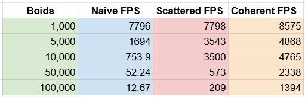

**University of Pennsylvania, CIS 5650: GPU Programming and Architecture,
Project 1 - Flocking**

* Christina Qiu
  * [LinkedIn](https://www.linkedin.com/in/christina-qiu-6094301b6/), [personal website](https://christinaqiu3.github.io/), [twitter](), etc.
* Tested on: Windows 11, Intel Core i7-13700H @ 2.40GHz, 16GB RAM, NVIDIA GeForce RTX 4060 Laptop GPU (Personal laptop)

### Overview

This is an implementation of a flocking simulation based on the Reynolds Boids algorithm. This project involved writing CUDA kernels, using them, and analyzing their performance. 

1. Naive boids simulation.
2. Scattered boids simulation on uniform grid.
3. Coherent boids simulation on uniform grid.

## Naive Boids

At every timestep, a boid looks at each of its neighboring boids and computes the velocity change contribution from each of the three rules:

1. cohesion - boids move towards the perceived center of mass of their neighbors
2. separation - boids avoid getting to close to their neighbors
3. alignment - boids generally try to move with the same direction and speed as their neighbors

Thus, a brute force implementation has each boid check every other boid in the simulation.

  
  

50,000 Boids Simulation

Runtime O(n^2)

## Scattered Uniform Grid

Each boid is assigned to a grid cell based on its position. We store an array of particle indices, which are sorted by their grid cell. The actual position and velocity data remain in their original arrays so we must look up the sorted index to access a boid's data. This enables fast neighbor search but can cause memory access inefficiencies due to scattered data.

  
  

50,000 Boids Simulation

Runtime O(n) * neighbors

## Coherent Uniform Grid

The coherent uniform grid improves on the scattered version by also reordering the position and velocity arrays so that boids within the same grid cell are stored contiguously in memory. This cuts out the middle-man and significantly improves performance, especially on large numbers of boids.

  
  

50,000 Boids Simulation

Runtime O(n) * neighbors

## Runtime Analysis

Average Kernel Time change with increasing # of Boids Graph

blockSize = 128, no visualization, dt = 0.2

Framerate change with increasing # of Boids Graph

blockSize = 128, no visualization, dt = 0.2

For each implementation, how does changing the number of boids affect performance? 

Naive: Performance decreases significantly as the number of boids increases.
Scattered Uniform Grid: Performance scales better
Coherent Uniform Grid: Sme theoretical complexity as scattered but faster in practice due to coalesced memory access.

How does changing the block size (and thus block count) affect performance?

Best performance was observed at block sizes of 128 and 256. Very small or very large block sizes lead to underutilization or register pressure.

For the coherent uniform grid: did you experience any performance improvements with the more coherent uniform grid? Was this the outcome you expected? Why or why not? 

Yes there was a notable improvment, which was expected because the coherent grid improves memory access patterns by storing position and velocity data contiguously in memory.

Did changing cell width and checking 27 vs 8 neighboring cells affect performance? Why or why not? Be careful: it is insufficient (and possibly incorrect) to say that 27-cell is slower simply because there are more cells to check! Add your performance analysis. 

When cell width was too small, more cells were needed to cover the same neighborhood radius, which increased the number of neighbor cells to check. This added overhead and reduced performance.

When cell width was too large, more boids ended up in each cell, increasing the number of pairwise checks per cell and reducing the benefits of spatial partitioning.

The ideal cell width was around twice the max rule distance, as suggested (covers interaction range efficiently with minimal overlap).