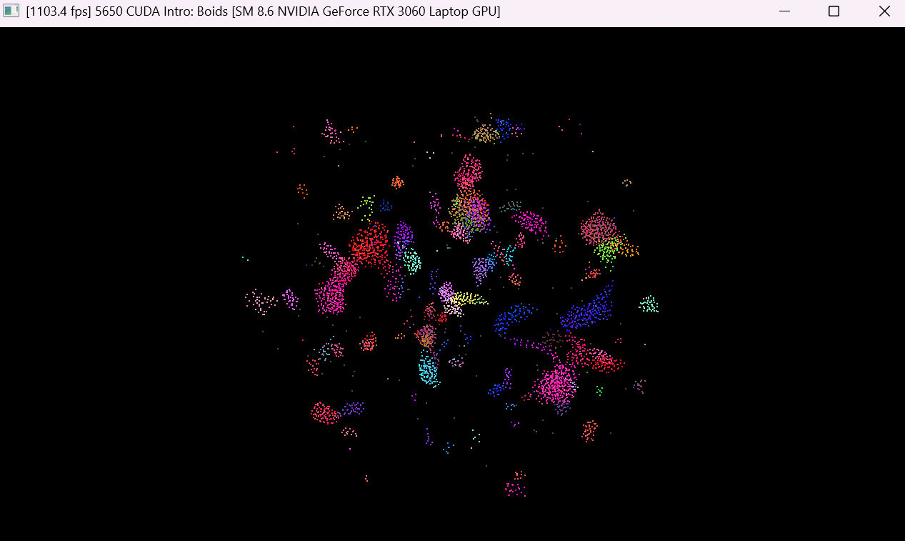
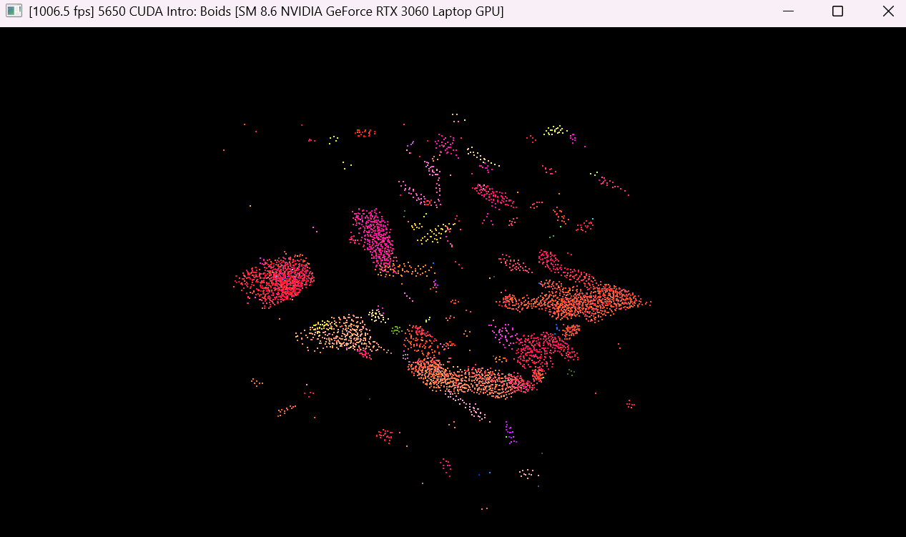

# CUDA Flocking Simulation

This is a CUDA-powered take on Reynolds’ Boids. I compare a few implementation strategies and look at how much each one helps on real hardware. I start with the brute force approach where every boid checks every other boid, then move on to using grids to make efficient use of CUDA parallelization, and finally I add another optimization where the boid positions and velocities are stored in a coherent array where particles in the same grid are contiguous in memory.

## Coherent Arrays Implementation

<!--  -->

## Brute Force Implementation

<!--  -->

## Uniform Grid Implementation

<!--  -->

As you can see, the coherent arrays version performs best, followed by the uniform grid, and then brute force. Below is a deeper dive with framerate, frame time, and kernel step timing.

## Performance Analysis

I benchmark three implementations:
1. **Naive:** Every boid checks every other boid.
2. **Uniform Grid:** Use a uniform spatial grid to cull neighbor checks.
3. **Coherent Uniform Grid:** Reorder boid data to be cache‑coherent with the grid.

### Performance Plots

**Framerate vs. Number of Boids**

- As boid count goes up, framerate drops for all methods. The naive approach falls off fastest (O(n^2)). Uniform grid and coherent grid maintain much higher framerates, with the coherent variant leading at larger N. The coherent vs. non‑coherent gap is real but not massive.

**Framerate vs. Block Size**

- On a 5000‑boid test (RTX 3060), performance improves as block size grows to roughly 128–512 threads, then flattens or dips. Very small blocks underutilize the GPU; very large blocks reduce concurrency. The sweet spot tends to be warp multiples that fill SMs well.

### Analysis Q&A

- **How does changing the number of boids affect performance for each implementation, and why?**
  - **Naive:** Drops roughly quadratically (O(n^2)) because every boid compares to every other.
  - **Uniform Grid:** Slower with N, but closer to O(n·k), where k is neighbors in nearby cells (k ≪ n).
  - **Coherent Grid:** Similar complexity to uniform grid, but faster thanks to better memory locality and fewer cache misses.

- **How do block count and block size affect performance, and why?**
  - Block size sets threads-per-block and affects occupancy. Larger blocks hide latency better, but if too large, reduce concurrent blocks per SM. Too small leaves SMs idle. Warp‑multiple sizes (32 on NVIDIA) are a good default.
  - Block count just needs to keep all SMs busy (on an RTX 3060 Laptop with 30 SMs, use many blocks). In the 5000‑boid runs, warp‑multiple block sizes and enough blocks to saturate the GPU performed best. The practical sweet spot here was around 128–256 threads per block with sufficient grid size.

- **Did the coherent uniform grid help? Was that expected?**
  - Yes—a modest but consistent bump. That’s expected: when threads in a warp access contiguous data, the hardware coalesces loads/stores, cutting memory transactions and latency.

- **Did changing cell width and checking 27 vs. 8 neighboring cells affect performance? Why?**

  
  Changing cell width to neighborhood distance (27 cells) vs. twice the neighborhood distance (8 cells) is a trade‑off:
  - **8‑cell check (larger cells):** Generally faster. There are more boids per cell, but far fewer cell lookups.
  - **27‑cell check (smaller cells):** Generally slower. Fewer boids per cell, but many more memory fetches across cells; overhead can dominate unless access is very coherent.
  - The naive method has no grid, so cell width doesn’t apply.

### Extra Plots

You can find some extra plotting here:

- `plotting/plots/frame_time.png` — Frame time vs. boid count (lower is better). Mirrors FPS but highlights latency spikes.
- `plotting/plots/step_time.png` — Average kernel step time vs. boid count. Useful for isolating compute vs. render overheads.
- `plotting/plots/blocksize_frame.png` — Frame time vs. block size. Shows the same occupancy‑driven sweet spot as FPS.
- `plotting/plots/blocksize_step.png` — Kernel step time vs. block size. Helpful for tuning launch configs.
- `plotting/plots/compare_frame.png` — 8‑cell vs. 27‑cell frame time comparison.
- `plotting/plots/compare_step.png` — 8‑cell vs. 27‑cell step time comparison.
