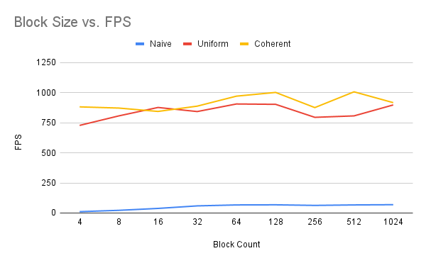

**University of Pennsylvania, CIS 5650: GPU Programming and Architecture,
Project 1 - Flocking**

 

* Jacqueline Guan
  * [LinkedIn](https://www.linkedin.com/in/jackie-guan/)
  * [Personal website](https://jyguan18.github.io/)
* Tested on my personal laptop:
  * Windows 11 Pro 26100.4946
  * Processor	AMD Ryzen 9 7945HX with Radeon Graphics
  * 32 GB RAM
  * Nvidia GeForce RTX 4080

Introduction
=============
In this boids flocking simulation, particles move around the simulation space following three rules:
1. Cohesion - boids move towards the perceived center of mass of their neighbors
2. Separation - boids avoid getting to close to their neighbors
3. Alignment - boids generally try to move with the same direction and speed as their neighbors

### 1. Naive Boid Flocking
Each boid naively checks all of the other boids to see if they are within a certain distance for flocking. This algorithm only uses one kernel that implements all three rules (cohesion, separation, alignment) to determine the new velocity of each boid. This approach is simple and easy to understand, but it does not scale well with a large number of boids.

### 2. Uniform Grid Flocking
The simulation space is divided into a uniform 3D grid. Each boid is assigned a certain cell based on its position and boid indices are sorted by cell index so that boids in the same cell are next to each other in the index array. The start and end indices are then recorded for each cell, so when updating a boid’s velocity, it only checks boids in the neighboring cells rather than all the boids in the scene. In order to get the original position and velocity, the boids are looped through the sorted index array.

### 3. Coherent Grid Flocking
This improves upon the uniform grid approach by reordering the position and velocity arrays themselves. This makes it faster for the GPU to look up boid positions and velocities, since the data is all neatly lined up in memory.

Performance Analysis
=============

### 1. Boid Count vs. FPS
 

**For each implementation, how does changing the number of boids affect performance? Why do you think that is?**
* Naive: For the naive approach, we get time complexity of O(N^2) since each boid checks all other boids. Every thread performs a nested loop over all the other N boids, so more boids also mean quadratically more distance calculations. At low counts, this is manageable but as the boid count gets higher, we can see that the FPS gets very low (close to 0).
* Uniform: For the uniform grid approach, each boid only checks with a fixed number of neighbor cells rather than all of the boids. This makes the runtime closer to O(N), since the number of comparisons depend on the local density rather than the total number of boids.
* Coherent: For the coherent grid approach, we can access memory faster so as the number of boids increase, the coherent grid has a higher FPS than uniform. At lower boid counts, coherent has a lower fps than uniform because the reordering overhead outweighs the benefits. At higher boid counts, the coherent grid is better because the GPU can read the memory in larger, faster chunks instead of making lots of small, scattered lookups.

### 2. Block Count and Block Size vs. FPS
 

**For each implementation, how does changing the block count and block size affect performance? Why do you think that is?**

If there are too few threads per block, there won't be enough warps to hide memory latency. If there are too many threads per block, there is more pressure on the register and scheduling overhead can cause worse performance.
* It doesn't affect naive performance as much since naive is just computationally heavy, so block size has a much lower impact as opposed to the grid-based methods.
* Block count and block size affect uniform and coherent grids a lot mroe because how the GPU accesses memory and warp scheduling actually matters for faster parallel neighbor lookups.

**For the coherent uniform grid: did you experience any performance improvements with the more coherent uniform grid? Was this the outcome you expected? Why or why not?**

Yes, I did expect coherent grid to have bettter performance compared to the uniform grid since the cost of memory access was reduced. This improvement was overall modest but still quite noticeable.

### 3. 27 vs. 8 neighboring cells
 
 
 
**Did changing the cell width and checking 27 vs. 8 neighboring cells affect performance? Why or why not?**

So the importance of cell width is that the max distance for flocking doesn't change, so a larger cell width also contains more boids compared to a smaller cell width. So when cells are smaller, you check 27 cells but each cell contains fewer boids. And when cells are larger, you check fewer cells but each cell has more boids. That's why we can see in the graph that there are moments where the 27 cell check is better and moments where the 8 cell check is better.
